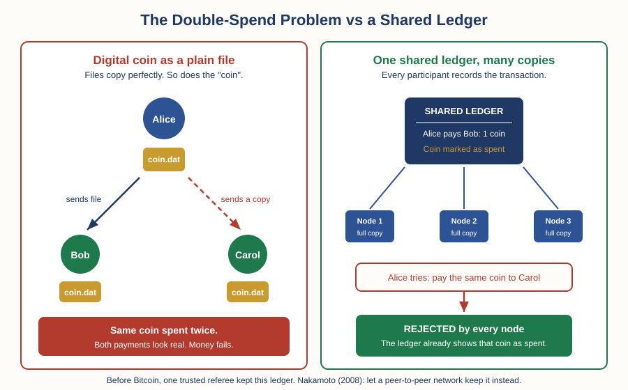

# Crypto — Chapter 1, Lesson 1: What Is a Cryptocurrency?

## Learning Objectives

By the end of this lesson, you will be able to:

- Explain what a cryptocurrency is, in plain terms, without using the word "blockchain"
- Explain the double-spend problem — why digital money has a copying problem that physical cash does not
- Describe what the 2008 Bitcoin paper actually proposed, and what it did not claim
- Separate two ideas that hype constantly merges: a token being scarce, and a token being valuable

---

## 1. Money Is Already Digital — It Just Has a Referee

In "The Foundation of Money and Trade," you saw money evolve from barter to coins to paper to fiat currency. Here is the final step that track left you at: today, most money is not paper at all. It is entries in databases.

Your bank balance is not a stack of notes in a vault with your name on it. It is a row in your bank's records. When you pay someone, no object moves. Your bank lowers one number and raises another.

:::definition
**Ledger** — A record of who owns what, and of every transaction that changed it. Your bank account is an entry on your bank's ledger. Modern money mostly lives on ledgers, not in vaults.
:::

This works because everyone involved trusts a referee. The bank keeps the ledger. The card network checks the ledger. If the ledger says you have 50 dollars, you cannot spend 100 — the referee refuses.

So digital money is not new. Digital money **without the referee** is new. That is the entire subject of this lesson.

---

## 2. The Copying Problem: Double-Spending

Why does digital money need a referee at all? Because of what computers do best: copy things.

:::example
Email a photo to a friend. Your friend now has the photo — and so do you. Nothing left your possession. Send the same photo to ten more people, and now eleven identical copies exist. For photos, that is a feature. For money, it is fatal. If a digital coin were just a file, you could "pay" it to one person, keep a copy, and pay the same coin to someone else. Both payments would look real.
:::

:::definition
**Double-Spend Problem** — The risk that the same unit of digital money is spent more than once, because digital information can be copied perfectly at almost no cost. Physical cash does not have this problem: hand over a banknote and you no longer hold it.
:::

Before 2008, there was exactly one working answer: put a trusted central party in charge of the ledger. The bank, the card network, or the payment company records every transaction and rejects any coin that has already been spent. The "coin" never really moves — the referee's ledger just updates.

This answer works. It runs the entire modern banking system. Its cost is that you must trust the referee: to stay honest, to stay solvent, to not freeze your account, and to stay in business.

People tried to build digital cash within that model long before Bitcoin. The cryptographer David Chaum published the key idea — blind signatures, which let a bank validate digital coins without seeing who spends them — in a 1983 paper, "Blind Signatures for Untraceable Payments." He founded a company, DigiCash, in 1989 to sell exactly this: private digital cash. It still needed the central bank-like issuer at the middle, and the company went bankrupt in 1998.

:::warning
Keep this history in mind whenever someone tells you crypto invented digital money. Digital money existed for decades before Bitcoin. The unsolved problem was narrower and harder: how do you stop double-spending with **no referee at all**? That specific problem is what the 2008 paper attacked.
:::

---

## 3. What the 2008 Paper Actually Proposed

On 31 October 2008, someone using the name Satoshi Nakamoto — a pseudonym; the real identity is still unknown — posted a nine-page paper to a cryptography mailing list. Its exact title: "Bitcoin: A Peer-to-Peer Electronic Cash System."

The abstract states the goal in its first sentence: a purely peer-to-peer version of electronic cash would let online payments go directly from one party to another without going through a financial institution. And it names the obstacle directly: the paper says, "We propose a solution to the double-spending problem using a peer-to-peer network."

:::definition
**Cryptocurrency** — A digital currency whose ledger is maintained by a network of computers running shared software rules, secured by cryptography, instead of by a central institution. Bitcoin was the first working example.
:::

:::definition
**Peer-to-Peer (P2P) Network** — A network where participants connect directly to each other and share the work, instead of all connecting to one central server. In Bitcoin, thousands of computers each keep a full copy of the ledger.
:::

The proposal replaces the one referee with two ingredients:

1. **Everyone keeps the ledger.** Instead of one bank holding the record, every full participant in the network holds a complete copy of every transaction. A coin that was already spent is visible to everyone, so a second spend of it is rejected by everyone.

2. **Proof-of-work orders the history.** With thousands of copies, the network needs one agreed ordering of transactions — otherwise "which spend came first?" has no answer. Nakamoto's paper proposes timestamping transactions into an ongoing chain secured by computational work, "forming a record that cannot be changed without redoing the proof-of-work."

:::definition
**Proof of Work** — A mechanism that makes adding to the transaction history require real computational effort (and therefore real electricity and money). Rewriting old history would require redoing all that work faster than the honest network adds new work — economically brutal, though not physically impossible. Lesson 3 covers how this actually operates.
:::

Notice the honest shape of that claim. The paper does not say the history *cannot* be rewritten. It says the system is secure "as long as a majority of CPU power is controlled by nodes that are not cooperating to attack the network." That is a stated assumption, not a guarantee. If an attacker ever controlled most of the network's computing power, the protections weaken — Lesson 3 covers this as the 51% attack.

:::example
Two things people confidently attribute to the 2008 paper are not in it. The word "blockchain" never appears — the paper describes a "chain of blocks" and calls the mechanism a timestamp server; the one-word name came later. And the famous 21 million limit is not in the paper either — it appears in the software rules, not the whitepaper. Reading the actual nine pages, rather than what people say about them, is this track's first exercise in verifying the claim.
:::

---

## 4. Digital Scarcity — and What It Does Not Buy You

Bitcoin's software rules started the reward for adding a block of transactions at 50 bitcoins and cut it in half every 210,000 blocks — roughly every four years. Add up that shrinking series and you get a hard ceiling of just under 21 million coins (20,999,999.98, to be precise), with new issuance ending around the year 2140. Every computer on the network enforces this: a block that tries to create extra coins is rejected as invalid.

:::definition
**Digital Scarcity** — A verifiable, software-enforced limit on how many units of a digital asset can exist. Before Bitcoin, anything digital could be copied without limit; a working cap on digital units was genuinely new.
:::

This is a real technical achievement. Now here is the part the hype leaves out, stated plainly:

**Scarcity of the token is not value of the token.** Scarcity limits supply. Value requires demand. Something can be perfectly, provably scarce and still be worth nothing — if you sign 21 copies of a napkin and burn the pen, you have created verifiable scarcity, not wealth. The 21 million cap tells you no one can inflate the supply. It tells you nothing about why anyone should want a bitcoin, or what one should cost. Supply and demand set prices — Foundations taught you that, and no software cap repeals it.

:::warning
You will constantly hear "Bitcoin fixes X" and "Bitcoin is digital gold, a store of value." Treat both as claims to verify, not facts to accept. The 2008 paper itself describes electronic cash — a payment system; the store-of-value framing came later. And the evidence on it is genuinely contested: Foundations Chapter 2 showed you that Bitcoin's volatility has repeatedly undermined its short-term inflation-hedge record (Lesson 3), and that two careful academic studies of whether Bitcoin protects a stock portfolio reached opposite conclusions (Lesson 4). A contested claim can still turn out true. But "contested" is the honest description today, and anyone presenting it as settled is selling something.
:::

:::practice
Find any article or video that says "there will only ever be 21 million bitcoin, so the price must rise." Write down, in one sentence each: (1) what the supply cap actually guarantees, and (2) what extra assumption about demand the "must rise" part quietly adds. You now read crypto marketing differently than most participants do.
:::

---

## What to Look For

- When someone cites the 21 million cap, check whether they say anything about demand. Supply caps without demand arguments are half an argument.
- When someone says Bitcoin's history "cannot be changed," check whether they state the assumption — security holds while a majority of the network's computing power is honest, and the paper says so itself.
- When someone attributes a claim to "the whitepaper," check the actual nine pages. Two of the most repeated "whitepaper facts" (the word blockchain, the 21 million cap) are not in it.
- When someone says crypto invented digital money, remember Chaum's ecash — digital cash existed in 1989 and died in 1998. The invention was removing the referee, not going digital.

---

## Practice / Quiz

1. Why does digital money have a double-spend problem that physical cash does not?
   - A) Digital transactions are slower than cash transactions
   - B) Digital information can be copied perfectly, so the same coin could be spent twice
   - C) Digital money is not legal tender
   - D) Banks charge fees on digital transactions

   **Correct: B.** Hand over a banknote and you no longer have it. Send a digital file and you still hold a perfect copy — so without some ledger to reject the second spend, one coin could pay two people.

2. How was double-spending prevented before Bitcoin?
   - A) It was impossible to prevent, so digital money did not exist
   - B) Digital coins were designed to self-destruct after one use
   - C) A trusted central party (a bank or payment network) kept the ledger and rejected already-spent money
   - D) Governments made double-spending illegal, which stopped it

   **Correct: C.** Central ledgers — banks, card networks, and even Chaum's DigiCash — solved double-spending for decades. The cost was trusting the referee. Nakamoto's 2008 paper proposed solving it with a peer-to-peer network and proof-of-work instead.

3. Bitcoin's supply is capped at just under 21 million coins. What does this cap, by itself, guarantee?
   - A) That the price of Bitcoin must rise over time
   - B) That Bitcoin is a reliable store of value
   - C) That no one can create extra bitcoins beyond the schedule — and nothing about what a bitcoin is worth
   - D) That Bitcoin will replace fiat currency by 2140

   **Correct: C.** The cap is a supply rule enforced by every computer on the network. Value needs demand as well as limited supply — a provably scarce token with no demand is worth nothing. The store-of-value claim is contested in the academic evidence, not settled.

---

## Key Terms Recap

| Term | One-line definition |
|---|---|
| Ledger | A record of who owns what and every transaction that changed it. |
| Double-Spend Problem | The risk that the same unit of digital money is spent twice, because digital data copies perfectly. |
| Cryptocurrency | A digital currency whose ledger is maintained by a network under shared software rules, not by a central institution. |
| Peer-to-Peer (P2P) Network | A network where participants connect directly and share the work, with no central server. |
| Proof of Work | A mechanism making additions to the transaction history cost real computation, so rewriting history is economically hard. |
| Digital Scarcity | A verifiable, software-enforced limit on how many units of a digital asset can exist. |

---

*Coming next: Lesson 2 — How a Blockchain Works: blocks, hashes, and why history is hard to rewrite.*
