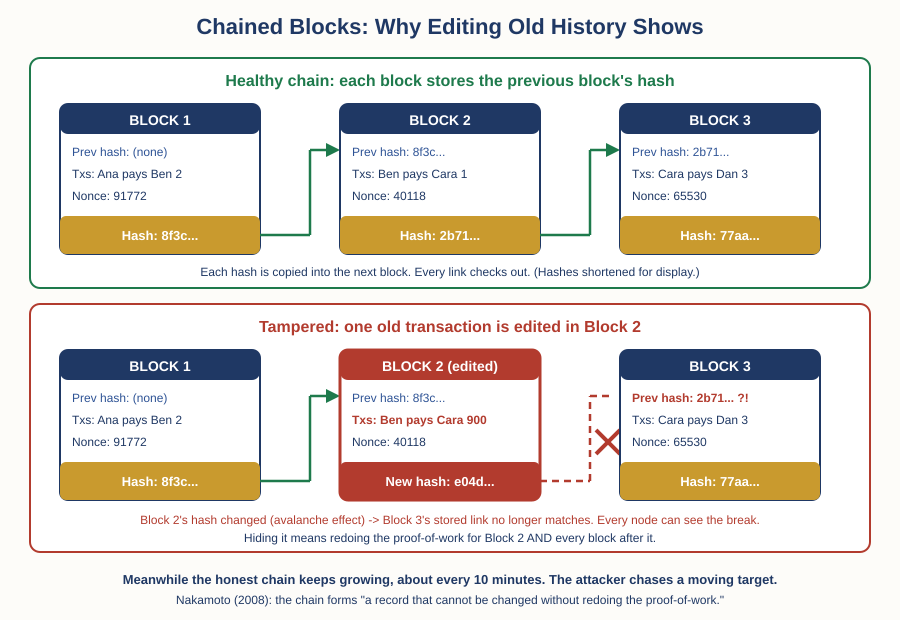

# Crypto — Chapter 1, Lesson 2: How a Blockchain Works

## Learning Objectives

By the end of this lesson, you will be able to:

- Describe what a block actually contains: transactions, a hash of the previous block, and a nonce
- Explain what a hash function does — a deterministic fingerprint for data — and what the avalanche effect means
- Explain why chaining block hashes makes editing old history detectable, and why redoing it is economically brutal
- Say precisely what "immutable" does and does not mean, and why some small blockchains have been rewritten

---

## 1. From Shared Ledger to Chain of Blocks

Lesson 1 ended with Nakamoto's 2008 proposal: replace the bank's referee with a shared ledger that thousands of computers keep in sync, so a double-spend is visible to everyone and rejected by everyone.

That raises an immediate practical question. Thousands of computers, all writing to the same record — how do you keep the record in one agreed order, and how do you stop anyone from quietly editing last month's page?

The answer is the data structure this lesson covers. The ledger is not one long continuous file. It is a sequence of batches, added one at a time, with each batch cryptographically locked to the one before it.

:::definition
**Block** — A batch of transactions bundled together and added to the ledger as one unit, roughly every ten minutes in Bitcoin. Besides its transactions, each block records a hash of the previous block, a timestamp, and a nonce.
:::

Three items inside a block matter for this lesson:

1. **The transactions.** The actual ledger entries — who paid whom, and how much. This is the cargo.
2. **The hash of the previous block.** A compact fingerprint of the block that came before. This is the link in the chain, and Section 3 shows why it does all the security work.
3. **The nonce.** A number with no meaning of its own. It exists only to be changed, and its job becomes clear once you understand hashes.

To understand items 2 and 3, you need one tool first. It is the single most important idea in this lesson.

---

## 2. Hash Functions: A Fingerprint for Data

:::definition
**Hash Function** — A procedure that takes any digital input — a word, a file, a block of transactions — and produces a short, fixed-length output called a hash. The same input always produces the same hash, but even a tiny change to the input produces a completely different one.
:::

Bitcoin uses a specific, public, heavily studied hash function called **SHA-256**. It was designed by the US National Security Agency and first published in 2001 in a draft US federal standard (FIPS 180-2, finalized in 2002), part of the SHA-2 family. Nothing about it is secret or crypto-specific — your bank and your web browser use the same family of functions every day. Whatever you feed it, SHA-256 outputs 256 bits, usually written as 64 hexadecimal characters.

Three properties make it useful here:

- **Deterministic.** The same input gives the same hash, every time, on every computer. A hash is a reliable fingerprint: if two people compute the same hash, they are holding identical data.
- **The avalanche effect.** Change the input by one character and the output does not change a little — it changes beyond recognition. There is no "close" in hashes.
- **One-way.** Given a hash, there is no known practical way to work backwards to the input, or to craft a different input that produces the same hash. The only way to find an input that hashes to something specific is to guess, over and over.

:::example
Here is the avalanche effect on real SHA-256 output. Hash the sentence "Alice pays Bob 10 coins" and the result begins 489cdba1288d6741... Now change one single character — "Alice pays Bob 70 coins" — and the result begins 5309adf6517ce2c5... One character changed in the input; the two fingerprints share nothing. You can verify this yourself with any online SHA-256 calculator, and you should — this course keeps telling you to check claims, including ours.
:::

Now the **nonce** makes sense. A block's hash is computed over everything in it — transactions, previous-block hash, timestamp, and the nonce. Because of the avalanche effect, changing the nonce by 1 gives the block a completely new hash. The nonce is a dial you can turn to re-roll the block's fingerprint as many times as you like.

:::definition
**Nonce** — A number included in a block purely so it can be varied. Each new nonce value gives the block an entirely different hash. In proof-of-work mining, computers race through nonce values by the trillion, hunting for one that gives the block a hash below a target set by the network — that hunt is the "work." Lesson 3 covers it fully.
:::

Recall the Proof of Work definition from Lesson 1: adding to the history must cost real computation. The nonce is where that cost lives. A valid block requires a rare hash, a rare hash requires an enormous number of guesses, and guesses cost electricity and hardware. Finding a valid nonce is expensive; checking one is instant — anyone can hash the block once and confirm it.

---

## 3. Chaining the Blocks: Why Old History Fights Back

Here is where the pieces lock together. Every block contains the hash of the previous block. That previous block contains the hash of the one before it, and so on, back to the first block ever created. This is the structure the name points at.

:::definition
**Blockchain** — A ledger built as a sequence of blocks in which each block contains the hash of the block before it. Any change to an old block changes its hash, which breaks the link stored in the next block — so tampering anywhere is detectable everywhere downstream.
:::

Walk through what a would-be history editor faces. Suppose an attacker wants to change a transaction in a block from last week — say, to erase a payment they made.

1. They edit the transaction. The block's contents have changed, so — avalanche effect — the block's hash is now completely different.
2. The next block stored the old hash as its "previous block" link. That stored fingerprint no longer matches. The chain is visibly broken, and every computer holding a copy of the ledger can see it by doing a few instant hash checks.
3. To hide the break, the attacker must rebuild the edited block — including redoing its proof-of-work, finding a fresh valid nonce. That restores one link.
4. But rebuilding that block gave it a new hash, so the next block's link is broken now. They must redo that block's work too. And the next. Every block after the edit, one by one.
5. Meanwhile, the honest network has not stopped. It keeps adding new blocks to the real chain roughly every ten minutes. The attacker is not chasing a fixed target — they are chasing a target that moves away at the full speed of the world's honest mining power.

This is the core argument of Nakamoto's 2008 paper, which you read honestly in Lesson 1: the chain forms "a record that cannot be changed without redoing the proof-of-work," and an attacker rewriting history must outpace the entire honest network while doing it. The deeper the block, the more work sits on top of it, and the safer it is. This is why exchanges wait for "confirmations" — blocks stacked on top of your transaction — before treating a deposit as final. Lesson 6 returns to that.

Notice what the security actually rests on. Not secrecy — everything here is public. Not trust in any participant. It rests on arithmetic anyone can check in milliseconds, plus work that takes the whole world's mining power to produce. Cheap to verify, expensive to forge.

:::example
One more honest-history note, in the Lesson 1 spirit of checking what people attribute to Bitcoin. The chained-hash idea is not from 2008. Stuart Haber and W. Scott Stornetta published "How to Time-Stamp a Digital Document" in the Journal of Cryptology in 1991 — seventeen years before Bitcoin — proposing linked cryptographic timestamps so that no record could be quietly back-dated. Nakamoto knew it and said so: the 2008 paper's reference list has eight entries, and three of them are Haber–Stornetta papers, including this one. Bitcoin's genuinely new contribution was not the chain of hashes. It was combining that older idea with proof-of-work and a peer-to-peer network so that no trusted timestamping company was needed at all — the same referee-removal move from Lesson 1.
:::

---

## 4. "Immutable" — the Honest Version

You will hear the word "immutable" attached to blockchains constantly. Here is the precise version of the claim, and it matters that you keep the precise version.

:::warning
A blockchain is not immutable the way a law of physics is immutable. It is expensive to rewrite — that is all, and the protection is economic, not magical. Nakamoto's own paper states the assumption plainly: the system holds as long as a majority of the network's computing power is honest. On Bitcoin, outspending the honest majority would cost billions, so the protection is very strong. On small networks it is not: rented mining power has repeatedly rewritten real chains. Ethereum Classic was successfully attacked three times in August 2020 — one attack reorganized thousands of blocks, about two days of history — and Bitcoin Gold lost roughly 18 million dollars to double-spends in a 2018 rewrite. Same design as Bitcoin. Much less honest work protecting it. When someone says "the blockchain can't be changed," the honest translation is: "changing it costs more than attackers are willing to spend — on this chain, today." How these 51% attacks actually work is Lesson 3's subject.
:::

This is the same lesson shape you met in Lesson 1 with scarcity: a true technical property ("the supply is capped," "the history is hash-chained") gets marketed as a stronger claim than the property actually delivers ("the price must rise," "the history can never change"). The gap between the property and the marketing is where beginners get hurt. Train yourself to hear the difference.

:::practice
Build a two-block toy chain by hand. Use this deliberately weak hash: convert letters to numbers (A=1, B=2, ... Z=26), count digits as themselves, ignore spaces, add everything up — including the previous block's hash — and keep only the last digit of the total.

Block 1 contains "PAY BOB 5" (no earlier block, so use 0 as the previous hash). The letters of PAY BOB sum to 61, plus 5, plus 0, gives 66 — so block 1's hash is 6.

Block 2 contains "PAY SUE 4" plus the previous hash 6. Compute it yourself: PAY SUE sums to 87, plus 4, plus 6, gives 97 — hash 7.

Now tamper: change block 1 to "PAY BOB 9" and recompute. You should get 70 — the hash becomes 0, but block 2 still says "previous hash: 6." Broken, and detectably so. Fix block 2's link to 0 and recompute block 2: 87 plus 4 plus 0 is 91 — its own hash just changed from 7 to 1, which would break block 3 if there were one. You have just experienced tamper-evidence propagating down a chain — with pencil and paper. Two honest caveats: this toy hash has no avalanche effect and is trivial to fake, which is exactly why real chains use SHA-256 — and unlike Bitcoin, re-hashing here costs you nothing, which is why real chains also attach proof-of-work.
:::

---

## What to Look For

- When someone says a blockchain is "immutable," ask: how much honest computing power protects this particular chain? For Bitcoin the answer is enormous. For a small chain, the same word can be covering a network that rented hash power rewrote last year.
- When someone claims a blockchain proves data is true, notice what hashing actually guarantees: that the record has not been altered since it entered the chain. A lie recorded on a blockchain is a tamper-evident lie. Garbage in, immutable garbage out.
- When someone credits Bitcoin with inventing the chained-ledger idea, remember Haber and Stornetta, 1991. The chain of hashed records predates Bitcoin by seventeen years — the invention was removing the trusted operator, not the chain itself.
- When you see "confirmations" on an exchange deposit, you now know what is being counted: blocks of proof-of-work stacked on top of your transaction, each one making a rewrite more expensive.

---

## Practice / Quiz

1. Each block in a blockchain contains a hash of the previous block. What does this achieve?

   - A) It compresses the ledger so it takes less disk space
   - B) It makes any edit to an old block detectable, because the edited block's hash no longer matches the link stored in the next block
   - C) It encrypts the transactions so only the owner can read them
   - D) It guarantees transactions are processed in under ten minutes

   **Correct: B.** The stored hash is a fingerprint of the previous block. Edit anything in an old block and — by the avalanche effect — its hash changes completely, breaking the recorded link. Hashing is not encryption, and it neither compresses the ledger nor speeds it up.

2. You change one character in a file and hash it again with SHA-256. What happens to the hash?

   - A) It changes by roughly one character
   - B) It stays the same, because the file is basically identical
   - C) It becomes completely different, with no resemblance to the original hash
   - D) It gets slightly longer

   **Correct: C.** This is the avalanche effect — "Alice pays Bob 10 coins" and "Alice pays Bob 70 coins" produce fingerprints that share nothing. SHA-256 output is always the same fixed length, and there is no such thing as a "close" hash. That is what makes even the smallest tampering stand out.

3. Why is rewriting an old block on a large proof-of-work chain economically brutal, rather than impossible?

   - A) The software refuses to accept any change to old blocks under any circumstances
   - B) Old blocks are deleted from the network, so there is nothing left to change
   - C) An attacker must redo the proof-of-work for the edited block and every block after it, faster than the honest network keeps extending the real chain
   - D) Governments monitor blockchains and prosecute anyone who edits one

   **Correct: C.** Nakamoto's paper never claims impossibility — it claims the honest chain outruns an attacker as long as most computing power is honest. Redoing the work for the edited block and everything above it, while the target keeps moving, is what costs more than it pays on a large chain. On small chains that cost has been paid, and history was rewritten — Lesson 3 covers how.

---

## Key Terms Recap

| Term | One-line definition |
|---|---|
| Block | A batch of transactions added to the ledger as one unit, carrying the previous block's hash and a nonce. |
| Hash Function | A procedure turning any input into a fixed-length fingerprint; same input, same hash — tiny change, totally different hash. |
| Avalanche Effect | The property that a minimal change to a hash function's input produces a completely different output. |
| Nonce | A number in a block that exists only to be varied, giving the block a new hash on every try. |
| Blockchain | A ledger of blocks in which each block contains the previous block's hash, making any tampering detectable downstream. |

---

*Coming next: Lesson 3 — Consensus: Proof of Work vs Proof of Stake — mining, staking, energy, and the 51% attack.*
