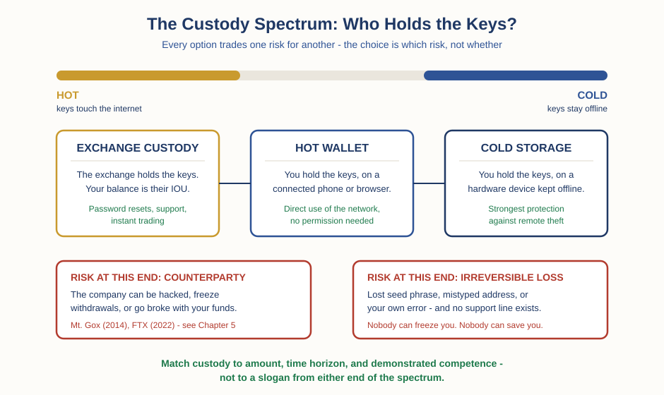

# Crypto — Chapter 1, Lesson 4: Wallets, Keys & Custody

## Learning Objectives

By the end of this lesson, you will be able to:

- Explain why a crypto wallet holds keys, not coins — and where the coins actually live
- Tell a public address apart from a private key, and explain what each one lets a person do
- Explain what a seed phrase is, what it backs up, and why anyone who reads it controls the money
- Place the main custody options on the hot-to-cold spectrum, and name the specific risk you accept at each end

---

## 1. Your Wallet Is Empty — and That Is the Point

Lesson 2 established where coins live: on the blockchain, the shared ledger that thousands of computers each keep a full copy of. Coins never leave that ledger. When someone "sends you bitcoin," no coin file arrives on your phone. The ledger updates to say that a certain amount is now spendable by a certain address — and every copy of the ledger agrees.

So if the coins stay on the ledger, what does a wallet actually hold?

:::definition
**Wallet** — Software or hardware that creates and stores your keys, and uses them to sign transactions. A wallet holds no coins. The coins are entries on the blockchain's ledger; the wallet holds the keys that control them.
:::

Your banking app works the same way, and you already trust it. The app on your phone contains no money. Delete the app, and your balance still exists at the bank. Reinstall and log in, and access returns. A crypto wallet is the same — with one enormous difference. At the bank, the referee from Lesson 1 keeps the master record and can restore your access. On a blockchain, there is no referee. The keys are the only access there is.

That difference cuts both ways. Destroy your phone, and your coins are untouched on the ledger — restore your keys on a new device and you control them again. But lose the keys with no backup, and the coins are still untouched on the ledger. Visible. Forever. Spendable by no one. The network has no way to know the owner is gone.

---

## 2. Two Keys: the Mailbox and the Signature

Every address on the ledger comes with a pair of mathematically linked keys. The intuition is a mailbox.

:::definition
**Public Key / Address** — The shareable half of the key pair. An address (derived from the public key) works like the slot on a mailbox: anyone who knows it can put money in, and nobody can take money out through it. Sharing your address is safe — it is how people pay you.
:::

:::definition
**Private Key** — The secret half of the key pair: a very large number that acts as the only signature the network accepts for spending from your address. Whoever knows the private key controls the money. There is no "owner" on a blockchain other than this.
:::

Spending works like signing a check that everyone can verify. Your wallet uses the private key to produce a digital signature on the transaction. The network checks that the signature matches the address the money is leaving from. The mathematics lets everyone verify the signature without ever seeing the private key itself — which is why you can transact in public without giving your key away.

Notice what the ledger checks and what it does not. It checks the signature. It does not check intent. It has no idea whether you meant this payment, mistyped the address, or were tricked.

:::warning
Blockchain transactions do not reverse. There is no chargeback, no fraud department, no undo. Send coins to a mistyped address, and they are gone — the ledger did exactly what a valid signature told it to do. Send coins to a scammer, and the network cannot tell theft-by-trickery from a gift. Every protection you are used to from card payments lives in the referee — and the referee is the thing this system removed. Verify addresses before sending, every time.
:::

---

## 3. Twelve Words That Are the Money

Early wallets made users back up each private key separately — lose one, lose that money. Modern wallets fix this by generating every key you will ever need from a single master secret. A widely adopted standard called BIP-39 encodes that master secret as a short list of ordinary words — usually 12 or 24 — drawn from a fixed list of 2,048 words.

:::definition
**Seed Phrase** — A sequence of words (commonly 12 or 24, from the BIP-39 standard's fixed word list) that encodes the master secret from which a wallet generates all of its private keys. Anyone who has the phrase can rebuild the entire wallet — every key, every coin — on any device, anywhere.
:::

Read that definition again slowly, because it is the most practically important sentence in this chapter. The seed phrase is not a password to the money. It is the money. A password unlocks an account that a company controls, and the company can reset it. A seed phrase regenerates the keys themselves. There is no reset. There is no customer support line. If the phrase is lost, nobody on Earth can recover the keys. If the phrase is copied — photographed, typed into the wrong website, read off the note on your desk — the copier does not need your phone, your fingerprint, or your permission. They already have everything.

:::example
This is why the standard advice is to write a seed phrase on paper or metal and store it offline, and why no serious wallet ever emails it to you or stores it "in your account." A phrase kept only in your head can be forgotten. A phrase kept as a screenshot can be stolen by any app that reads your photos. The backup problem is real, physical, and yours.
:::

:::warning
No legitimate support agent, wallet company, exchange, or app will ever ask for your seed phrase. Ever. There is no technical task — "validating," "syncing," "unlocking," "verifying your wallet" — that requires it. A person or website asking for your seed phrase is attempting to take your money, with a script polished on thousands of victims before you. This is currently one of the most common ways crypto is actually stolen: not by breaking the mathematics, but by asking politely.
:::

---

## 4. The Custody Spectrum: Hot to Cold

You now know what the keys are. The next question is who holds them, and on what kind of device. That question has a name.

:::definition
**Custody** — Who controls the keys to an asset. If a company holds the keys and owes you the balance, the asset is in their custody. If you hold the keys, you have taken custody yourself.
:::

:::definition
**Self-Custody** — Holding your own keys, so that no company stands between you and your coins. You gain independence from any custodian — and you inherit every job the custodian was doing: security, backups, and the consequences of mistakes.
:::

Custody options sit on a spectrum, usually described in terms of temperature: how connected to the internet the keys are.

:::definition
**Hot Wallet** — A wallet whose keys live on an internet-connected device: a mobile app, a browser extension, a desktop program. Convenient for frequent use; exposed, by that same connection, to malware and phishing.
:::

:::definition
**Cold Storage** — Keeping keys on something that never touches the internet — most commonly a hardware wallet, a small device that signs transactions internally so the keys never reach the connected computer. Strongest against remote theft; does nothing to protect you from losing the device and the seed phrase backup.
:::

Here is the honest version of the trade-off, in one table:

| Option | Who holds the keys | Main risk you carry | What you get in return |
|---|---|---|---|
| Exchange custody | The exchange | Counterparty risk: hacks, frozen withdrawals, insolvency | Password resets, customer support, instant trading |
| Hot wallet (mobile / browser) | You, on a connected device | Phishing, malware, mistyped addresses | Direct use of the network, no permission needed |
| Cold storage (hardware) | You, offline | Irreversible loss: lost seed, destroyed device, your own errors | Strongest protection against remote theft |

Read the table columns, not just the rows. No option has an empty risk cell. Moving along the spectrum does not remove risk — it swaps one kind for another. Exchange custody carries the risks of trusting a company. Self-custody carries the risks of being your own bank: nobody can freeze your money, and nobody can save it either.

---

## 5. "Not Your Keys, Not Your Coins" — a Trade-off, Not a Slogan

You will hear this slogan constantly: coins on an exchange are not really yours, because the exchange holds the keys. Both halves of the honest version deserve a look.

The slogan is pointing at something real. An exchange balance is not coins on the ledger under your key — it is the exchange's promise to pay you, an IOU on the exchange's internal books, exactly like the bank ledger from Lesson 1. If the exchange fails, the promise fails with it. This has happened at scale. In February 2014, Mt. Gox — then the largest bitcoin exchange — collapsed with roughly 850,000 bitcoins missing, about 750,000 of them belonging to customers (around 200,000 were later found). In November 2022, the exchange FTX failed with an estimated 8 billion dollars of customer funds missing. One sentence each is all they get here, because Chapter 5 takes both apart as full case studies. For now, the point stands: counterparty risk in crypto custody is not hypothetical.

But the slogan is silent about the other side of the ledger, and the other side is also well documented. Self-custody has its own body count — measured in keys, not counterparties.

The scale first, stated as carefully as the data allows. In a June 2020 analysis, the blockchain-data firm Chainalysis estimated that roughly 3.7 million bitcoin — about 20% of all coins in existence at the time — had not moved in five years or more, and were likely lost. Treat that number as an estimate, not a fact. Its method is dormancy: coins that have not moved for years are assumed lost, but the blockchain cannot distinguish a destroyed key from a patient holder, so the true figure is unknowable by nature. What the estimate honestly supports is the direction: the amount of crypto permanently stranded by lost keys is not an edge case. It is a meaningful share of everything ever created.

The individual stories make the mechanism concrete. James Howells, a British IT worker, mined roughly 8,000 bitcoin in 2009 and lost the hard drive holding his private keys when it was mistakenly thrown out in 2013 and buried in a landfill in Newport, Wales. He spent over a decade trying to excavate it. In January 2025, the UK High Court dismissed his claim against the city council, ruling the buried drive was legally the council's property; his appeal was rejected two months later. Note what that story actually teaches: the coins were never stolen. The ledger still shows them. No hacker, no fraud — just a backup that ended up in the ground, and a legal system that could not help. Programmer Stefan Thomas tells the same story in miniature: 7,002 bitcoin earned in 2011, keys locked on an encrypted IronKey drive whose password he lost, with a device that erases itself after 10 wrong guesses — eight of which he has already used.

:::warning
Hold both failure lists in your head at once, because each one is regularly used to sell you something. "Not your keys, not your coins" is the sales pitch for hardware wallets; "self-custody is too dangerous" is the sales pitch for custodians. Both are half-arguments. Exchange failures prove custody risk is real. Lost-key stories prove self-custody is a skill — one that Howells and Thomas, both technically sophisticated, still failed at. Moving to self-custody does not make you safer by itself. It makes you responsible.
:::

So the honest answer to "should I hold my own keys?" is not yes or no. It is: match the custody to the amount, the time horizon, and — this is the part people skip — your actually demonstrated competence, not your assumed competence.

:::practice
The custody decision checklist. Answer these three questions in writing before deciding where any crypto should live:

1. Amount — if this money vanished tomorrow, is it an annoyance, a wound, or a catastrophe? An annoyance can live wherever is convenient. A catastrophe should never depend on a single point of failure — including a single company, and including a single piece of paper.
2. Horizon — will you touch this money weekly, or not for years? Frequent trading pulls toward hot custody; long holding pulls toward cold, because every extra month of exchange custody is another month of counterparty risk you are not being paid for.
3. Competence — have you proven, not assumed, that you can do this? The test: send a small amount to a self-custody wallet, delete the wallet, and restore it from your written seed phrase on a different device. If you have never done that drill, your cold storage is a theory. Do the drill with an amount you can afford to lose before trusting the setup with an amount you cannot.
:::

---

## What to Look For

- Before sending any transaction, verify the address — check the first and last several characters at minimum, and send a small test amount first when the sum matters. The ledger executes valid signatures; it does not check intent.
- Any person, site, or pop-up asking for your seed phrase is attempting theft. There are no exceptions, and "support agent" is the single most common costume.
- When you see a balance on an exchange, name it correctly: it is the exchange's IOU to you, not coins under your key. That can be an acceptable risk — but only if you know you are taking it.
- When someone quotes the "20% of bitcoin is lost" figure, notice whether they present it as an estimate with a method (dormancy since 2020, per Chainalysis) or as a fact. The blockchain cannot tell lost coins from patient holders.
- When either slogan appears — "not your keys, not your coins" or "self-custody is too risky" — ask what the speaker is selling. Each slogan is one true half of a two-sided trade-off.

---

## Practice / Quiz

1. Your phone, with your only crypto wallet app on it, is destroyed. You have your seed phrase written on paper at home. What happened to your coins?
   - A) They were destroyed with the phone and are gone
   - B) Nothing — they are on the blockchain's ledger, and the seed phrase can regenerate the keys on a new device
   - C) They automatically moved to the wallet company's servers for safekeeping
   - D) They are frozen until you contact the wallet's customer support

   **Correct: B.** The wallet never held the coins — it held the keys. The coins are entries on the ledger, which thousands of computers still maintain. The seed phrase rebuilds every key on any device. (And note the mirror image: with the phone destroyed and no written phrase, the coins would be visible on the ledger forever and spendable by no one.)

2. A "support agent" from your wallet's official-looking help chat says your wallet needs to be "re-validated" and asks you to enter your 12-word seed phrase on a verification page. What is the correct response?
   - A) Enter it — support agents need the phrase to fix wallet problems
   - B) Enter it, but only on a page showing the padlock icon for a secure connection
   - C) Refuse and leave — no legitimate support ever needs a seed phrase, and anyone who has it has the money
   - D) Give them half the words as a compromise

   **Correct: C.** The seed phrase regenerates every private key. Whoever has it does not need your device or your permission — they already control the coins, and blockchain transactions do not reverse. No real support process requires it; the request itself is the proof of a scam. (A secure connection to a thief is still a thief.)

3. Moving your coins from an exchange into self-custody on a hardware wallet does what to your risk?
   - A) Removes risk — self-custody is the safe option
   - B) Adds risk — exchanges are professionally secured and safer for everyone
   - C) Swaps counterparty risk (exchange hacks, freezes, insolvency) for operational risk (lost seed, user error, irreversible mistakes)
   - D) Nothing — where coins are held makes no practical difference

   **Correct: C.** Mt. Gox and FTX show the counterparty risk on one end; an estimated millions of bitcoin stranded by lost keys — and cases like the Howells landfill drive — show the loss risk on the other. Self-custody removes the custodian and transfers all of the custodian's jobs to you. Whether that swap improves your position depends on the amount, your horizon, and your demonstrated competence.

---

## Key Terms Recap

| Term | One-line definition |
|---|---|
| Wallet | Software or hardware that stores keys and signs transactions; it holds no coins — those live on the ledger. |
| Public Key / Address | The shareable half of a key pair; like a mailbox slot, anyone can pay into it and no one can take out. |
| Private Key | The secret half of a key pair; the only signature the network accepts for spending. Whoever knows it controls the money. |
| Seed Phrase | A word list (BIP-39; usually 12 or 24 words) encoding the master secret that regenerates all of a wallet's keys. |
| Custody | Who controls the keys — a company on your behalf, or you directly. |
| Self-Custody | Holding your own keys: no custodian between you and the coins, and no custodian doing security or backups for you. |
| Hot Wallet | A wallet whose keys live on an internet-connected device; convenient, and exposed to malware and phishing. |
| Cold Storage | Keys kept offline (typically a hardware wallet); strongest against remote theft, no protection against losing the backup. |

---

*Coming next: Lesson 5 — Exchanges: CEX vs DEX, order books vs AMMs, and what actually happens to your money on each.*
