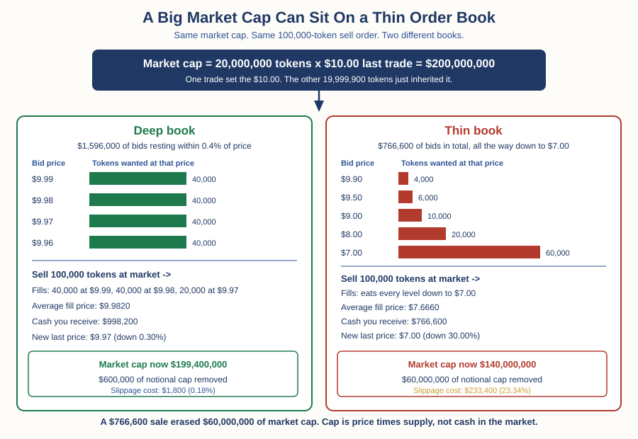

# Crypto — Chapter 2, Lesson 1: Market Cap, Liquidity & Volume

## Learning Objectives

By the end of this lesson, you will be able to:

- Compute a market capitalization, and explain why it is not "money invested" and not what the asset could be sold for
- Tell circulating, total and fully diluted supply apart, and compute a fully diluted valuation
- Read an order book as depth, and compute what a given market order does to price in a thin book versus a deep one
- Explain what wash trading is, cite what the measured evidence says about its scale, and treat reported volume on unregulated venues accordingly

---

## 1. The Number Everyone Quotes

Open any crypto price site. The first column is price. The second is almost always market capitalization, and coins are ranked by it. It is the number that decides whether something is called a "large cap" or a "small cap," and it is the number most people use to decide whether an asset is "still early."

Almost nobody who quotes it can say what it actually measures.

:::definition
**Market Capitalization (Market Cap)** — The last traded price multiplied by the number of units in circulation. It is one multiplication, nothing more. It measures what every unit would be worth if every unit could be sold at the most recent price.
:::

That last sentence contains the entire problem. Market cap takes the price of the most recent trade — which might have been for 10 tokens — and applies it to every token in existence.

:::example
A token trades at 0.40 dollars. There are 500,000,000 tokens in circulation.

Market cap = 0.40 x 500,000,000 = 200,000,000 dollars.

Now look at what actually happened that day. Only 2,000,000 tokens changed hands, which is 0.4% of the supply. At 0.40 dollars each, that is 800,000 dollars of real buying and selling. So 800,000 dollars of trading is being used to price a 200,000,000 dollar valuation. The other 99.6% of the supply never moved. It simply inherited the price set by the last trade.
:::

This is not a crypto quirk. Stock market caps work the same way. But two things make the effect far larger in crypto: many tokens have a very small share of supply actually available to trade, and many trade on venues with very little depth. Both are covered below.

:::warning
**Market cap is not money that went in.** A 200,000,000 dollar market cap does not mean investors put 200,000,000 dollars into the asset. It does not mean 200,000,000 dollars could come out. It means one recent trade happened at a price, and that price was multiplied by the supply. When a news article says "1 billion dollars was wiped off the crypto market today," it is describing a multiplication changing, not a billion dollars leaving anyone's pocket.
:::

The relationship between money going in and market cap moving has been studied directly. Rodney Garratt and Maarten van Oordt developed what they call the "crypto multiplier" — a measure of how much a cryptocurrency's market capitalization moves in response to money flowing in or out. Their central result is that the multiplier is generally greater than 1: one dollar of net inflow moves market capitalization by more than one dollar. The multiplier is largest when most coins are held as an investment rather than spent, and they find that the share of coins actually used for payments is small for the major cryptocurrencies. Their paper appeared as Bank for International Settlements Working Paper No. 1104 in June 2023 and was later published in the Journal of Corporate Finance.

Read that finding carefully, because it cuts both ways. It explains why modest inflows can produce large market cap gains. It equally explains why modest outflows can produce large market cap losses. A number that can be levered up by small flows can be levered down by them too.

---

## 2. Which Supply? Circulating, Total, and Fully Diluted

"Price times supply" hides a second question: which supply?

:::definition
**Circulating Supply** — The number of units currently issued and available to trade. This excludes tokens that are locked, vesting, reserved for the team, or held back by the project. The circulating share of a token is often called its float.
:::

:::definition
**Total Supply (and Max Supply)** — Total supply is every unit that has been created, including locked and unvested units. Max supply is the hard ceiling the software will ever allow. For Bitcoin, Chapter 1 Lesson 1 showed that ceiling is just under 21 million. Many tokens have no max supply at all.
:::

:::definition
**Fully Diluted Valuation (FDV)** — The last traded price multiplied by the total or maximum supply, rather than the circulating supply. It answers a hypothetical question: what would the market cap be if every token that will ever exist were already trading at today's price?
:::

FDV is where low-float tokens get flattering. Here is the arithmetic.

:::example
A token trades at 2.00 dollars. 100,000,000 tokens circulate. Total supply is 1,000,000,000.

Market cap = 2.00 x 100,000,000 = 200,000,000 dollars.
FDV = 2.00 x 1,000,000,000 = 2,000,000,000 dollars.
Market cap divided by FDV = 200,000,000 / 2,000,000,000 = 10%.

So 90% of the supply has not reached the market yet. That is 900,000,000 tokens still to come. For the price to stay at 2.00 dollars once they all unlock, buyers must absorb 900,000,000 x 2.00 = 1,800,000,000 dollars of new supply. If instead the total money in the asset stays at 200,000,000 dollars while supply grows to 1,000,000,000 tokens, the price becomes 200,000,000 / 1,000,000,000 = 0.20 dollars — a 90% fall, with no change in the story, the technology, or the team.
:::

That pattern is common enough to have a name in the industry: low float, high FDV. Binance Research published a study in May 2024 finding that tokens launched in 2024 had an average market cap to FDV ratio of 12.3% — very close to the example above. The same report estimated roughly 155 billion dollars of tokens scheduled to unlock between 2024 and 2030. Treat the numbers as an industry estimate rather than peer-reviewed evidence: Binance is an exchange, and the report is written by an exchange's research arm. The measurement is still specific, dated, and checkable, which is why it is worth quoting rather than a vague claim that "float is low these days."

:::warning
A low market cap next to a huge FDV is not a bargain. It is a schedule. It tells you that a large quantity of supply is contracted to arrive later, usually at a cost basis far below yours. Before you use either number, check three things: what the circulating supply is, what the total supply is, and when the difference unlocks.
:::

---

## 3. Liquidity Is Depth, Not Volume

Chapter 1 Lesson 5 taught you the order book: the live list of resting bids and asks at each price, with the spread as the gap between the best bid and the best ask. That lesson ended with a promise — that how deep those books really are, and why reported volume can mislead, would be covered here. This is that lesson.

Liquidity, as the glossary defines it, is how easily an asset can be bought or sold without significantly moving its price. Notice what that definition does not mention: volume. Volume tells you how much traded. Liquidity tells you what it would cost you to trade now. Those are different questions, and only one of them affects your fill.

:::definition
**Order Book Depth** — How many units are resting as buy and sell orders at each price level, and therefore how much can be traded before the price has to move. A book can be deep close to the current price and vanish a few percent away from it, so depth is always described at a distance: "how much can I sell within 1% of the current price?"
:::

:::definition
**Price Impact** — How far your own order moves the price, because it consumes the resting orders on the other side. Price impact grows with the size of your order relative to the depth available. It is the reason large orders receive a worse average price than small ones.
:::

Chapter 1 Lesson 5 already showed you this on the other kind of venue. On a decentralized exchange using an automated market maker, your own trade moves the price along a formula, and it moves it more the larger your trade is relative to the pool. On a centralized exchange with an order book, the same thing happens for a different mechanical reason: you eat through resting bids one price level at a time. Both produce slippage, which the Forex track defines in Chapter 1 Lesson 7 as the gap between the price you expected and the price you got.

Academics measure crypto liquidity the same way they measure it in other markets, and they do not use volume to do it. Brauneis, Mestel, Riordan and Theissen tested how well low-frequency, easily computed liquidity measures track actual high-frequency liquidity in cryptocurrency markets, in a paper published in the Journal of Banking & Finance, Volume 124, in 2021. Their measures are built from spreads and price impact, not from reported trade counts. When researchers want to know how liquid a crypto market is, they look at what it costs to trade, not at how much volume an exchange claims.

---

## 4. What a Thin Book Actually Does to You

Time to compute it. Take one token, one market cap, and two different books.

The token last traded at 10.00 dollars. Circulating supply is 20,000,000 tokens. Market cap is 10.00 x 20,000,000 = 200,000,000 dollars. That figure is identical in both cases below.

You want to sell 100,000 tokens with a market order. That is 100,000 / 20,000,000 = 0.5% of the circulating supply.

:::example
**The deep book.** Bids are resting in size close to the price: 40,000 tokens wanted at 9.99, another 40,000 at 9.98, another 40,000 at 9.97, another 40,000 at 9.96. That is 1,596,000 dollars of buying interest within 0.4% of the last price.

Your sell order fills like this:
- 40,000 at 9.99 = 399,600 dollars
- 40,000 at 9.98 = 399,200 dollars
- 20,000 at 9.97 = 199,400 dollars

You receive 998,200 dollars. Your average fill price is 9.9820. At 10.00 dollars you would have received 1,000,000 dollars, so the trade cost you 1,800 dollars, or 0.18%. The new last price is 9.97, down 0.30%. Market cap is now 9.97 x 20,000,000 = 199,400,000 dollars.
:::

:::example
**The thin book.** Same token, same market cap, same order. But the bids look like this: 4,000 tokens at 9.90, then 6,000 at 9.50, then 10,000 at 9.00, then 20,000 at 8.00, then 60,000 at 7.00. The entire bid side, all the way down to 7.00 dollars, is worth 766,600 dollars.

Your sell order eats every level:
- 4,000 at 9.90 = 39,600 dollars
- 6,000 at 9.50 = 57,000 dollars
- 10,000 at 9.00 = 90,000 dollars
- 20,000 at 8.00 = 160,000 dollars
- 60,000 at 7.00 = 420,000 dollars

You receive 766,600 dollars. Your average fill price is 7.6660. Against the 1,000,000 dollars the screen implied, the trade cost you 233,400 dollars, or 23.34%. The new last price is 7.00, down 30.00%. Market cap is now 7.00 x 20,000,000 = 140,000,000 dollars.
:::

Compare the two results, because the contrast is the lesson. The same 200,000,000 dollar market cap, and the same routine-looking 0.5% sale, produced a 1,800 dollar cost in one book and a 233,400 dollar cost in the other. And in the thin book, a sale that moved 766,600 dollars of real cash removed 60,000,000 dollars of market cap. That is the crypto multiplier from Section 1, visible in a single trade.

Nothing on the price page would have warned you. Price was 10.00 in both cases. Market cap was 200,000,000 in both cases. The only number that distinguished them was depth, and depth is not on the price page.

:::practice
Pick any token outside the ten largest by market cap. Open its order book on a large exchange. Add up the size of the bids sitting within 2% of the current price, and convert that to dollars. Now compare that figure to the token's stated market cap. Write the ratio down. For most small tokens it is a fraction of 1%. That ratio, not the market cap, is what tells you whether you could exit a position.
:::

---

## 5. Volume: The Most Manipulated Number in Crypto

Volume looks like the honest number. It is a count of what traded, and a high figure looks like proof that a market is real and active. That is exactly why it is worth faking.

:::definition
**Wash Trading** — Trading with yourself. The same party, or parties acting together, buys and sells the same asset so that a transaction is recorded without any real change in ownership or economic risk. It manufactures volume, and it can manufacture price. In US futures markets it is explicitly unlawful: Section 4c(a) of the Commodity Exchange Act bans entering into any transaction that is "commonly known to the trade as a 'wash sale' or 'fictitious sale'," and the CFTC brings enforcement actions over it. On unregulated crypto venues, nobody is stopping it.
:::

Why do it? An exchange with high reported volume ranks higher on data sites, attracts listings, and can charge projects for them. A token project with high reported volume looks like it has demand. And a wash trader can push a price up on a thin book, precisely because Section 4's arithmetic works in both directions.

The measured scale is large, and different studies disagree about how large. That disagreement is worth showing you rather than smoothing over.

In March 2019, the asset manager Bitwise presented research to United States Securities and Exchange Commission staff, as part of the review of a proposed bitcoin exchange-traded fund. The presentation, filed publicly on the SEC's website under File No. SR-NYSEArca-2019-01, argued that roughly 95% of reported bitcoin spot volume was fake or non-economic. Bitwise analysed 81 exchanges reporting more than 1 million dollars of daily volume and concluded that the data from 71 of them was fake or wash traded. Against roughly 6 billion dollars of reported daily volume, they estimated the real figure at roughly 273 million dollars, concentrated on 10 exchanges.

Two honest caveats belong with that famous 95% figure. First, Bitwise had a direct commercial interest in the conclusion: its argument was that the real bitcoin market is small, orderly and therefore suitable for an ETF. Second, the SEC did not accept the overall case. On 9 October 2019 it issued an order disapproving the proposed rule change, finding the applicant had not met its burden to show the market was resistant to fraud and manipulation. The wash-trading research was serious work. The conclusion drawn from it was contested by the regulator it was presented to.

Peer-reviewed research has since produced its own estimates using a different method. Lin William Cong, Xi Li, Ke Tang and Yang Yang published "Crypto Wash Trading" in Management Science, Volume 69, Issue 11, in 2023, pages 6427 to 6454. It circulated earlier as National Bureau of Economic Research Working Paper 30783. Rather than auditing exchanges, they detected fake trades statistically: real trading obeys certain regularities, including a characteristic distribution of leading digits and a characteristic pattern of round-number trade sizes, and manipulated volume does not. Across 29 centralized exchanges, they found regulated exchanges behaved normally while unregulated ones did not. Their estimate for wash trading on unregulated exchanges averaged 77.5% of reported volume, with a median of 79.1%. Scaled against reported volumes, that implied over 4.5 trillion dollars of wash trading in spot markets in the first quarter of 2020 alone.

A third estimate, from practitioners rather than academics, is lower. In August 2022, Forbes analysed 157 crypto exchanges and concluded that about 51% of reported daily bitcoin trading volume was likely fake or non-economic — 128 billion dollars of real volume against 262 billion dollars reported.

Three studies, three numbers: roughly 95%, roughly 77.5%, roughly 51%. They used different methods, different years, and different sets of exchanges, so they are not directly comparable and should not be averaged into a single tidy figure. What they agree on is the direction and the order of magnitude: on unregulated venues, a large fraction of reported volume is not real, and the honest range is "most of it" rather than "a bit of it."

:::warning
**Reported volume on an unregulated venue is not evidence of anything.** Do not use it to judge whether a token is liquid, whether an exchange is safe, or whether interest is rising. Volume is self-reported by the venue that profits from it looking high. Depth, by contrast, is much harder to fake convincingly, because faked depth has to be real orders that you can actually hit — and if you can hit them, someone can take your money by leaving them there.
:::

---

## 6. "It Is a Small Cap, So It Can Easily 10x"

You will meet this argument constantly. It sounds like analysis. It is worth taking apart, because it is a claim about arithmetic disguised as a claim about value.

The argument runs: this token's market cap is 20 million dollars, and that other token's is 20 billion, so this one has 1,000 times the room to grow. Every part of that is a supply-side statement. Market cap is price times circulating supply, so saying "the cap is small" says only that price times float is small. It says nothing about whether anyone wants the token.

:::warning
"Small cap so it can 10x" is a claim about liquidity and float, not a valuation. It is also symmetrical, and people only ever state one half of it. A thin book that lets 766,600 dollars lift a price 30% is the identical thin book that lets 766,600 dollars drop it 30% — Section 4 computed both directions from the same ladder. A small cap does mean a small amount of money can move the price a long way. That is a description of fragility, not of opportunity.
:::

There is a further trap in the comparison itself. Comparing a low-float token's market cap to an established asset's market cap compares two different things, because one of them has 90% of its supply still to arrive. If you want the comparison to mean anything, compare FDV to FDV, and then check the unlock schedule that FDV is quietly assuming.

None of this means small assets cannot rise. It means the sentence "the cap is small" is not a reason. The reason, if one exists, has to be an argument about demand — and Chapter 1 Lesson 1 already set that rule down: scarcity limits supply, value requires demand.

---

## What to Look For

- When someone quotes a market cap, ask what the circulating supply is and what the total supply is. If market cap divided by FDV is well under 50%, most of the supply has not arrived yet.
- When someone says a number was "wiped off" a market, remember that a market cap change is a multiplication changing, not that quantity of cash leaving.
- Before entering a position, add up the resting bids within 1% and 2% of price and compare that to the size you intend to sell. If your intended exit is larger than the depth, you do not have an exit at that price.
- Treat reported volume on an unregulated venue as a marketing figure. If you must use volume, prefer venues with regulatory oversight, and prefer depth over volume in every case.
- When a token's volume is high but its book is thin, treat the mismatch as a warning rather than as excitement. That combination is exactly what wash trading produces.
- When someone argues from "small cap," ask what the demand argument is. If there is not one, there is no argument.

---

## Practice / Quiz

1. A token trades at 2.00 dollars with 100,000,000 tokens circulating and 1,000,000,000 total supply. What is its market cap and its FDV?
   - A) Market cap 2,000,000,000 dollars; FDV 200,000,000 dollars
   - B) Market cap 200,000,000 dollars; FDV 2,000,000,000 dollars
   - C) Market cap 200,000,000 dollars; FDV 200,000,000 dollars
   - D) Market cap 1,000,000,000 dollars; FDV 2,000,000,000 dollars

   **Correct: B.** Market cap uses circulating supply: 2.00 x 100,000,000 = 200,000,000 dollars. FDV uses total supply: 2.00 x 1,000,000,000 = 2,000,000,000 dollars. Market cap divided by FDV is 10%, so 90% of the supply is still to arrive. At 2.00 dollars, absorbing it would take 1,800,000,000 dollars of new buying.

2. Two tokens each have a 200,000,000 dollar market cap and a 10.00 dollar price. In the first, 40,000 tokens are bid at each of 9.99, 9.98, 9.97 and 9.96. In the second, the whole bid side down to 7.00 dollars holds 100,000 tokens worth 766,600 dollars. You sell 100,000 tokens at market in each. What happens?
   - A) Both fill near 10.00 dollars, because both have the same market cap
   - B) The first fills at an average of 9.9820; the second fills at an average of 7.6660 and drops the price 30%
   - C) The second fills better, because there are more price levels available
   - D) Neither order fills, because 100,000 tokens is too large

   **Correct: B.** In the deep book you take 40,000 at 9.99, 40,000 at 9.98 and 20,000 at 9.97, receiving 998,200 dollars — a cost of 1,800 dollars, or 0.18%. In the thin book you eat every level down to 7.00 and receive 766,600 dollars — a cost of 233,400 dollars, or 23.34%. Market cap was identical. Depth was not, and depth is what set your fill.

3. An exchange reports very high daily volume for a token, but its order book has only a few thousand dollars of bids within 2% of price. What is the most reasonable conclusion?
   - A) The token is highly liquid, because volume is high
   - B) The high volume proves strong genuine demand
   - C) The reported volume may be wash trading, and the depth is the number to trust
   - D) The exchange is understating its true depth

   **Correct: C.** Volume is self-reported by a venue that benefits from it looking high, and wash trading manufactures it without any real change in ownership. Cong, Li, Tang and Yang estimated wash trading averaged 77.5% of reported volume on unregulated exchanges; Bitwise put fake bitcoin spot volume near 95% in 2019; Forbes put it near 51% in 2022. The estimates differ, but all of them are large. Depth is harder to fake, because resting orders can actually be traded against.

---

## Key Terms Recap

| Term | One-line definition |
|---|---|
| Market Capitalization (Market Cap) | The last traded price multiplied by circulating supply — one multiplication, not money invested. |
| Circulating Supply | The units currently issued and available to trade, excluding locked, vesting or reserved tokens. |
| Total Supply (and Max Supply) | Total supply is every unit created including locked units; max supply is the hard ceiling the software allows. |
| Fully Diluted Valuation (FDV) | The last traded price multiplied by total or maximum supply, as if every future unit already traded today. |
| Order Book Depth | How many units rest as orders at each price level, and therefore how much can trade before price moves. |
| Price Impact | How far your own order moves the price by consuming the resting orders on the other side. |
| Wash Trading | Trading with yourself to manufacture volume or price, with no real change in ownership or risk. |

---

*Coming next: Lesson 2 — Cycles & Halvings: the four-year narrative examined honestly, what the data shows and what it cannot.*
