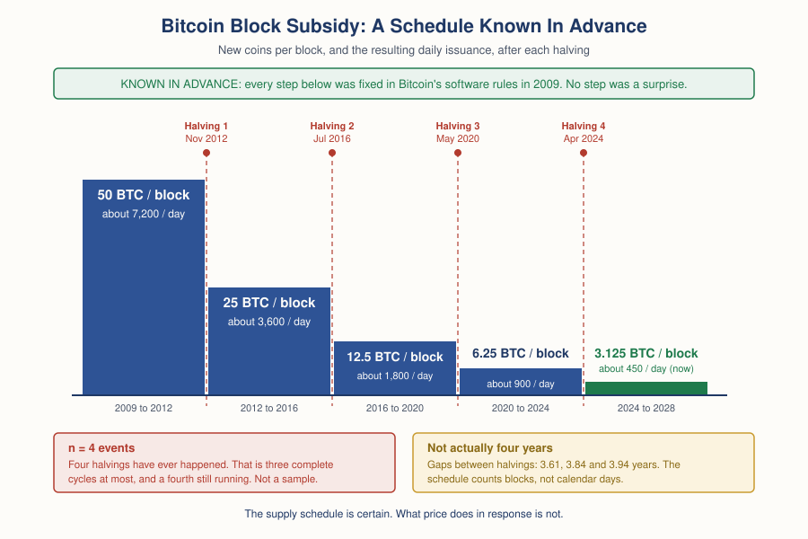

# Crypto — Chapter 2, Lesson 2: Cycles & Halvings

## Learning Objectives

By the end of this lesson, you will be able to:

- Explain what the halving does to Bitcoin's supply issuance, and state the schedule precisely
- State the popular four-year-cycle narrative fairly, in the words its supporters use
- Name the three specific reasons that narrative does not yet qualify as established evidence: small sample, confounded causes, and a publicly known schedule
- Separate what the halving data genuinely supports from what it cannot support

---

## 1. The Halving: What It Is, and What It Does to Supply

Chapter 1, Lesson 3 gave you the mechanics. Miners who add a valid block earn the **block subsidy** — newly created coins — plus the block's transaction fees. Every 210,000 blocks, the software cuts that subsidy in half. That is the halving. The **difficulty adjustment** holds the block pace near 10 minutes no matter how much mining power joins, so the schedule advances in blocks, not in calendar time.

:::definition
**Halving** — The scheduled event where Bitcoin's block subsidy is cut in half, every 210,000 blocks. It is written into the software rules, so the entire future schedule has been public since the network started in 2009.
:::

Here is the full history, with the resulting supply issuance at the target pace of about 144 blocks a day:

| Halving | Date | Subsidy before | Subsidy after | New coins per day after |
|---|---|---|---|---|
| — | Jan 2009 (launch) | — | 50 BTC | about 7,200 |
| 1st | 28 November 2012 | 50 BTC | 25 BTC | about 3,600 |
| 2nd | 9 July 2016 | 25 BTC | 12.5 BTC | about 1,800 |
| 3rd | 11 May 2020 | 12.5 BTC | 6.25 BTC | about 900 |
| 4th | 20 April 2024 | 6.25 BTC | 3.125 BTC | about 450 |

Sources disagree on the fourth halving by one day. Block 840,000 was mined at roughly 00:09 UTC on 20 April 2024, which was still the evening of 19 April in North American time zones — so you will see both dates published. The block height is the fact; the calendar date is a reporting convention.

The supply effect is real and easy to state. Before April 2024, the network issued about 328,500 new coins a year against a circulating supply near 19.7 million — roughly 1.67% annual growth. After April 2024, it issues about 164,250 a year against a supply that passed 20 million in March 2026 — roughly 0.82%. Around 95% of the 21 million cap has already been mined.

:::example
The subsidy has fallen by a factor of 16 since launch: 50 divided by 3.125 equals 16. That is a large change to the rate of new supply. It is not a change to the existing supply, which is what almost 20 million coins already in circulation represents. Roughly 450 new coins a day enter a market where far more than that trades every hour.
:::

Note one detail that the phrase "every four years" hides. The gaps between the four halvings were 1,319 days, 1,402 days and 1,440 days — 3.61, 3.84 and 3.94 years. Blocks arrive faster than 10 minutes when mining power is growing, so the schedule ran ahead of the calendar. The "four-year cycle" has not once been four years long.

---

## 2. The Four-Year Narrative, Stated Fairly

Now the claim itself, put as strongly as its supporters put it. This lesson is not a hatchet job. A claim you cannot state fairly is a claim you have not understood.

The narrative borrows a four-phase market model from Richard Wyckoff, an American investor who set out his framework in the early 1900s. The four phases are accumulation, markup, distribution and markdown.

:::definition
**Market Cycle** — A repeating sequence of phases a market is said to pass through: accumulation (quiet buying after a crash), markup (a sustained rise), distribution (large holders selling into strength), and markdown (the decline). The model comes from Wyckoff's work on early-1900s stock markets, long before crypto existed.
:::

Applied to Bitcoin, the story runs like this. The halving cuts new supply. If demand holds steady while supply growth halves, price should rise. The rise takes time to build, so the cycle top arrives roughly 12 to 18 months after the halving. Then distribution and markdown follow, a deep bear market clears out leveraged holders, and accumulation begins again ahead of the next halving.

The timing claim is the specific, checkable part, so check it. Measuring from each halving to the highest price of that cycle:

| Halving | Cycle peak | Days | Months |
|---|---|---|---|
| 28 Nov 2012 | 30 Nov 2013 | 367 | 12.1 |
| 9 Jul 2016 | 16 Dec 2017 | 525 | 17.2 |
| 11 May 2020 | 10 Nov 2021 | 548 | 18.0 |
| 20 Apr 2024 | 6 Oct 2025 | 534 | 17.5 |

All four land inside the stated 12-to-18-month window. That is the strongest form of the case, and it is a genuinely striking table. The rest of this lesson explains why a striking table is not the same as evidence.

---

## 3. Problem One: Four Events Is Not a Sample

There have been four halvings. Four. That means three completed halving-to-halving cycles, and a fourth still unfolding as this lesson is written.

:::warning
Ask what four matching observations would prove in any other setting. Flip a coin four times and get four heads — nobody concludes the coin is loaded, because four heads happens by chance about one time in sixteen with a perfectly fair coin. Foundations Chapter 3 taught you to interrogate a pattern statistic before believing it. The Bulkowski chart-pattern numbers failed that test because they came from one unreplicated dataset. The four-year cycle fails a harsher version of it: there is barely a dataset at all.
:::

Two further problems make the small sample worse than the raw count suggests.

The window was chosen after seeing the data. "Twelve to eighteen months" is a six-month target inside a roughly four-year cycle. Nobody published that window before 2013 and then watched it succeed three more times. It was fitted to the observations it now claims to predict. A rule written after the fact is a description, not a forecast.

And the four cycles are not independent trials. Each one shaped the next. The 2017 boom created the exchanges, the media coverage and the participant base that the 2021 boom ran on. In statistics, four dependent observations carry far less information than four independent ones.

---

## 4. Problem Two: Everything Else Moved At the Same Time

Even if the pattern were real, attributing it to the halving requires that nothing else large moved on a similar schedule. Something else always did.

:::example
The May 2020 halving arrived eight weeks after the Federal Reserve cut its policy rate to a range of 0 to 0.25% on 15 March 2020 and launched a 700 billion dollar asset-purchase program, expanded to open-ended purchases on 23 March. Nearly every risk asset on earth rose from that point. The 2022 crash coincided with the Fed reversing course, lifting rates from near zero to 5.25-5.50% between March 2022 and July 2023. The 2024 halving came just over three months after the U.S. Securities and Exchange Commission approved 11 spot Bitcoin exchange-traded funds on 10 January 2024, which opened a distribution channel Bitcoin had never had.
:::

Global liquidity conditions, a landmark regulatory approval, and the halving all moved together. That is the identification problem, and it is fatal to a causal claim. When two or more causes change at the same time, the data cannot tell you which one produced the effect. No amount of chart-overlaying fixes it.

At least four candidate drivers co-move with the halving cycle:

- **Macro liquidity.** Central bank policy sets the price of risk everywhere, and crypto sits at the far end of that chain. Chapter 2, Lesson 3 takes this apart properly.
- **Regulatory and access events.** The 2024 spot-ETF approval changed who could buy, not how much was mined.
- **The adoption S-curve.** A new technology's user base grows fastest in its middle years. Rising adoption alone produces rising demand, on its own multi-year arc, with or without a halving.
- **Leverage cycles.** Borrowed money builds up through a rally and unwinds violently in a fall. That mechanism creates boom-bust shapes in markets that have no halving at all.

---

## 5. Problem Three: The Schedule Was Public All Along

Here is the objection that gets skipped most often. The halving is not news. Its date has been calculable from Bitcoin's source code since 2009. Every participant knows the exact block height and the exact new subsidy, years ahead.

The efficient-markets argument says that a fully known future supply change should already be reflected in today's price. Nobody should be able to earn a reliable profit from information everyone already has. This idea is associated with the economist Eugene Fama, whose 1970 review article "Efficient Capital Markets: A Review of Theory and Empirical Work" in the Journal of Finance set out the framework and the evidence for it.

:::warning
State this honestly: the efficient-markets argument is itself contested, and this course does not present it as settled fact. Decades of research have found anomalies that appear to contradict it, and crypto markets in particular are young, retail-heavy and fragmented in ways that make strong efficiency unlikely. The point is not that markets are perfectly efficient. The point is that anyone claiming the halving mechanically causes a later price rise owes an answer to the question: why did the price not move when everyone learned the schedule?
:::

Academic event studies have tested this directly. A 2025 study by Veloso, Gatsios, Magnani and Lima in the Journal of Risk and Financial Management examined abnormal returns and volatility around all four halvings, and reported that the market response around the 2024 event peaked earlier and faded faster than in 2020 — consistent with participants pricing a predictable supply cut in advance rather than reacting to it.

---

## 6. Stock-to-Flow: A Named Model That Made Specific Predictions

The most influential attempt to turn scarcity into a price forecast has a name, an author, a publication date and a public track record. That makes it an excellent teaching case, because you can check every part of it.

:::definition
**Stock-to-Flow (S2F)** — A ratio comparing the existing stock of an asset to the new supply produced each year. A high ratio means new production is small relative to what already exists. Applied to Bitcoin, the halving doubles this ratio overnight, because it halves the flow while the stock keeps growing.
:::

In March 2019, a pseudonymous analyst writing as PlanB published "Modeling Bitcoin's Value with Scarcity" on Medium. The article fitted Bitcoin's market value to its stock-to-flow ratio, reported a very high statistical fit, and made a specific forecast: a market value near 1 trillion dollars after the May 2020 halving, which the article translated to roughly 55,000 dollars per coin. In April 2020, PlanB published a follow-up cross-asset version that put the 2020-2024 target near 288,000 dollars. A separate "floor model" published in 2021 gave month-by-month floors, including about 98,000 dollars for November 2021 and about 135,000 for December 2021.

Now the record. Bitcoin did trade above 55,000 dollars in early 2021. It did not reach the later targets. The cycle peaked near 69,000 dollars in November 2021, against a floor-model figure of 135,000 for that December, and closed 2021 near 47,000. PlanB had publicly said in mid-2021 that he would call the model invalidated if Bitcoin had not reached 100,000 dollars by December. When it did not, he attributed the miss to the floor model rather than to stock-to-flow itself, and continued to publish stock-to-flow targets.

:::warning
Watch the move in that last sentence, because you will see it again everywhere. A model made a falsifiable prediction. The prediction failed. The author redefined which model had failed, and kept the framework. A claim that cannot fail is not a strong claim — it is an unfalsifiable one. The willingness to say in advance what result would change your mind, and then honour it, is what separates a model from a slogan.
:::

The peer-reviewed evidence is unusually clear here, and it is worth stating precisely rather than in summary form:

- Morillon and Chacon (2022), in Studies in Economics and Finance, volume 39 issue 3, built a version of the stock-to-flow model free of look-ahead bias and tested trading on it. A strategy that went long when the model said Bitcoin was undervalued and short when it said overvalued was far less profitable than simply buying and holding.
- Shelton (2024), in the Journal of Risk and Financial Management, volume 17 issue 10, article 443, tested stock-to-flow alongside Metcalfe's Law, technical analysis and market sentiment. Stock-to-flow helped explain Bitcoin's returns in-sample but had limited to no ability to predict returns out-of-sample.

That distinction between in-sample and out-of-sample is the whole lesson in two words. A model can fit history beautifully and still tell you nothing about tomorrow. Practitioner critics reached the same place by a different route, arguing that the fit is largely an artefact of both variables rising with time, which makes the regression statistically spurious.

---

## 7. What the Data Can Support, and What It Cannot

Separate these carefully. Both columns are honest.

**The data supports these claims:**

- Issuance falls on a known schedule. This is not a forecast; it is arithmetic from the software rules. The next halving is expected around 2028, at block 1,050,000, taking the subsidy to 1.5625 coins.
- Realized volatility is high, persistently, across the whole history.
- Very deep declines have happened repeatedly. Three separate peak-to-trough falls exceeding 70% are visible in the record.

:::example
Published figures for the three big drawdowns disagree, because sources use different exchanges and differ on whether they measure closing prices or intraday extremes. Reported honestly as ranges: the 2013-2015 decline is reported at roughly 84% to 87%; the 2017-2018 decline at roughly 83% to 84%; the 2021-2022 decline at roughly 77% to 78%. Every source agrees the falls exceeded 70%. Where they disagree is on the second digit, and this lesson does not pretend otherwise.
:::

:::definition
**Drawdown** — The fall from a peak price to the lowest point that follows, expressed as a percentage of the peak. A 77% drawdown means the price lost more than three-quarters of its value before it stopped falling. Recovering from an 80% drawdown requires a 400% gain.
:::

**The data does not support these claims:**

- That the halving causes the subsequent price move. Three confounded, dependent cycles cannot separate the halving from macro liquidity, regulatory access or adoption.
- That there is a reliable, tradeable timing rule. The strongest published attempt, stock-to-flow, was tested by two peer-reviewed studies and underperformed buying and holding in one and failed out-of-sample in the other.
- That the pattern must continue. It has been checked four times, with a window fitted after the fact.

:::warning
Watch the grammar of cycle claims. "The cycle says the top comes 18 months after the halving" is not a description of a pattern. It is a prediction, wearing the clothing of an observed regularity. Patterns describe what happened. Predictions claim what will happen. Anyone sliding from one to the other, in a single sentence, without naming the sample size, is doing exactly what Foundations Chapter 3 trained you to catch.
:::

Recent history has made the point without any help from this lesson. Bitcoin reached an all-time high near 126,000 dollars on 6 October 2025 — inside the 12-to-18-month window, and therefore read by many as the cycle holding. Through the first half of 2026 it fell to the low 60-thousands, more than half off that peak. As this lesson is written in late July 2026, prominent analysts publicly disagree about whether the four-year cycle is intact, stretched or finished. That disagreement is not a failure of the analysts. It is what a genuinely small sample looks like from the inside.

:::practice
Someone shows you this rule: "Bitcoin bottoms about 12 months before each halving, so the pre-halving year is the best time to buy." Do not judge whether it is true. Instead, write down the evidence you would need to believe it. Aim for at least five items. Consider: how many independent observations exist; whether the rule was published before or after the data it describes; what else was happening in each of those pre-halving years; what result would prove the rule wrong; and whether the rule survives after transaction costs and a realistic account of the drawdowns you would have held through. Keep your list. It works on any cycle claim you meet in this market.
:::

---

## What to Look For

- Count the events. When someone shows a crypto cycle chart, ask how many completed cycles it contains. The honest answer is three, with a fourth in progress.
- Ask when the rule was written. A window fitted after the data is a description of the past dressed as a forecast of the future.
- Look for the confound. For any halving-driven claim, ask what central banks, regulators and adoption were doing in the same months. If the answer is "a great deal," attribution to the halving is not available.
- Ask what would falsify it. A cycle claim that survives every outcome is not a strong claim. PlanB named a falsification condition, the condition triggered, and the framework survived anyway.
- Separate the certain from the speculative. The issuance schedule is certain. What price does in response is not, and no amount of confidence in the first transfers to the second.
- Distrust round numbers with no source. "Bitcoin always drops 80% in a bear market" collapses on contact with the actual published ranges, which disagree with each other.

---

## Practice / Quiz

1. There have been four Bitcoin halvings, and all four cycle peaks fell inside the widely quoted 12-to-18-month window. Why is this not strong evidence that the halving causes the peak?
   - A) The peaks were not really inside the window; the dates are wrong
   - B) Four events is a very small sample, the window was fitted after the data, and other large drivers moved at the same time
   - C) Because Bitcoin's price is random and no pattern can ever exist in it
   - D) Because the halving reduces supply, which should lower the price, not raise it

   **Correct: B.** Three problems stack. Four dependent observations carry little statistical weight. The 12-to-18-month window was defined after seeing the outcomes it now claims to anticipate. And macro liquidity, the 2024 spot-ETF approval, adoption growth and leverage cycles all moved on overlapping timelines, so the data cannot separate the halving's effect from theirs. Option C overreaches in the opposite direction: "not established" is not the same as "impossible."

2. What did the peer-reviewed research actually find about the stock-to-flow model?
   - A) It reliably predicted Bitcoin's price and remains the best available model
   - B) It was never tested academically, so no conclusion is possible
   - C) It explained returns in-sample but had limited to no out-of-sample predictive ability, and a trading strategy built on it underperformed buying and holding
   - D) It proved that Bitcoin's price is entirely driven by supply

   **Correct: C.** Shelton (2024) in the Journal of Risk and Financial Management found stock-to-flow helped explain returns in-sample but had limited to no ability to predict them out-of-sample. Morillon and Chacon (2022) in Studies in Economics and Finance built a version without look-ahead bias and found that trading on it was far less profitable than simply buying and holding. Fitting the past and forecasting the future are different achievements.

3. The halving date is calculable from Bitcoin's source code years in advance. What objection does this raise against "the halving will push the price up"?
   - A) None — public information has no effect on prices
   - B) It means the halving cannot happen on schedule
   - C) If the supply change is fully known ahead of time, it should already be reflected in the current price, so a later mechanical rise needs a separate explanation
   - D) It proves that markets are perfectly efficient

   **Correct: C.** This is the efficient-markets objection, associated with Fama's 1970 review in the Journal of Finance. It does not prove the cycle claim is wrong, and option D overstates it — market efficiency is genuinely contested, and crypto markets are young and retail-heavy. What the objection does is place a burden of explanation on anyone claiming a pre-announced supply cut mechanically moves price later.

---

## Key Terms Recap

| Term | One-line definition |
|---|---|
| Halving | The scheduled 50% cut to Bitcoin's block subsidy, every 210,000 blocks, fixed in software since 2009. |
| Market Cycle | The accumulation, markup, distribution and markdown phase model, borrowed from Wyckoff's early-1900s stock market work. |
| Stock-to-Flow (S2F) | A ratio of existing supply to annual new supply, used in a well-known and unsuccessful Bitcoin price model. |
| Drawdown | The percentage fall from a peak price to the lowest point that follows it. |

---

*Coming next: Lesson 3 — Crypto as a Risk Asset: correlation with equities, the high-beta regime read, and what "diversification" actually did in 2022.*
