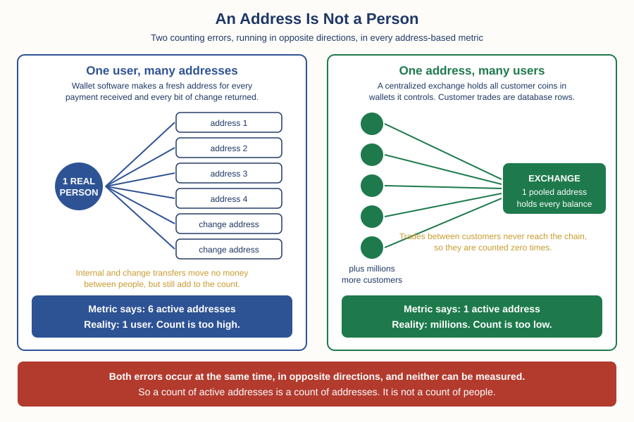

# Crypto — Chapter 2, Lesson 4: On-Chain Data

## Learning Objectives

By the end of this lesson, you will be able to:

- Explain what on-chain data is, where it comes from, and why traditional markets have nothing quite like it
- Describe what active addresses, transaction counts, exchange flows and whale holdings literally measure
- Explain why an address count is not a user count, and why exchange flow figures underdetermine the conclusions drawn from them
- Judge an on-chain claim the way this course judges any claim: by asking what was measured, who inferred what, and whether it was ever tested out of sample

---

## 1. What On-Chain Data Actually Is

Chapter 1, Lesson 2 established something that sounded like a technical detail and is actually the foundation of this lesson: a public blockchain's ledger is public. Every transaction ever made sits in a file that anyone can download. Lesson 6 gave you the beginner's tool for reading it, the block explorer, which looks up one transaction at a time.

On-chain data is what you get when you stop looking up one transaction and start counting all of them.

:::definition
**On-Chain Data** — Measurements produced by reading a public blockchain's own ledger and aggregating it. Nothing is surveyed, estimated from samples, or reported by a company. The raw input is the same file every participant already holds.
:::

Stop and notice how strange this is. In the stock market, you cannot see who owns what. Ownership sits inside brokerage records that are private by law and by business practice. Large holdings surface only in delayed regulatory filings, and small holdings never surface at all. In forex, there is no central ledger to look at, because there is no central market — the Forex track's positioning data comes from surveys and from one futures exchange's reports, which cover a sliver of a market measured in trillions per day.

Crypto is different. The complete transaction history of a public chain is downloadable, free, and updated every few minutes. That is a genuinely new kind of visibility, and it is why this data source exists at all.

Now here is the honest part, and it runs through the rest of the lesson. The ledger records addresses moving amounts. It does not record people, intentions, ownership, or reasons. Everything a headline on-chain metric claims about people is added afterwards by an analyst, using assumptions. The raw data is precise. The interpretation is not.

---

## 2. The Headline Metrics, Explained Mechanically

Before you can judge these numbers you need to know what each one literally counts. Read each definition twice: once for what it includes, once for what it quietly leaves out.

:::definition
**Active Addresses** — The count of unique addresses that appeared in at least one successful transaction during a period, as a sender or a receiver. An address active five times in a day is counted once. Coin Metrics and Glassnode, two of the larger data providers, both define the metric this way in their public documentation.
:::

**Transaction count** is simpler still: how many transactions were included in blocks during the period. It measures usage of block space. It does not measure value, users, or purpose, and one transaction can move a fraction of a cent or a billion dollars.

:::definition
**Exchange Flows** — The value of coins moving into addresses an analyst believes belong to a centralized exchange (inflows), and out of them (outflows). Net flow is inflows minus outflows over a period.
:::

Note the phrase "an analyst believes." Nothing in the ledger labels an address as belonging to Binance or Coinbase. That label is added by the data provider. Section 4 covers how, and how well.

:::definition
**Whale** — Informal term for an address, or a cluster of addresses, holding a large amount of a coin. There is no standard threshold. Providers publish supply-distribution bands, such as addresses holding at least 1,000 BTC, and different providers draw the lines differently.
:::

One more metric is worth naming because it appears constantly in cycle commentary. **Realized capitalization** values every coin not at today's price but at the price it last moved at on-chain, then adds those values together. It is a rough estimate of what the market collectively paid for its coins. The idea was introduced in 2018 by Nic Carter and Antoine Le Calvez, and Coin Metrics publishes it as one of its flagship metrics. Its original purpose was modest and sensible: to stop coins that have not moved since 2010, and are probably lost forever, from being valued at today's price.

:::example
Two different pieces of information about the same day. Metric A: 950,000 unique Bitcoin addresses transacted. Metric B: 12,000 BTC moved into addresses labelled as exchanges. Metric A is a fact about the ledger and requires no assumptions. Metric B requires knowing which addresses belong to exchanges, which the ledger does not say. They look equally solid on a chart. They are not.
:::

---

## 3. The Central Lesson: An Address Is Not a Person

This is the section to remember if you remember nothing else.

Chapter 1, Lesson 4 taught you that a blockchain recognizes no owner other than whoever holds the private key. It checks a signature, not an identity, and not an intent. That is not a limitation of one chain — it is the design. A public blockchain has no concept of a person at all.

So every metric built on addresses measures addresses. Turning an address count into a user count requires three separate leaps, and every one of them fails in a predictable direction.

**One person can control thousands of addresses.** Modern wallet software generates a fresh address for every incoming payment and a fresh address for every bit of change left over from a transaction. This is standard privacy practice, not evasive behaviour. A single ordinary user can accumulate hundreds of addresses without ever choosing to.

**One address can hold the money of millions of people.** Chapter 1, Lesson 5 showed you what actually happens when you buy on a centralized exchange: the exchange holds the coins in wallets it controls, and your balance is a row in the company's internal database. Your trades never touch the blockchain. So an exchange with ten million customers may show up on-chain as a handful of addresses that transact a few thousand times a day. Ten million users, almost no on-chain footprint.

**Much of the traffic is internal.** Exchanges consolidate deposits, rotate wallets, and move coins between hot and cold storage as routine operations. Every one of those movements creates addresses and transactions that represent no user, no decision and no trade.

The two errors do not cancel out. They run in opposite directions and their sizes are unknown, which is worse than a single known bias. You cannot correct for them, because nobody can measure them.

The providers say this themselves, which is worth noticing. Glassnode's documentation explains that its clustering work addresses only one of the two problems — grouping many addresses under one controller — and deliberately does not address the second, where one address holds many people's funds. For that reason the company calls its numbers entities rather than users or individuals. Coin Metrics' documentation makes the parallel point that active addresses are a proxy for usage and a poor proxy for unique people.

:::warning
When a headline says "Bitcoin adoption hit a record, with 1.1 million active addresses," it has quietly swapped a count of cryptographic identifiers for a count of human beings. The correct reading is narrower and duller: 1.1 million addresses transacted. That is compatible with adoption growing, with one exchange restructuring its wallets, or with a single service batching its payouts differently. The metric cannot tell you which.
:::

---

## 4. Where the Labels Come From: Clustering Is Inference

If the ledger does not say which addresses belong to an exchange, or to one owner, how does any provider publish exchange balances and whale counts?

They infer it, using heuristics — rules of thumb that are usually right.

:::definition
**Address Clustering** — Grouping addresses that are probably controlled by the same party, using patterns in transaction structure rather than any stated identity. The output is an estimate produced by a rule, not a fact recorded on the ledger.
:::

The foundational academic work here is Meiklejohn, Pomarole, Jordan, Levchenko, McCoy, Voelker and Savage, "A Fistful of Bitcoins: Characterizing Payments Among Men with No Names," published at the ACM Internet Measurement Conference in 2013. It is worth knowing what they did, because every commercial analytics product still rests on the same two ideas.

Their first rule: if two addresses are used together as inputs to the same transaction, the same party probably controls both. Applied across the Bitcoin ledger of the time, this collapsed roughly 12 million public keys into about 5.5 million clusters. Their second rule identified one-time change addresses, and applied on top of the first it cut the total to about 3.3 million clusters. They found about 3.5 million change addresses this way, with an estimated false positive rate of 0.17%.

Then, crucially, they had to make purchases themselves. To attach a real-world name to any cluster, the researchers made their own transactions with exchanges and services, then traced where their coins went. Through that manual work they tagged about 1.9 million public keys — around 16% of the total — with a real-world service. The other 84% stayed anonymous.

:::warning
Read that ratio again. In the paper that founded this field, the majority of the ledger could not be attached to any identity, and the identities that were attached came from the researchers physically transacting with services, one at a time. Commercial providers have far more resources and better methods today. They still start from the same position: the ledger volunteers no names.
:::

The heuristics have known failure modes, and later academic work measured them. Möser and Narayanan's "Resurrecting Address Clustering in Bitcoin," presented at Financial Cryptography and Data Security in 2022, examined change-address detection against a constructed ground-truth set and developed methods to detect and prevent cluster collapse — the failure in which a single bad link merges two unrelated clusters, then merges their neighbours, until one enormous cluster absorbs entities that have nothing to do with each other. Meanwhile the input-sharing rule is broken deliberately by mixing protocols such as CoinJoin, where unrelated users combine inputs on purpose, and the rule then reports them as one owner.

Note also what Meiklejohn's own paper calls an idiom of use. The change-address rule works because wallet software currently behaves a certain way. Change the software convention and the rule degrades, silently, with no error message.

There is one more consequence that surprises people. Because labels are continuously revised as clustering improves, the historical series can change. Glassnode's own transparency notice states that its exchange metrics come from verified addresses, external sources and clustering algorithms, that complete accuracy remains out of reach, and that recent data points may be revised as labels update. A chart you screenshot today may not match the same chart next month.

---

## 5. Exchange Flows: One Measurement, Many Explanations

Exchange flows are the most heavily traded-on on-chain metric, and the clearest case of a number that underdetermines its own interpretation.

The standard story goes: coins leaving exchanges means investors are moving to self-custody to hold long term, which is bullish. Coins arriving at exchanges means investors are preparing to sell, which is bearish.

That story is a hypothesis. It is sometimes true. The problem is that the same measurement is equally consistent with several other explanations, and the ledger contains nothing that lets you choose between them.

Consider a large outflow from an exchange address. It could be a long-term holder withdrawing to cold storage. It could be the exchange itself rotating coins from a hot wallet to a cold wallet, which is an internal operation with no owner change at all. It could be a custody migration, where an institution moves coins to a different custodian. It could be the exchange's side of an over-the-counter deal that was already agreed and priced off-chain. It could be a provider re-labelling an address that was always the exchange's.

Only the first of those is the accumulation story. All five produce the same on-chain measurement.

:::example
On 14 March 2021, the analytics firm CryptoQuant issued an alert reporting an aggregated inflow of 18,961 BTC — worth about 1.145 billion US dollars, implying a price near 60,400 dollars per coin — to the exchange Gemini, and warned of downside risk from whales selling. Bitcoin fell from roughly 60,500 dollars to roughly 54,000 dollars, a drop of about 11%, and many commentators blamed the alert for the panic. The following day the rival firm Glassnode publicly disputed the reading, saying the movement was internal to Gemini rather than a whale depositing. CryptoQuant then said the transfer had come from BlockFi and was technically external, defended its data, and announced it would remove definitive wording such as warnings about dumping from its alerts so users could draw their own conclusions.
:::

Look closely at that example, because it demonstrates three things at once. Two of the most respected firms in the industry read the same public ledger and reached opposite conclusions about what had happened. The disagreement was not about arithmetic — it was about attribution, which is inference. And the market moved billions of dollars on the interpretation before the disagreement was resolved.

:::warning
Cross-source figures for the same metric are not comparable. Providers use different address label sets, different clustering rules, different exchange coverage, and different proprietary adjustments. Two exchange-balance charts that disagree are not evidence that one is lying. They are evidence that you are looking at two different estimates of an unobservable quantity. Never combine numbers from two providers in the same comparison, and always name the provider when you cite a figure.
:::

Whale metrics carry the same problem in a sharper form. The largest addresses on most chains are exchange and custodian wallets, so a naive list of top holders is largely a list of institutions holding other people's coins. And "whale accumulation" narratives are usually built so that no observation can refute them: if the price rises, whales were accumulating; if it falls, whales were distributing; if it moves sideways, whales are quietly accumulating. A story that survives every outcome told you nothing before the outcome arrived.

---

## 6. The Evidence Standard: Descriptive Is Not Predictive

On-chain metrics are marketed as an information advantage. This section applies the same test the course applies everywhere else: not "is it interesting," but "has anyone tested whether it works, on data it was not built on."

Start by separating two claims. A descriptive claim says what happened: coins moved, addresses transacted, supply distribution shifted. Those claims are checkable, and within the limits of Sections 3 and 4 they are largely sound. A predictive claim says what happens next. That is a different claim requiring different evidence.

Here is the honest state of the evidence, as verified for this lesson.

The academic literature on on-chain metrics as return predictors is small and recent, and it is nothing like the decades of testing behind, say, the forward premium puzzle you met in the Forex track. The most specific published result found was Klaus Grobys, Sebastian Näsman and Davide Sandretto, "Using on-chain data to predict Bitcoin cycles," in Research in International Business and Finance in 2026. They tested three well-known on-chain indicators — net unrealized profit and loss, the market-value-to-realized-value Z-score, and cumulative value days destroyed — as simple rule-based strategies over 7 December 2013 to 12 April 2025. They report that the rules beat buying and holding, with the Sharpe ratio rising from 0.45 for buy-and-hold to 1.28 for the best rule, and that the results survive a Monte Carlo comparison against randomly timed entries.

That is a real finding from a peer-reviewed journal, and this course does not dismiss findings it dislikes. But read the sample honestly. It covers three complete market cycles. Three cycles is three observations of the thing being predicted, however many daily data points sit between them. The indicator thresholds are evaluated over the same history that made those indicators famous in the first place. No independent replication on later, unseen data was found while preparing this lesson, because there is barely any later data to replicate on.

The Forex track named this hazard already. Data snooping is what happens when a rule is selected by searching a history, and then presented as though it had been tested on that history. Every popular on-chain indicator you will encounter was chosen, from a very large space of possible indicators and thresholds, because it looked good on the chart it was built on.

:::warning
A chart showing an on-chain metric overlaid on price, with arrows at the turning points, proves nothing. It is the same picture that Foundations Chapter 3 taught you to distrust when it was drawn with chart patterns. The questions are unchanged. How many indicators and thresholds were tried before this one was shown to you? What period was it fitted on, and what period was it then tested on? What would it have signalled at the times it was wrong, and are those times on the chart? If a claim cannot survive those four questions, it is a picture, not evidence.
:::

:::practice
Find any post claiming an on-chain metric called a top or a bottom. Write down four things: (1) which provider's version of the metric is shown, (2) the exact rule that generates the signal, including the numeric threshold, (3) every past instance where that exact rule fired, including the ones that failed, and (4) whether the rule existed before the dates it is being credited for. Most posts fail at step 2, because there is no stated rule — only a chart and an arrow.
:::

---

## What to Look For

- When you see an address-based figure, translate it back before reacting. "Active addresses" means addresses transacted — not people, not accounts, not adoption.
- When you see an exchange flow figure, ask which provider produced it, and remember that the exchange label is an inference. Then list at least three explanations for the flow other than the one being offered.
- When two sources disagree about the same metric, do not assume one is wrong. Check whether they use different label sets and different definitions, which is usually the answer.
- When someone shows an indicator overlaid on price, ask what period it was fitted on and what period it was tested on. If those are the same period, you have been shown a description of the past.
- When a narrative explains every outcome — accumulation on the way up and on the way down — treat it as unfalsifiable and set it aside. It cannot be wrong, so it cannot be informative.
- Treat historical on-chain series as revisable. Note the provider and the date whenever you record a figure, because the same query may return a different number later.

---

## Practice / Quiz

1. A report states that active addresses on a chain rose 20% last month and calls this proof of rising adoption. What is the most accurate objection?
   - A) Active addresses are private data and cannot be measured
   - B) Addresses are not people — one user can control many addresses and one exchange address can represent millions of users, so the count is compatible with several explanations
   - C) Active address data is only published quarterly, so the figure is out of date
   - D) Adoption can only be measured by exchange trading volume

   **Correct: B.** The count itself is precise and public. The error is the translation from addresses to human users. Wallet software creates many addresses per person, exchanges pool many people behind few addresses, and routine internal transfers add addresses that represent nobody. The two distortions run in opposite directions and cannot be netted out.

2. An analyst reports a large outflow of coins from a major exchange and concludes that investors are accumulating for the long term. What is the correct assessment of that conclusion?
   - A) It is proven, because the blockchain is a public and accurate record
   - B) It is false, because exchange outflows are always internal transfers
   - C) It is one hypothesis among several — the same measurement is equally consistent with wallet rotation, custody migration, or an over-the-counter settlement
   - D) It is unverifiable, because exchange data is not recorded on-chain

   **Correct: C.** The movement is real and recorded. What is not recorded is why it happened or whether ownership changed. The March 2021 dispute over an 18,961 BTC transfer involving Gemini is the concrete case: two leading firms read the same ledger and disagreed about whether a whale had deposited or an exchange had moved its own coins.

3. Two analytics providers publish exchange balance charts for the same coin, and the numbers differ substantially. What does this most likely indicate?
   - A) One provider is falsifying its data
   - B) The blockchain recorded the transactions incorrectly
   - C) The providers use different sets of labelled exchange addresses and different clustering rules, so they are publishing two different estimates of a quantity nobody can observe directly
   - D) One chart is simply older than the other

   **Correct: C.** No exchange label exists on the ledger. Each provider builds its own label set from verified addresses, third-party sources, and clustering heuristics, and revises it over time. Glassnode's own transparency notice states that complete accuracy is out of reach and that recent data points can be revised. Figures from different providers should never be mixed in one comparison.

---

## Key Terms Recap

| Term | One-line definition |
|---|---|
| On-Chain Data | Measurements produced by reading and aggregating a public blockchain's own ledger. |
| Active Addresses | The count of unique addresses appearing in at least one successful transaction in a period. |
| Exchange Flows | Value moving into or out of addresses an analyst has labelled as belonging to an exchange. |
| Address Clustering | Grouping addresses probably controlled by the same party, using transaction-pattern heuristics rather than stated identity. |
| Whale | Informal term for an address or cluster holding a large amount of a coin; the threshold is not standardized. |
| Realized Capitalization | The total value of all coins priced at the level each one last moved at on-chain, rather than at today's price. |

---

*Coming next: Lesson 5 — Sentiment, Narratives & Hype Cycles: how narratives move a market with no cash flows to anchor it, and reading funding rates as a positioning proxy.*
