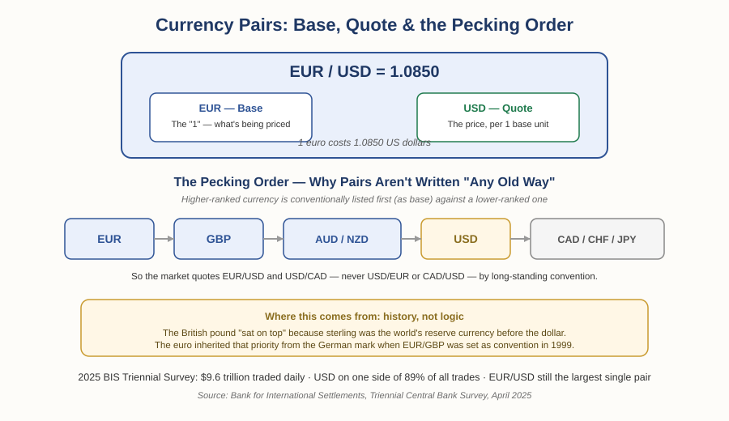

# Forex Track — Chapter 1, Lesson 2: Currency Pairs, ISO Codes, and Quote Conventions

## Learning Objectives

By the end of this lesson, you will be able to:

- Define currency pair, base currency, and quote currency, and correctly identify each in any pair
- Explain what ISO currency codes are and how they're constructed
- Explain why currency pairs are written in a specific order — not an arbitrary combination — and where that convention actually comes from
- Read a real, current currency pair quote correctly

---

## 1. Naming What You're Actually Trading

In Lesson 1, converting dollars to pesos meant working with two currencies at once. There's a specific term for that relationship.

:::definition
**Currency Pair** — Two currencies quoted against each other, expressing the value of one in terms of the other.
:::

:::definition
**Base Currency** — The first currency listed in a pair. It's the currency being measured — always treated as a single unit ("1") for the purpose of the quote.
:::

:::definition
**Quote Currency** — The second currency listed in a pair. It's the currency the price is expressed in — how much of it one unit of the base currency costs.
:::

:::example
In USD/MXN, USD is the base currency and MXN is the quote currency. A quote of 1 USD/MXN = 20 means one U.S. dollar costs 20 Mexican pesos. The base currency always answers "how much is one of this worth?" — the quote currency is the answer.
:::

---

## 2. ISO Codes: Why "USD," Not "Dollar"

The three-letter codes you see in every currency pair aren't arbitrary abbreviations — they follow a real, formally maintained international standard.

:::definition
**ISO 4217** — The international standard defining three-letter alphabetic codes (and three-digit numeric codes) for every active currency, first published in 1978 and maintained by SIX Financial Information AG on behalf of the International Organization for Standardization (ISO).
:::

The construction is logical once you know the rule: the first two letters usually match the currency's country under a separate country-code standard (ISO 3166), and the third letter is typically the first letter of the currency's name. JPY breaks down as JP (Japan) + Y (Yen). CAD is CA (Canada) + D (Dollar).

:::warning
"Dollar," "peso," and "franc" are used by many different, unrelated currencies — the peso alone belongs to Mexico, Argentina, Chile, Colombia, the Philippines, and several other countries, each a completely separate currency. A currency *name* is genuinely ambiguous. A three-letter ISO code is not — which is the entire reason the standard exists.
:::

One correction worth making carefully: China's currency is officially called the **renminbi** (RMB), meaning "the people's currency" — the yuan is the base *unit* of the renminbi, the same relationship as "sterling" and "pound" in the UK. The ISO code CNY refers specifically to the yuan unit. In practice, "yuan" and "renminbi" are used almost interchangeably in everyday conversation, but the formal distinction is: renminbi is the currency, yuan is the unit it's counted in.

:::example
USD/CAD = 1.35 means the U.S. dollar is the base currency, the Canadian dollar is the quote currency, and one U.S. dollar costs 1.35 Canadian dollars.
:::

---

## 3. Pairs Aren't Written in "Any Combination" — There's a Real Convention

It would be easy to assume a pair could be written in either order — USD/EUR or EUR/USD, whichever you prefer. In practice, the market has settled on one specific order for each major pair, and it's genuinely not arbitrary.

There's a long-standing hierarchy — sometimes called a "pecking order" — that determines which currency conventionally sits as the base when two major currencies are paired: the euro outranks the British pound, which outranks the Australian and New Zealand dollars, which outrank the U.S. dollar itself, which outranks the Canadian dollar, Swiss franc, and Japanese yen. That's why the market quotes EUR/USD and USD/CAD, but never USD/EUR or CAD/USD.

:::warning
This ordering isn't based on economic size or trading volume — it's rooted in history. The British pound "sat on top" of the hierarchy because sterling was the world's dominant reserve currency before the U.S. dollar took over that role. When euro trading launched on January 4, 1999, brokers initially supported both EUR/GBP and GBP/EUR quote conventions and let the market decide — EUR/GBP won out almost immediately, with the euro effectively inheriting the German mark's position in the pecking order. The convention persists today for reasons of market habit and consistency, not because it's the only logical way to write it.
:::

This matters practically: if you ever read a quote that looks "backwards" compared to what you expect, it's not necessarily wrong — check which convention is actually being used before assuming a mistake.

---

## 4. The Market at Actual Current Scale

According to the Bank for International Settlements' 2025 Triennial Central Bank Survey — the most authoritative, comprehensive measurement of global currency trading, conducted every three years by central banks worldwide — global foreign exchange turnover reached **$9.6 trillion per day** in April 2025, up 28% from three years earlier. The U.S. dollar appeared on one side of **89%** of all trades. EUR/USD remains the single largest currency pair by volume, though the Chinese yuan's share has been steadily rising — USD/CNY is now the third most-traded pair globally, ahead of GBP/USD.

:::warning
**Correction:** an earlier version of this lesson stated USD/CNY was the "fourth" most-traded pair. Checking the precise 2025 BIS breakdown (EUR/USD 21.2%, USD/JPY 14.3%, USD/CNY 8.1%, GBP/USD 7.6%), it's actually third, ahead of GBP/USD. Flagging this directly rather than quietly fixing it — checking a specific number against the actual data, even your own course's earlier claim, is exactly the habit this course is trying to build.
:::

:::practice
Given everything in this lesson: for the pair GBP/JPY, which currency would you expect to be the base, and which the quote — based purely on the pecking order? Check your answer against the hierarchy diagram above.
:::

---

## What to Look For

- When you see a currency pair, can you immediately identify which side is base and which is quote — and what that actually means for the price shown?
- Does a currency code look unfamiliar? Check it against the ISO 4217 standard rather than guessing from the currency's common name.
- If a quote looks "backwards" from what you expected, check the convention being used before assuming an error.
- When citing FX market statistics (total volume, which pairs dominate), is the source something authoritative like the BIS survey, or an unsourced blog claim? Apply the same verification habit from Foundations Chapter 3.

---

## Practice / Quiz

1. In the pair USD/JPY = 149.50, which currency is the base currency?
   - A) USD
   - B) JPY
   - C) Both, equally
   - D) Neither — "base" doesn't apply here

   **Correct: A — USD.** USD is listed first, making it the base; JPY is the quote, meaning one US dollar costs 149.50 yen.

2. True or False: currency pairs can be written in any order — there's no real convention governing which currency comes first.

   **Correct: False.** There's a genuine, historically rooted pecking order (EUR > GBP > AUD/NZD > USD > CAD/CHF/JPY, roughly) that determines the conventional order for major pairs — it's market history, not arbitrary choice.

---

## Key Terms Recap

| Term | One-line definition |
|---|---|
| Currency Pair | Two currencies quoted against each other. |
| Base Currency | The first currency in a pair — the one being measured as "1." |
| Quote Currency | The second currency in a pair — the price of one unit of the base. |
| ISO 4217 | The international standard defining three-letter currency codes. |

---

*Coming next: Lesson 3 — bid/ask spread and pips: the two prices hiding inside every quote, and the smallest unit of price movement you'll use to measure every trade going forward.*
