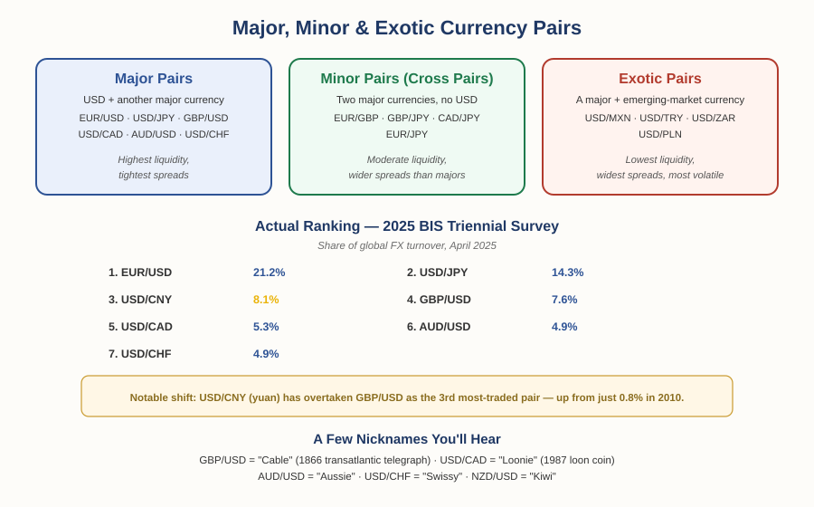

# Forex Track — Chapter 1, Lesson 3: Major Currencies, Major Pairs & Cross Pairs

## Learning Objectives

By the end of this lesson, you will be able to:

- Explain why some currencies are far more liquid than others, with real current data
- Identify the major currencies and major currency pairs, and recognize common nicknames
- Correctly distinguish major, minor (cross), and exotic pairs — precise terms that are often used loosely
- Know where a currency pair's rank actually comes from, rather than assuming

---

## 1. Not All Currencies Are Equal

Currencies aren't traded in equal volume. Some are involved in a huge share of global trading; most barely register.

:::definition
**Major Currencies** — The most heavily traded currencies globally: the U.S. dollar, euro, Japanese yen, British pound, Australian dollar, Canadian dollar, and Swiss franc (with the New Zealand dollar sometimes included as an eighth).
:::

:::example
According to the Bank for International Settlements' 2025 Triennial Survey — the definitive, authoritative measurement of global currency trading — the U.S. dollar was on one side of 89% of all FX trades. The euro was second at 28.9%. That works out to the dollar being traded roughly three times more than the euro — a real, current, precisely sourced number, not a rough guess.
:::

---

## 2. Major Currency Pairs — and Their Actual Current Ranking

:::definition
**Major Currency Pairs** — Currency pairs pairing the U.S. dollar with another major currency. These are the most liquid, most widely traded pairs in the market.
:::

Here's the real, current ranking by share of global turnover, from the same 2025 BIS survey: EUR/USD leads at 21.2%, followed by USD/JPY at 14.3%. The genuinely interesting shift: **USD/CNY (the Chinese yuan) has climbed to third place at 8.1%**, overtaking GBP/USD (now fourth, at 7.6%) — a dramatic rise from just 0.8% in 2010. USD/CAD, AUD/USD, and USD/CHF round out the majors, each in the 4–5% range.

:::warning
That ranking shifts over time — the yuan's rise from 0.8% to 8.1% in fifteen years is proof of that. Don't treat any pair ranking as permanent; check current data rather than relying on a number that may be years out of date.
:::

---

## 3. Nicknames You'll Actually Hear

Major pairs have informal nicknames that traders use constantly — worth recognizing even if you never use them yourself.

:::example
**GBP/USD is "Cable"** — dating to the mid-1800s, when exchange rates between London and New York were transmitted via transatlantic telegraph cable (the first successful one completed in 1866). **USD/CAD is "the Loonie"** — after the loon bird on Canada's one-dollar coin, introduced in 1987. **AUD/USD is "the Aussie," NZD/USD is "the Kiwi,"** and **USD/CHF is "the Swissy"** — each simply shortened from the country name.
:::

Recall from Lesson 2: which currency is listed first in a major pair isn't arbitrary — it follows the historical pecking order (EUR, then GBP, then AUD/NZD, then USD, then CAD/CHF/JPY) rooted in sterling's former reserve-currency dominance.

---

## 4. Minor Pairs, Cross Pairs, and Exotic Pairs — Getting the Terms Right

This is where casual explanations (including informal trading lectures) often blur three genuinely distinct terms.

:::definition
**Minor Pair (Cross Pair)** — A pair combining two major currencies, with no U.S. dollar involved — for example, EUR/GBP, GBP/JPY, or CAD/JPY. "Minor" and "cross pair" refer to the same thing.
:::

:::definition
**Exotic Pair** — A major currency paired with the currency of a smaller or emerging economy — for example, USD/MXN, USD/TRY, or USD/ZAR.
:::

:::warning
It's easy to casually call a pair like USD/MXN a "minor" pair, since it's less liquid than a major — but by standard classification, it's actually an *exotic* pair. A true minor (cross) pair never involves USD at all — it's two majors paired directly, like CAD/JPY. Precision matters here because exotic pairs carry meaningfully different risk (lower liquidity, wider spreads, higher volatility) than true minors.
:::

:::practice
Classify each of these: EUR/GBP, USD/ZAR, GBP/JPY, USD/CHF. Which are majors, which are minors (cross pairs), and which are exotics? Work through the definitions above before checking — the rule is simply whether USD is present, and if so, whether the other side is a major or an emerging-market currency.
:::

---

## What to Look For

- Is a "most traded" or "most liquid" claim backed by a specific, current, named source — or just stated as if it's common knowledge?
- When you see an unfamiliar pair, check: does it include USD? If yes, is the other side a major or an emerging currency? If no USD at all, it's a minor/cross pair.
- Pair rankings change over time — treat any specific ranking as a snapshot, not a permanent fact.

---

## Practice / Quiz

1. Which of these correctly describes an exotic currency pair?
   - A) Two major currencies paired without USD
   - B) A major currency paired with an emerging-market currency
   - C) Any pair that includes USD
   - D) The most liquid pairs in the market

   **Correct: B.** Exotic pairs combine a major currency with a smaller or emerging-market currency — lower liquidity, wider spreads, more volatility.

2. True or False: according to the 2025 BIS survey, USD/CNY has overtaken GBP/USD as the third most-traded currency pair globally.

   **Correct: True.** USD/CNY reached 8.1% market share, edging past GBP/USD at 7.6% — a real, current shift reflecting the yuan's rising role in global trade.

---

## Key Terms Recap

| Term | One-line definition |
|---|---|
| Major Currencies | The most heavily traded currencies globally (USD, EUR, JPY, GBP, AUD, CAD, CHF). |
| Major Currency Pairs | Pairs combining USD with another major currency. |
| Minor Pair (Cross Pair) | A pair combining two major currencies, with no USD involved. |
| Exotic Pair | A major currency paired with an emerging-market currency. |

---

*Coming next: Lesson 4 — bid/ask spread and pips: the two prices hiding in every quote, and the smallest unit of price movement you'll use to measure every trade going forward.*
