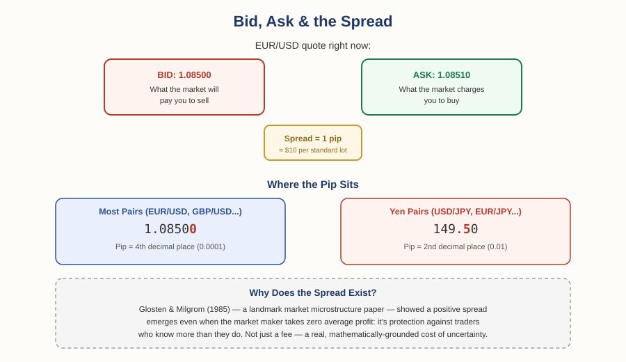

# Forex Track — Chapter 1, Lesson 4: Bid/Ask Spread & Pips

## Learning Objectives

By the end of this lesson, you will be able to:

- Define a pip precisely, including the yen-pair exception and the modern "pipette"
- Define bid/ask spread and calculate its real cost on a trade
- Explain, using real market microstructure research, *why* the spread exists — it's not simply broker profit
- Read current spread data and understand why spreads widen at certain times

---

## 1. The Pip: Measuring the Smallest Move

Every price you'll look at needs a unit small enough to talk about precisely. That unit is the pip.

:::definition
**Pip** — The standard unit for measuring a price move in most currency pairs. For most pairs, one pip is the fourth decimal place (0.0001).
:::

:::example
If EUR/USD moves from 1.0800 to 1.0815, that's a 15-pip move.
:::

The term's exact origin is genuinely disputed — some say it stands for "Percentage in Point," others "Price Interest Point," and several serious sources note this may be a case of *false etymology*, a plausible-sounding backronym invented after the fact rather than the term's true origin. What's better established: the word came into wide use among European forex traders in the 1970s and 80s, as electronic trading standardized currency quotes to four decimal places and traders needed a fast, unambiguous way to talk about tiny price changes.

:::warning
Yen pairs break the pattern. Because the yen has a much lower per-unit value than currencies like the dollar or euro, USD/JPY and other yen pairs are quoted to only two decimal places — so a pip there is the *second* decimal place (0.01), not the fourth. If USD/JPY moves from 149.50 to 150.00, that's a 50-pip move, not a 0.5-pip move. This trips up nearly every beginner at least once.
:::

:::definition
**Pipette** — A tenth of a pip — one decimal place further than the standard pip. Many modern brokers quote an extra decimal (e.g., EUR/USD to five decimals instead of four) for finer pricing precision.
:::

Technically, the pip is no longer always "the smallest possible price move" the way it was when this terminology was set — pipettes now offer finer resolution. But "pip" remains the standard unit traders actually think and talk in.

---

## 2. Bid, Ask, and the Spread

Every quote you see is actually two prices, not one.

:::definition
**Bid Price** — The price the market will pay you to sell the base currency.
:::

:::definition
**Ask Price** — The price the market will charge you to buy the base currency.
:::

:::definition
**Bid-Ask Spread** — The gap between the bid and ask price. This is the built-in cost of entering and exiting a trade.
:::

:::example
EUR/USD shows a bid of 1.08500 and an ask of 1.08510. The spread is 0.00010 — one pip. On a standard lot (100,000 units), one pip is worth roughly $10, so this trade costs about $10 the moment you open it, before the market has moved at all in either direction.
:::

---

## 3. Why Does the Spread Exist at All?

It's tempting to assume the spread is simply how a broker makes money — and that's part of the picture, but not the deepest explanation. There's a genuine, well-established body of academic research on exactly this question, going back to a landmark 1985 paper.

:::definition
**Adverse Selection** (in a market-making context) — The risk a market maker faces that the person on the other side of a trade knows something they don't, and is trading on that advantage.
:::

:::example
Glosten & Milgrom (1985), published in the *Journal of Financial Economics*, proved something genuinely counterintuitive: a positive bid-ask spread emerges even when the market maker is making *zero* expected profit on average. The reason is adverse selection. A market maker quoting prices to a stream of traders can't tell in advance who's trading on real information (an "informed" trader who knows something about where the price is headed) and who's just trading for ordinary reasons (an "uninformed" trader). Since informed traders systematically win at the market maker's expense, the market maker must widen the spread just to break even against that risk — even with no profit motive at all. This paper remains foundational; researchers were still directly building on and citing it in market microstructure papers as recently as 2026.
:::

The spread isn't only about adverse selection, though — the broader research on this (often traced to work by Hans Stoll and others) identifies a few real components stacked together: **order-processing costs** (the genuine overhead of running the infrastructure that executes trades), **inventory risk** (a market maker holding currency exposure they didn't necessarily want, and pricing in the risk of holding it), and **adverse selection** (the Glosten-Milgrom effect above). The spread you see quoted is these forces combined into one number.

:::practice
If a market maker widens the spread specifically around a major news release (like a central bank rate decision), which of the three cost components above do you think is driving that — and why would uncertainty about upcoming news make that component larger?
:::

---

## 4. What Spreads Actually Look Like Right Now

Real, current spread data (2026) gives a useful sense of scale. On EUR/USD — the most liquid pair in the world — the industry-average spread across retail brokers sits around 0.88 pips on a standard, commission-free account, working out to roughly $8.80 per standard lot round-trip. On "raw" or ECN-style accounts, the quoted spread often drops close to 0.0–0.2 pips, but the broker charges a separate commission (typically $3–7 per lot round-trip) instead — the total cost usually lands in a similar range either way, just structured differently.

:::warning
Spreads are not fixed. They widen measurably during low-liquidity periods (the Asian trading session, for instance) and around major scheduled news events, exactly when uncertainty about the "true" price is highest — a direct, practical echo of the adverse-selection and inventory-risk theory above. A spread that looks tight on a demo account during the London session can widen noticeably at other times.
:::

---

## What to Look For

- Before trading, check the actual current spread on the pair you're using — not a marketing headline number, which is often a best-case minimum that doesn't hold at all hours.
- Compare the *all-in* cost (spread plus any commission), not just the quoted spread alone — a "0.0 pip spread" account with a large commission can cost the same as, or more than, a wider-spread account with no commission.
- Notice when spreads widen around news events or thin trading hours, and factor that into when you choose to enter or exit a position.

---

## Practice / Quiz

1. EUR/USD shows a bid of 1.08500 and an ask of 1.08510. What is the spread?
   - A) 0.1 pip
   - B) 1 pip
   - C) 10 pips
   - D) 100 pips

   **Correct: B — 1 pip.** The difference (1.08510 − 1.08500 = 0.00010) equals one pip for a standard pair.

2. True or False: according to Glosten and Milgrom's (1985) research, bid-ask spreads exist purely because market makers want to profit, with no other cause.

   **Correct: False.** Their landmark finding was that a positive spread emerges even at zero expected profit, purely from the need to protect against adverse selection — trading against better-informed counterparties. Real-world spreads also reflect order-processing costs and inventory risk, not profit motive alone.

---

## Key Terms Recap

| Term | One-line definition |
|---|---|
| Pip | The standard unit for measuring a price move — the 4th decimal place for most pairs, 2nd for yen pairs. |
| Pipette | A tenth of a pip — finer modern pricing precision. |
| Bid Price | The price the market will pay you to sell. |
| Ask Price | The price the market will charge you to buy. |
| Bid-Ask Spread | The gap between bid and ask — the built-in cost of a trade. |
| Adverse Selection | The risk a market maker faces from trading against better-informed counterparties. |

---

*Coming next: Lesson 5 — lot sizes and position sizing: how pip value actually translates into real money, and how much of a currency you're really buying or selling in a single trade.*
