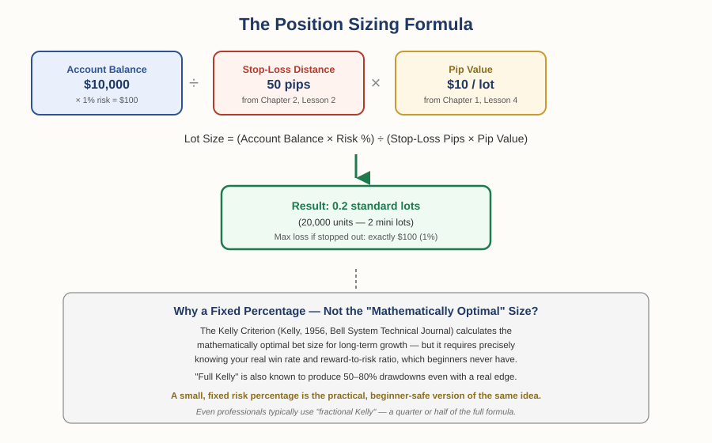

# Forex Track — Chapter 1, Lesson 5: Lot Sizes & Position Sizing

## Learning Objectives

By the end of this lesson, you will be able to:

- Identify the four standard lot sizes and calculate pip value for each
- Use the position sizing formula to calculate exactly how large a trade should be, given your account and stop-loss
- Explain why professional traders use a fixed risk percentage instead of the "mathematically optimal" bet size
- Connect this lesson directly back to the stop-loss and risk-management principles from Foundations Chapter 2

---

## 1. What a Lot Actually Is

:::definition
**Lot** — A standardized unit of trade size in forex. One standard lot equals 100,000 units of the base currency.
:::

Lots come in four standard sizes:

| Lot Type | Units | Approx. Pip Value (USD-quoted pairs) |
|---|---|---|
| Standard | 100,000 | $10 |
| Mini | 10,000 | $1 |
| Micro | 1,000 | $0.10 |
| Nano | 100 | $0.01 |

:::example
If you trade 1 standard lot of EUR/USD, you're controlling €100,000. A 1-pip move in your favor or against you is worth roughly $10. Trade 1 micro lot instead (1,000 units), and that same 1-pip move is worth $0.10 — a hundred times smaller.
:::

:::warning
The 100,000-unit standard lot isn't an arbitrary round number — it reflects the historical scale of interbank trading, where banks moved large sums to settle international trade, long before individual retail traders had any access to the market. Mini, micro, and nano lots were introduced later specifically to make the market accessible to smaller accounts.
:::

---

## 2. The Position Sizing Formula

This is the calculation Foundations Chapter 2 flagged but never actually solved: once you know your stop-loss distance (Chapter 2, Lesson 2) and pip value (Chapter 1, Lesson 4), you can calculate exactly how large a position should be.

:::definition
**Position Sizing** — Calculating exactly how much of a currency to buy or sell in a trade, based on your account size, your risk tolerance, and your stop-loss distance.
:::

The formula:

**Lot Size = (Account Balance × Risk %) ÷ (Stop-Loss in Pips × Pip Value)**

:::example
You have a $10,000 account, and you've decided (per Foundations Chapter 2) to risk 1% per trade — that's $100. You're planning a trade with a 50-pip stop-loss. On a standard lot, each pip is worth $10, so you need to find the lot size where 50 pips of movement costs exactly $100.

$100 ÷ 50 pips = $2 of risk per pip needed. Since a standard lot is $10 per pip, $2 ÷ $10 = 0.2 standard lots — 20,000 units, or 2 mini lots. If the trade hits your stop-loss, you lose exactly $100. Not roughly $100. Exactly $100, because you sized the position specifically to make that true.
:::

:::practice
Using the same $10,000 account and 1% risk, work out the correct lot size for a trade with a *25-pip* stop-loss instead of 50. (Hint: a tighter stop-loss means you can afford a larger position for the same dollar risk.)
:::

---

## 3. Why Not Just Bet the "Mathematically Optimal" Amount?

There's a genuine, well-established academic answer to "how much should I risk," developed decades before retail forex trading existed.

:::definition
**Kelly Criterion** — A formula for calculating the mathematically optimal fraction of capital to risk on a bet or trade, in order to maximize long-term growth, developed by John L. Kelly Jr. at Bell Labs in 1956.
:::

:::example
Kelly's original paper, "A New Interpretation of Information Rate," was published in the *Bell System Technical Journal* — and wasn't even primarily about gambling or trading. Kelly was extending Claude Shannon's information theory, and discovered that the same math describing optimal information transmission also describes optimal bet sizing. The formula requires knowing your real win rate and your reward-to-risk ratio precisely; given those, it tells you exactly what fraction of your capital to risk to grow fastest over time.
:::

:::warning
Kelly's formula is well-proven, but it has a serious practical problem for real trading: it requires you to already know your true win rate and reward-to-risk ratio — numbers a beginner (and honestly, most traders) can't estimate reliably. Worse, "full Kelly" is aggressive enough that even with a genuine edge, it can produce 50–80% drawdowns along the way. This is precisely why professional traders and quants typically use "fractional Kelly" — a half or quarter of the full formula — trading some theoretical growth for dramatically less volatility.
:::

The fixed-percentage risk approach from Foundations Chapter 2 (risking 1–2% per trade) is, in effect, a simplified, beginner-safe cousin of the same underlying idea: risk a small, controlled fraction of your capital rather than a large, theoretically "optimal" one you can't actually calculate with confidence.

---

## What to Look For

- Before entering any trade, can you state the exact lot size the formula produces — not a round number you picked by feel?
- Does your position size actually make your maximum loss equal to your intended risk percentage, or just approximately?
- Be skeptical of any sizing approach (including "optimal" formulas) that requires knowing numbers — like your true win rate — that you can't actually know in advance with real confidence.

---

## Practice / Quiz

1. You have a $5,000 account and want to risk 2% on a trade with a 40-pip stop-loss on a standard-lot pip value of $10. What lot size gives you exactly that risk?
   - A) 0.1 standard lots
   - B) 0.25 standard lots
   - C) 0.5 standard lots
   - D) 1.0 standard lots

   **Correct: B — 0.25 standard lots.** $5,000 × 2% = $100 risk. $100 ÷ 40 pips = $2.50 per pip needed. $2.50 ÷ $10 = 0.25 standard lots.

2. True or False: professional traders typically use the full Kelly Criterion bet size because it's mathematically optimal.

   **Correct: False.** Full Kelly is known to produce severe drawdowns (50–80%) even with a real edge, and requires knowing your true win rate and reward-to-risk ratio precisely. Most professionals use "fractional Kelly" or a simpler fixed-percentage approach instead.

---

## Key Terms Recap

| Term | One-line definition |
|---|---|
| Lot | A standardized trade size — 100,000 units for a standard lot. |
| Position Sizing | Calculating trade size based on account size, risk tolerance, and stop-loss distance. |
| Kelly Criterion | A 1956 formula for the mathematically optimal fraction of capital to risk per bet. |

---

*Coming next: Lesson 6 — leverage and margin: how brokers let you control a position far larger than your actual account balance, and the real risk that comes with it.*
