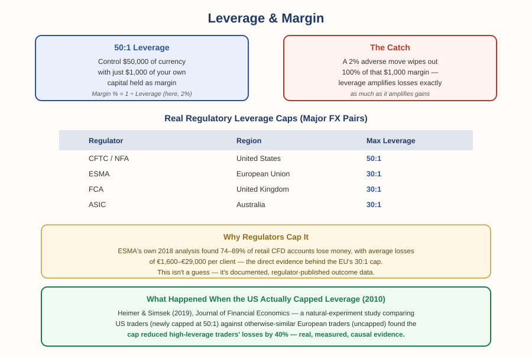

# Forex Track — Chapter 1, Lesson 6: Leverage & Margin

## Learning Objectives

By the end of this lesson, you will be able to:

- Define leverage and margin precisely, and explain their inverse relationship
- Calculate the margin required for a given position size and leverage ratio
- Explain what a margin call is and how margin level is calculated
- Explain, using real regulatory data and a landmark natural-experiment study, why leverage is capped for retail traders — and what measurably happens when it is

---

## 1. What Leverage Actually Does

:::definition
**Leverage** — Borrowed buying power that lets a trader control a position much larger than their own capital alone would allow, expressed as a ratio (e.g., 50:1).
:::

:::definition
**Margin** — The trader's own capital, held by the broker as collateral, required to open and maintain a leveraged position.
:::

Leverage and margin are two sides of the same relationship: margin is expressed as a percentage of the full position size, and leverage is simply the inverse of that percentage.

:::example
With 50:1 leverage, the required margin is 1/50 = 2% of the position size. To open a $50,000 EUR/USD position, you'd need $1,000 of your own capital as margin — the broker effectively fronts the remaining $49,000 of exposure.
:::

---

## 2. Margin Level and the Margin Call

Your account doesn't just sit at a fixed margin requirement — it moves as the trade moves.

:::definition
**Margin Level** — A live percentage measure of account equity relative to margin currently in use, calculated as (Equity ÷ Used Margin) × 100.
:::

:::definition
**Margin Call** — A broker's demand for additional funds, or automatic closure of positions, when a losing trade pushes margin level down to a critical threshold.
:::

:::example
You open the $50,000 position above with $1,000 margin, on a $5,000 account. The other $4,000 is "free margin," available to absorb losses. If the trade moves against you enough to erode that cushion, your broker will issue a margin call — and if you don't add funds, they'll start closing your positions automatically to protect themselves from your account going negative.
:::

:::warning
Leverage cuts identically in both directions. It doesn't just amplify potential gains — it amplifies losses by exactly the same factor. A 2% adverse move against a fully leveraged 50:1 position wipes out 100% of the margin backing it. This is the single most important thing to understand about leverage before using it.
:::

---

## 3. Why Leverage Is Capped — With Real Numbers

Because of that amplification risk, financial regulators around the world cap how much leverage brokers can offer retail traders. These aren't arbitrary numbers:

:::example
In the United States, the CFTC has capped retail forex leverage at 50:1 for major currency pairs (20:1 for others) since October 2010, under authority granted by the Dodd-Frank Act. In the European Union, ESMA capped retail leverage at 30:1 for major pairs in 2018 — a rule the UK's FCA kept in place independently after Brexit, and Australia's ASIC adopted a similar 30:1 cap in 2021.
:::

The EU's cap wasn't a guess. ESMA published its actual reasoning:

:::warning
ESMA's own 2018 analysis of national regulators' data found that **74–89% of retail CFD accounts lose money**, with average losses per client ranging from €1,600 to €29,000. That statistic — not just general caution — is the documented basis for the EU's leverage restriction.
:::

---

## 4. What Actually Happened When the US Capped Leverage

Regulatory reasoning is one thing. Real, measured evidence of what a leverage cap actually *does* to trader outcomes is rarer — but it exists.

:::example
Heimer & Simsek (2019), published in the *Journal of Financial Economics*, studied exactly this question using a natural experiment: when the US imposed its 50:1/20:1 leverage cap in 2010, the researchers compared American traders (now capped) against otherwise-similar European traders (still uncapped at the time) using a difference-in-differences approach. They found the leverage constraint reduced trading volume by 23%, and — the key result — improved high-leverage traders' portfolio returns by 18 percentage points per month, alleviating their losses by roughly 40%. Their conclusion: the trading the cap eliminated was disproportionately speculative rather than informed, meaning the restriction removed harmful activity rather than useful market participation.
:::

:::practice
Based on this study, if a broker markets "500:1 leverage available!" as an unambiguous benefit, how would you respond to that claim using what you now know? What's the difference between what leverage *lets* you do and what it's actually *wise* to do?
:::

---

## What to Look For

- Before using leverage, calculate your actual required margin and confirm your account can absorb realistic adverse moves without a margin call.
- Remember: leverage changes how much capital you need to open a position — it does not by itself determine how much you're risking. Position sizing and stop-loss placement (Chapter 2, Lessons 1–2, and Chapter 1, Lesson 5) are what actually control your risk.
- Treat "maximum available leverage" marketing claims with real skepticism — regulators cap leverage specifically because higher leverage is associated with worse trader outcomes, not better ones.

---

## Practice / Quiz

1. You want to open a $50,000 EUR/USD position using 50:1 leverage. How much margin is required?
   - A) $500
   - B) $1,000
   - C) $2,500
   - D) $5,000

   **Correct: B — $1,000.** Margin = position size ÷ leverage ratio = $50,000 ÷ 50 = $1,000.

2. True or False: according to Heimer and Simsek's (2019) study, capping leverage for US retail forex traders had no measurable effect on trader outcomes.

   **Correct: False.** The study found the leverage cap reduced high-leverage traders' losses by approximately 40% and cut trading volume by 23% — a real, measured, causal effect, not a null result.

---

## Key Terms Recap

| Term | One-line definition |
|---|---|
| Leverage | Borrowed buying power letting a trader control a position larger than their capital. |
| Margin | The trader's own capital held as collateral for a leveraged position. |
| Margin Level | Account equity relative to margin in use, as a percentage. |
| Margin Call | A broker's demand for funds or forced closure when margin level falls too low. |

---

*Coming next: Lesson 7 — order types and trade execution: market, limit, and stop orders in a live forex context, closing out Chapter 1's mechanics before Chapter 2 moves into reading the market itself.*
