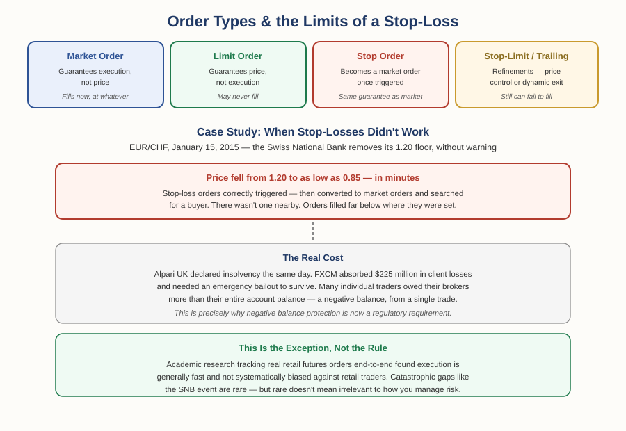

# Forex Track — Chapter 1, Lesson 7: Order Types & Trade Execution

## Learning Objectives

By the end of this lesson, you will be able to:

- Define and distinguish market, limit, and stop orders, and explain the guarantee each one actually makes
- Explain stop-limit and trailing stop orders as refinements on a basic stop
- Explain what an OCO order is and why automated traders rely on them
- Understand slippage — when it's a normal, minor cost, and when it becomes something far more serious

---

## 1. The Three Basic Orders — and What Each One Actually Guarantees

Foundations Chapter 2 introduced entry price, stop-loss, and take-profit as concepts. This lesson covers the actual order types that implement them.

:::definition
**Market Order** — An instruction to buy or sell immediately at the best available current price. Guarantees execution. Does not guarantee price.
:::

:::definition
**Limit Order** — An instruction to buy or sell only at a specified price or better. Guarantees price. Does not guarantee execution — it may never fill if the market doesn't reach your level.
:::

:::definition
**Stop Order** — An order that sits inactive until price reaches a trigger level, at which point it becomes a market order. Once triggered, it carries a market order's guarantee: execution, not price.
:::

:::warning
That last point is easy to miss and matters enormously: a triggered stop order is *not* guaranteed to fill at your stop price. It's guaranteed to fill — at whatever price is actually available once it converts to a market order. In a fast-moving or illiquid market, those can be very different numbers. Section 4 covers exactly how different.
:::

---

## 2. Refinements: Stop-Limit and Trailing Stop

:::definition
**Stop-Limit Order** — A hybrid: once the stop price triggers, it becomes a *limit* order rather than a market order, giving you price control at the cost of a real chance it doesn't fill at all.
:::

:::example
A stop-limit sell at 1.0800 with a limit of 1.0795 will only execute between those two prices. If the market gaps straight through both levels, the order simply doesn't fill — you keep the position, for better or worse.
:::

:::definition
**Trailing Stop** — A stop-loss that automatically moves with the price as a trade becomes more profitable, locking in gains without requiring you to manually adjust it.
:::

:::example
You buy EUR/USD at 1.1050 with a 30-pip trailing stop. If price rises to 1.1080, your stop automatically rises to 1.1050 (breakeven). If price continues to 1.1120, your stop rises again to 1.1090 — now locking in 40 pips of profit even if price reverses. The stop only ever moves in your favor; it never moves back.
:::

---

## 3. OCO Orders — Automating the Exit

:::definition
**OCO (One-Cancels-the-Other) Order** — Two linked orders — typically a take-profit and a stop-loss — where the execution of either one automatically cancels the other.
:::

:::example
You hold a position with a take-profit limit order at one price and a stop-loss order at another. Whichever level price reaches first executes; the other order is automatically removed. You don't have to manually cancel anything or monitor the position constantly.
:::

This is standard practice for traders who can't watch a screen all day — the exit plan is built into the order itself, decided in advance, exactly the discipline Foundations Chapter 2 established as the foundation of real risk management.

---

## 4. Slippage: The Normal Kind, and the Catastrophic Kind

:::definition
**Slippage** — The difference between the price you expected an order to fill at and the price it actually filled at.
:::

Most of the time, slippage is a minor, routine cost — a fraction of a pip here or there as prices move in the instant between your order and its execution. Academic research tracking real retail futures orders end-to-end, from submission to fill, found execution is generally fast and not systematically biased against retail traders, contrary to a common complaint that "the system" favors professionals.

:::warning
But "usually minor" isn't "always minor" — and the exception matters enough to know in detail.
:::

:::example
On January 15, 2015, the Swiss National Bank unexpectedly removed a floor it had defended for over three years, promising to hold EUR/CHF at 1.20 "with the utmost determination." Without warning, they abandoned it — and cut interest rates further into negative territory in the same announcement. EUR/CHF collapsed from 1.20 to as low as 0.85 within minutes. Every stop-loss order set anywhere near 1.20 triggered correctly and converted to a market order exactly as designed — but there was no buyer waiting nearby to fill them. Orders that should have closed near 1.19 or 1.15 instead filled at 0.90 or worse, if they filled at all. Alpari UK declared insolvency that same day. FXCM absorbed $225 million in client losses and needed an emergency bailout to survive. Many individual traders discovered they owed their broker *more* than their entire account balance, from a single trade.
:::

:::warning
This single event is the real-world reason "negative balance protection" — mentioned in Lesson 6 as a regulatory requirement in the EU, UK, and Australia — exists as a rule at all. A stop-loss order is a real risk-management tool, not a guarantee. In a genuine liquidity gap, it can fail to protect you at exactly the moment you need it most.
:::

:::practice
Given everything in this lesson: is the right response to this event "never use a stop-loss, since it might not work," or something more precise? What role does position sizing (Lesson 5) play in surviving an event like this even when a stop-loss doesn't fill where expected?
:::

---

## What to Look For

- Before placing an order, know exactly what it guarantees — execution, price, or neither absolutely.
- Recognize which currency pairs carry unusual gap risk — pairs tied to a central bank policy peg (like EUR/CHF was) can behave very differently from a normal floating pair.
- Confirm whether your broker offers negative balance protection before trading with real leverage — this lesson is exactly why that matters.
- Remember that a rare, catastrophic event doesn't invalidate a risk management tool — it's a reason position sizing and broker protections matter as a second layer, not a substitute for the first.

---

## Practice / Quiz

1. Which order type guarantees execution but not price?
   - A) Limit order
   - B) Market order
   - C) Stop-limit order
   - D) OCO order

   **Correct: B — Market order.** It fills immediately at whatever price is available — guaranteed execution, unguaranteed price. A triggered stop order carries this same guarantee once it converts.

2. True or False: a standard stop-loss order guarantees your position will close at exactly the price you set, even during extreme volatility.

   **Correct: False.** The 2015 SNB event is the clearest possible proof: stop-losses triggered correctly but filled far from their set price because no liquidity was available nearby — a stop-loss guarantees a trigger, not a fill price.

---

## Key Terms Recap

| Term | One-line definition |
|---|---|
| Market Order | Executes immediately at the best available price. |
| Limit Order | Executes only at a specified price or better. |
| Stop Order | Becomes a market order once a trigger price is reached. |
| Stop-Limit Order | Becomes a limit order (not market order) once triggered. |
| Trailing Stop | A stop-loss that automatically moves in your favor as price moves. |
| OCO Order | Two linked orders where one executing cancels the other. |
| Slippage | The difference between expected and actual fill price. |

---

*Chapter 1 complete — you now have the full mechanics of a trade: how profit actually happens, currency pairs and quoting conventions, major/minor/exotic pairs, spreads and pips, position sizing, leverage and margin, and now order types and execution risk. Coming next: Chapter 2 — Reading the Forex Market, building on Foundations Chapter 3 with forex-specific technical indicators, fundamental analysis, the economic calendar, and multi-timeframe analysis.*
