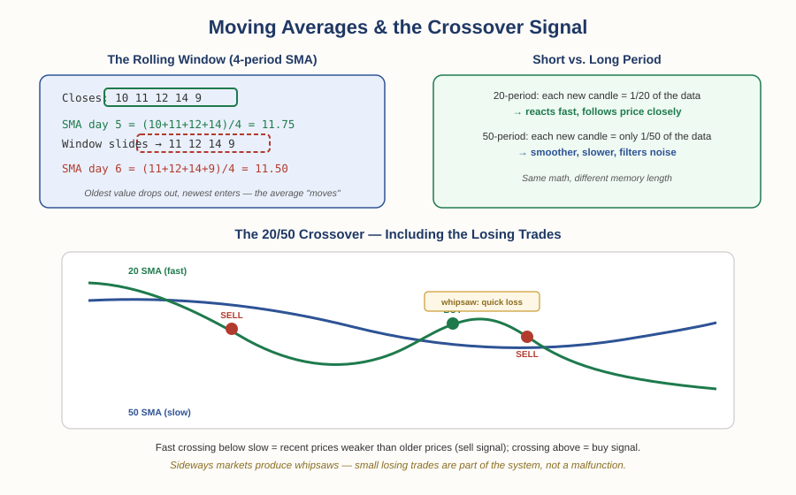

# Forex Track — Chapter 2, Lesson 1: Technical Indicators I — Moving Averages, Crossovers & MACD

## Learning Objectives

By the end of this lesson, you will be able to:

- Explain what a technical indicator actually is — and the one honest sentence that describes all of them
- Compute a simple moving average by hand and explain why the "window" makes it move
- Read a 20/50 moving average crossover as an entry/exit signal, including its known failure mode
- Explain what MACD is — and why it's best understood as a formalized crossover

---

## 1. What an Indicator Actually Is

:::definition
**Technical Indicator** — A calculation derived *entirely* from an instrument's price history and/or trading volume, plotted on or below a chart. It uses nothing else: no news, no economic data, no opinion — only the chart in front of you.
:::

That definition contains the most important honest sentence in this entire chapter: **an indicator can only ever highlight something that is already visible in price itself.** Since every indicator is computed from the prices on your screen, it cannot know anything the chart doesn't already contain. The reason traders use them anyway is practical, not magical — a good indicator makes a pattern easier to *see* and act on consistently.

:::warning
There are hundreds of indicators, and anyone can invent a new one — many are redundant or worthless. Piling many onto one chart doesn't add insight; it adds conflict. This mirrors a general principle from statistics: adding more and more weakly-informative variables to a prediction degrades it rather than improving it. Pick a small number of tools you genuinely understand. Fifteen out of twenty indicators "agreeing" means far less than it sounds like — many are computing near-identical things from the same prices.
:::

---

## 2. The Simple Moving Average

:::definition
**Simple Moving Average (SMA)** — The average of the last N closing prices, recalculated as each new period closes. Plotted as a line over the price chart.
:::

:::example
A 4-period SMA on a daily chart, with closes of 10, 11, 12, 14: the average is (10+11+12+14) ÷ 4 = **11.75**. Next day the price drops to 9. The window *slides*: the oldest value (10) drops out, the new close (9) enters, and the new average is (11+12+14+9) ÷ 4 = **11.50**. That sliding window is the entire mechanism — the average "moves" because its data window moves.
:::

The window length is the whole personality of the indicator. In a short SMA (say 20 periods), each new candle is 1/20 of the data, so the line reacts quickly and hugs price. In a long SMA (say 50), each new candle is only 1/50 of the data, so the line is smoother and slower — it filters out noise at the cost of reacting late. Neither is "better"; they answer different questions: *what has price done recently* versus *what has price done over the longer stretch*.

For forex, a practical, widely-used pairing is the **20-period and 50-period SMA** (stock traders often add the 200-day; that's a different market's convention). What a single SMA gives you is a cleaner read of the **trend direction** than raw candles — a downward-sloping 20 SMA says the last 20 periods have, on average, been falling.

A note on the **exponential moving average (EMA)**: it's a variant that weights recent prices more heavily. Some traders prefer it; the simple version teaches the same concepts and is what this course uses. MACD (below) is built from EMAs — worth knowing the term exists.

---

## 3. The Crossover Signal

:::definition
**Moving Average Crossover** — A signal generated when a shorter-period moving average crosses a longer-period one. Short crossing *above* long = recent prices outperforming the longer stretch (buy signal). Short crossing *below* long = recent prices underperforming (sell signal).
:::

The logic is genuinely intuitive: if the 20-period average falls below the 50-period average, the last 20 periods were *worse* than the last 50 — recent momentum has turned down relative to the bigger picture. The crossover marks that shift.

:::example
On a 4-hour NZD/USD chart with a 20 and 50 SMA: the 20 crosses below the 50 → enter short. Price falls; the 20 eventually crosses back above → close the short at a profit, and optionally go long. But the very next long gets stopped almost immediately when a large red candle drags the 20 back below the 50 — a small, quick loss. Then another short signal, another profitable leg. This sequence — several winning trades punctuated by small whipsaw losses — is what crossover trading actually looks like.
:::

:::warning
That losing trade in the middle is called a **whipsaw**, and it is not a malfunction — it's the known cost of the method. Crossovers work when price *trends* and bleed small losses when price moves sideways, because a flat market makes the two averages braid around each other, generating false signals. No setting eliminates this; risk management (Chapter 1, Lessons 5–7) is what makes the losses survivable and small relative to the trending wins.
:::

**What does the evidence say?** One of the most-cited academic studies of technical analysis — Brock, Lakonishok & LeBaron (1992), *Journal of Finance* — tested exactly these moving-average rules on nearly a century of Dow Jones data and found they showed genuine predictive ability. But the follow-up literature matters just as much: later research questioned how well those results survive transaction costs and the risk of data-snooping (testing many rules and reporting the ones that happened to work). Meanwhile the recent FX-specific study you met in Foundations Chapter 3 — Ghanem et al. (2024), 497 rules, 10 currencies, 22 years — found technical rules *do* significantly predict currency movements. The honest summary: crossovers are one of the few indicator families with real academic support, and also one where the support comes with genuine caveats. Use them as a tool, not a truth.

---

## 4. MACD — The Crossover, Formalized

:::definition
**MACD (Moving Average Convergence Divergence)** — An indicator (created by Gerald Appel in the 1970s) that plots the *difference* between two exponential moving averages (typically 12- and 26-period), plus a 9-period "signal line" of that difference. When the MACD line crosses its signal line, that's the buy/sell trigger.
:::

Here's the demystifying truth: MACD is measuring how two moving averages **converge and diverge** — which is exactly what you just learned to see directly on the chart with the 20/50 pair. When people talk about MACD crossovers, they're talking about the same underlying event as a moving-average crossover, expressed as an oscillating line below the chart instead of two lines on it. If you understand Section 3, you already understand MACD. Some traders prefer its presentation (the histogram makes momentum shifts visually loud); others just read the averages directly. There is no extra information in it that the moving averages don't contain — remember Section 1.

:::practice
Pull up any major pair on a free charting tool, add a 20 and a 50 SMA, and scroll back through six months of history. Count the crossover signals. How many would have been profitable trades, and how many were whipsaws? Notice *where* the whipsaws cluster — trending stretches or sideways stretches?
:::

---

## What to Look For

- Is the market trending or ranging right now? Crossover signals earn their keep in trends and bleed in ranges.
- When an indicator "confirms" another one, ask: are they actually independent, or two calculations of the same thing (like MACD and an MA crossover)?
- Would you take this signal if the indicator weren't there — can you see the shift in raw price? If not, be suspicious.

---

## Practice / Quiz

1. A 20-period SMA crosses below a 50-period SMA. What does this literally mean?
   - A) The price is guaranteed to fall
   - B) The average of the last 20 closes has dropped below the average of the last 50 closes
   - C) Volume is declining
   - D) The market is oversold

   **Correct: B.** That's all a crossover is — recent average prices underperforming the longer-window average. It's read as a bearish shift, but it guarantees nothing.

2. True or False: MACD provides fundamentally different information than a moving average crossover.

   **Correct: False.** MACD is built from moving averages and measures their convergence/divergence — the same underlying event as a crossover, presented differently. No indicator computed from price can contain information price doesn't.

---

## Key Terms Recap

| Term | One-line definition |
|---|---|
| Technical Indicator | A calculation derived solely from price and/or volume, plotted on a chart. |
| Simple Moving Average (SMA) | The average of the last N closes, recalculated each period. |
| Moving Average Crossover | A signal from a short-period MA crossing a long-period MA. |
| Whipsaw | A false crossover signal in a sideways market producing a quick small loss. |
| MACD | The difference between two EMAs plus a signal line — a formalized crossover. |

---

*Coming next: Lesson 2 — the mean-reversion toolkit: Bollinger Bands, RSI, and Fibonacci retracement — including what peer-reviewed testing actually found when the Fibonacci claim was put under the microscope.*
