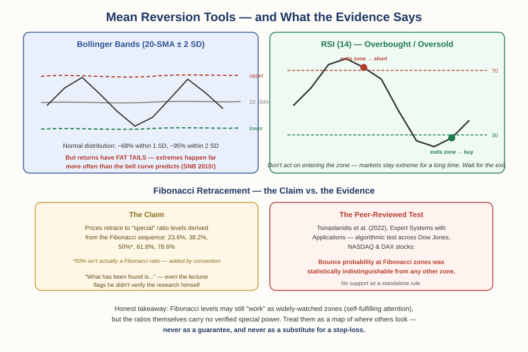

# Forex Track — Chapter 2, Lesson 2: Mean Reversion & Levels — Bollinger Bands, RSI & Fibonacci

## Learning Objectives

By the end of this lesson, you will be able to:

- Explain how Bollinger Bands are constructed from a moving average and standard deviations — and the fat-tail problem the bell curve hides
- Read RSI overbought/oversold signals, including the crucial "wait for the exit" discipline
- Describe Fibonacci retracement levels and what the actual evidence says about them
- Distinguish mean-reversion tools from trend-following tools, and know when each applies

---

## 1. Bollinger Bands — A Bell Curve Wrapped Around Price

:::definition
**Bollinger Bands** — An indicator (developed by John Bollinger in the 1980s) consisting of a 20-period moving average with an upper and lower band drawn a set number of standard deviations above and below it — 2 by default.
:::

:::definition
**Standard Deviation** — A statistical measure of how spread out values are around their average. The more volatile the prices, the larger the standard deviation — so the bands automatically widen in volatile markets and tighten in calm ones.
:::

The construction borrows a famous idea from statistics: in a normal distribution (the "bell curve"), about **68%** of values fall within one standard deviation of the average, about **95%** within two, and about **99.7%** within three. Apply that to the last 20 closing prices, and bands at ±2 standard deviations "should" contain roughly 95% of price action — so a touch of the outer band suggests price is statistically stretched.

:::example
The intuitive mean-reversion play: price touches the lower band (stretched low) → buy → exit at the middle band. Price touches the upper band (stretched high) → short → exit at the middle. Tighter bands (2 SD) give more frequent, earlier signals; wider bands (3 SD) give fewer, more extreme ones. This logic works best on instruments that genuinely oscillate around a mean — for example, currency pairs between similar, linked economies (CAD and AUD-style pairs), which tend to deviate and re-converge — and works badly on anything in a strong trend, where "stretched" just keeps stretching.
:::

:::warning
**Here's the honest problem, and it's a big one: financial prices do not actually follow a bell curve.** This isn't a technicality — it's one of the most important findings in the history of finance. Benoit Mandelbrot demonstrated it in 1963 ("The Variation of Certain Speculative Prices," *Journal of Business* 36, 394–419): real price changes have **fat tails** — extreme moves occur far, far more often than the normal distribution predicts. Moves the bell curve calls once-in-thousands-of-years events happen every few years. You've already met the perfect example: the 2015 EUR/CHF collapse from Chapter 1, Lesson 7 — a move so far outside the bands that the clean "95% containment" math becomes meaningless. Practical consequence: price *will* pierce your bands more often than the statistics imply, sometimes violently. Bollinger Bands remain a genuinely useful volatility-adaptive tool — but never size a position as if the 95% figure were literally true.
:::

---

## 2. RSI — Measuring Overbought and Oversold

:::definition
**RSI (Relative Strength Index)** — A momentum oscillator, introduced by J. Welles Wilder Jr. in his 1978 book *New Concepts in Technical Trading Systems*, that measures the relative size of recent gains versus recent losses over the last 14 periods, producing a value between 0 and 100.
:::

The intuition: if recent up-candles are much larger than recent down-candles, buyers are dominating and RSI pushes toward 100. If down-candles dominate, RSI falls toward 0. (The precise formula averages the gains and losses of closing prices over 14 periods, but the candle intuition is faithful to what it measures.)

:::definition
**Overbought / Oversold** — Conventional RSI thresholds: above 70 = overbought (buying has been unusually one-sided), below 30 = oversold (selling has been unusually one-sided). More conservative traders use 80/20.
:::

:::warning
The single most important RSI discipline — and the mistake that costs beginners the most: **do not buy simply because something is oversold, and do not short simply because it's overbought.** Markets can stay overbought or oversold for a very long time while continuing in the same direction — an oversold currency can keep getting *more* oversold, day after day. Buying it on the way down is catching a falling knife with a statistics label on it.
:::

:::example
The disciplined version: wait for the RSI to *exit* the extreme zone. Price falls, RSI drops below 30 (oversold) — you wait. Only when RSI crosses back *above* 30 — meaning the selling pressure has actually broken — do you buy. Same mirrored for shorts: wait for RSI to fall back below 70 rather than shorting the moment it becomes overbought. You sacrifice a little of the move in exchange for confirmation that the reversal has actually begun, rather than betting that it will.
:::

---

## 3. Fibonacci Retracements — The Levels, and the Evidence

:::definition
**Fibonacci Sequence** — The series 0, 1, 1, 2, 3, 5, 8, 13, 21... where each number is the sum of the previous two. Dividing a number by its successor converges to ≈0.618 — the "golden ratio" relationship; dividing by the number two positions later gives ≈0.382, and three later ≈0.236.
:::

:::definition
**Fibonacci Retracement** — A charting tool that stretches from a swing low to a swing high (or vice versa) and marks horizontal levels at 23.6%, 38.2%, 50%, 61.8%, and 78.6% of that move — proposed as likely places for a pullback (retracement) to pause or reverse before the trend resumes.
:::

One honest detail worth knowing: the 50% level isn't a Fibonacci ratio at all. It's included by convention because prices are often observed to retrace about half a move — an observation going back to early Dow-era technical analysis — not because the sequence produces it. (The ratios do have genuinely elegant mathematical relationships — √0.382 ≈ 0.618, √0.618 ≈ 0.786 — which is part of the tool's aesthetic appeal.)

**How traders use it:** in an uptrend you expect to continue, rather than buying immediately, you wait for the pullback and place staggered orders at the retracement levels — for example, part of your position at 38.2%, more at 50%, the rest at 61.8% — expecting a bounce from one of them. Scaling in across levels like this is sometimes called pyramid entry.

:::warning
**Now the evidence — because Fibonacci retracements are exactly the kind of widely-repeated claim this course has taught you to check.** The research is genuinely mixed, and knowing the shape of that disagreement is more useful than either blind faith or blanket dismissal. As early as 1977, Arthur Merrill's systematic study of market swings found no reliably standard retracement level. A rigorous 2021 study in *Expert Systems with Applications* built an algorithm to detect retracements objectively across Dow Jones, NASDAQ, and DAX stocks and found prices *do* bounce at Fibonacci levels somewhat more often than at arbitrary levels — but the authors explicitly note this doesn't necessarily translate into a profitable trading strategy. And multiple reviews find that standalone Fibonacci levels perform about as well as random levels, improving only when combined with independent evidence like support/resistance or trend. The most defensible reading: Fibonacci levels work partly *because* thousands of traders watch the same levels and place orders there — a self-fulfilling coordination point, not market magic. Treat them as zones where a reaction is plausible and other traders are paying attention — never as a guarantee, and never as a standalone system.
:::

---

## 4. The Real Skill: Matching the Tool to the Market

Step back from the individual tools and the deeper pattern of this chapter emerges:

:::definition
**Mean Reversion** — A trading approach betting that a stretched price will return toward its average. Bollinger Bands and RSI are mean-reversion tools. Crossovers (Lesson 1) are the opposite — trend-following tools, betting that movement will *continue*.
:::

These two families make opposite bets. A mean-reversion tool in a strong trend loses repeatedly ("it's stretched!" — it stretches further). A trend-following tool in a sideways market whipsaws to death. Neither tool is broken in those moments — it's being asked the wrong question. Diagnosing *which kind of market you're in* is the judgment that sits above every indicator, and no indicator can make it for you — which is exactly where this chapter goes next.

:::practice
Pull up two charts: one in an obvious strong trend, one moving sideways in a range. Apply Bollinger Bands to both. Count how many lower-band touches would have been profitable mean-reversion buys on each chart. The difference you'll see *is* this lesson's core point.
:::

---

## What to Look For

- Before using any mean-reversion signal, ask: is this instrument actually ranging, or trending? The same signal means opposite things in the two regimes.
- When any tool invokes probability ("95% of price action stays inside the bands"), remember fat tails: markets break statistical containment far more often than the bell curve promises.
- With RSI, the signal isn't *entering* the extreme zone — it's *exiting* it.
- When a level "works," ask why: genuine market structure, or many traders watching the same line? Both are tradeable, but the second can evaporate.

---

## Practice / Quiz

1. According to the RSI discipline in this lesson, when is the higher-quality moment to buy an oversold currency?
   - A) The instant RSI drops below 30
   - B) When RSI crosses back above 30 after being oversold
   - C) Whenever RSI is below 50
   - D) RSI cannot be used for buy decisions

   **Correct: B.** Entering the oversold zone shows one-sided selling; *exiting* it shows that pressure has actually broken. Waiting for the exit trades a little upside for real confirmation — markets can stay oversold far longer than your account can stay solvent.

2. True or False: because Bollinger Bands are set at 2 standard deviations, there is genuinely only about a 5% chance of price moving outside them.

   **Correct: False.** That figure assumes prices follow a normal distribution — and Mandelbrot's 1963 research established that real financial prices have fat tails: extreme moves far outside the bands occur much more often than the bell curve predicts. The 2015 EUR/CHF collapse is the textbook example.

---

## Key Terms Recap

| Term | One-line definition |
|---|---|
| Bollinger Bands | A 20-period MA with bands ±2 standard deviations, widening with volatility. |
| Standard Deviation | A measure of how spread out values are around their average. |
| Fat Tails | The reality that extreme price moves occur far more often than the bell curve predicts. |
| RSI | Wilder's 0–100 oscillator measuring recent gains vs. losses over 14 periods. |
| Overbought / Oversold | RSI above 70 / below 30 — one-sided recent buying or selling. |
| Fibonacci Retracement | Levels at 23.6/38.2/50/61.8/78.6% of a move, watched as pullback zones. |
| Mean Reversion | Betting a stretched price returns to its average — the opposite of trend-following. |

---

*Coming next: Lesson 3 — fundamental analysis: interest rates and central banks, where the "why" behind price movement finally enters the picture.*
