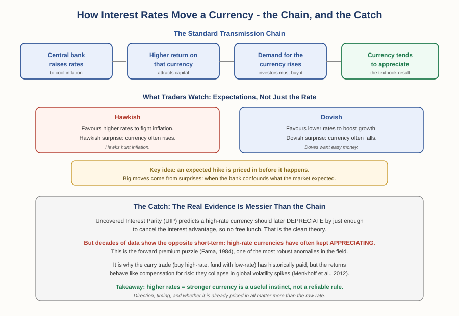

# Forex Track — Chapter 2, Lesson 3: Fundamental Analysis — Interest Rates & Central Banks

## Learning Objectives

By the end of this lesson, you will be able to:

- Explain the difference between technical and fundamental analysis, and where each fits
- Describe how a central bank's interest rate decisions are *meant* to move its currency
- Distinguish "hawkish" from "dovish," and explain why expectations matter more than the raw decision
- Explain the carry trade — and the genuine academic puzzle that complicates the whole "high rates = strong currency" story

---

## 1. A Different Lens on the Same Market

Everything in this chapter so far — moving averages, Bollinger Bands, RSI, Fibonacci — has been *technical* analysis: reading price itself. This lesson introduces the opposite lens.

:::definition
**Fundamental Analysis** — Evaluating a currency based on the underlying economic forces that drive its value — interest rates, inflation, growth, employment, and central bank policy — rather than on chart patterns.
:::

Technical analysis asks "what is price doing?" Fundamental analysis asks "*why* would price move at all?" Neither replaces the other — many traders use technicals for timing and fundamentals for direction. And for currencies specifically, one fundamental force sits above all others.

---

## 2. Central Banks: The Most Important Players

Foundations Chapter 1 introduced central banks historically (the Bank of England, 1694; the Fed). Here's why they matter to a trader every single week.

:::definition
**Central Bank** — The institution responsible for a nation's monetary system: issuing currency, overseeing commercial banks, managing reserves, acting as lender of last resort, and — most importantly for traders — setting monetary policy to balance inflation against growth and employment.
:::

The eight central banks tied to the most-traded currencies: the US Federal Reserve (USD), European Central Bank (EUR), Bank of England (GBP), Bank of Japan (JPY), Swiss National Bank (CHF), Bank of Canada (CAD), Reserve Bank of Australia (AUD), and Reserve Bank of New Zealand (NZD). When any of these speaks, its currency can move sharply.

:::definition
**Base Interest Rate** — The rate a central bank sets as its primary policy tool. It ripples through the whole economy: it's effectively the price of money, shaping what banks charge for loans and pay on savings.
:::

The balancing act, echoing Foundations Chapter 2's inflation lesson: raise rates to cool an overheating economy and fight inflation; lower rates to encourage borrowing and spending when growth stalls. Too fast, and inflation erodes the currency; too slow, and unemployment rises.

---

## 3. How Rates Are *Supposed* to Move a Currency

Here's the textbook transmission chain, and it follows directly from supply and demand:

When a central bank raises rates, that currency offers investors a higher return. To capture it, foreign investors must *buy* that currency — raising demand, and with it, the price. So the standard expectation is: **higher rates → currency appreciates; lower rates → currency depreciates.** This is the single most-cited relationship in forex fundamental analysis.

:::example
This is also why a rate *cut* — or even a signal of future cuts — can weaken a currency. If the Fed unexpectedly holds rates low when markets expected a hike, the dollar often falls, because the anticipated demand boost doesn't arrive. In a pair like GBP/USD, a falling USD (the quote currency) pushes the pair *up*.
:::

---

## 4. Hawks, Doves, and Why Expectations Rule

Traders rarely wait for the actual announcement. They read the language and the personalities.

:::definition
**Hawkish / Dovish** — A hawkish stance favours higher interest rates to fight inflation; a dovish stance favours lower rates to promote growth. Individual policymakers, and a central bank's overall tone, are described this way.
:::

:::warning
The single most important nuance in this entire lesson: **an expected rate move is usually "priced in" before it happens.** If the whole market already expects a hike, the currency has largely *already moved* by the time the announcement lands. The big, violent moves come from *surprises* — when a central bank confounds expectations. This is why two traders can watch the same rate hike and see the currency fall: if the market expected an even larger hike, the "smaller than expected" hike is effectively dovish. You're not trading the rate. You're trading the gap between the decision and what was already expected.
:::

:::definition
**Carry Trade** — A strategy of borrowing (or selling) a low-interest-rate currency to buy a high-interest-rate one, aiming to pocket the interest rate difference — provided the exchange rate doesn't move enough to wipe out that gain.
:::

---

## 5. The Catch — Where the Honest Story Gets Interesting

Here's where this course's habit of checking the textbook against real evidence pays off. The clean "higher rates → stronger currency" story runs into one of the most famous anomalies in all of financial economics.

:::definition
**Uncovered Interest Parity (UIP)** — The economic theory that a currency with higher interest rates should *depreciate* over time by exactly enough to cancel out its interest advantage — so that, in theory, there's no free profit in simply chasing high-rate currencies.
:::

UIP is the elegant theory. The data says something startlingly different:

:::warning
**Decades of evidence show UIP fails badly over short horizons — and fails in the *opposite* direction to what it predicts.** Rather than depreciating, high-interest-rate currencies have historically tended to *keep appreciating* in the short run. Economist Eugene Fama documented this in 1984, and it's been known ever since as the "forward premium puzzle" (or "Fama puzzle") — described in the literature as one of the most robust empirical regularities in international finance. In plain terms: the simple story isn't just imperfect, the real world has often done the reverse of what the clean theory predicts.
:::

This isn't an academic footnote — it's *why the carry trade has historically made money* at all. If high-rate currencies fell as UIP predicts, carry trades wouldn't work. They've worked precisely because the theory fails. But there's a sting in the tail:

:::example
Menkhoff, Sarno, Schmeling & Schrimpf (2012), published in *The Journal of Finance*, showed that carry trade returns are strongly tied to global foreign-exchange volatility. The strategy earns steady profits in calm periods — then suffers sharp, correlated losses precisely when global volatility spikes (crises, panics). In other words, carry trade returns behave like *compensation for taking on crash risk*, not a free lunch. The interest edge is real, but you're being paid to hold a currency that can drop violently at the worst possible moment — a direct, real-world echo of the fat-tails warning from Lesson 2 and the SNB collapse from Chapter 1.
:::

The honest takeaway, and the reason this lesson matters: **"higher rates strengthen a currency" is a genuinely useful starting instinct — but it is not a reliable mechanical rule.** Whether a move is already priced in, which direction the surprise breaks, and what global volatility is doing can all override it. Fundamentals tell you where pressure is building; they don't hand you a guaranteed outcome.

---

## What to Look For

- Before a central bank meeting, ask not "will they hike?" but "what does the market *already expect*, and what would surprise it?"
- Notice hawkish/dovish *language* in policymaker speeches between meetings — markets move on these long before any decision.
- When you hear "high interest rates mean a strong currency," remember the forward premium puzzle: true as an instinct, unreliable as a rule.
- Treat carry-trade interest income as compensation for real crash risk, not free money — size positions accordingly (Chapter 1, Lesson 5).

---

## Practice / Quiz

1. The market strongly expects a central bank to raise rates by 0.5%. The bank raises by only 0.25%. What's the most likely reaction in that currency?
   - A) It rises sharply, because rates went up
   - B) It may fall, because the hike was smaller than expected ("dovish surprise")
   - C) Nothing changes, because rates rose as predicted
   - D) It always depends only on the raw rate, not expectations

   **Correct: B.** A smaller-than-expected hike is effectively dovish relative to expectations. Markets trade the *surprise*, not the raw decision — a hike can weaken a currency if a bigger hike was already priced in.

2. True or False: the "forward premium puzzle" refers to the empirical finding that high-interest-rate currencies reliably depreciate, exactly as Uncovered Interest Parity predicts.

   **Correct: False.** It's the opposite — the puzzle is that UIP *fails*: high-rate currencies have historically tended to keep *appreciating* in the short run, contradicting the theory. That failure is a genuine, robust, and still-debated anomaly.

---

## Key Terms Recap

| Term | One-line definition |
|---|---|
| Fundamental Analysis | Evaluating a currency by underlying economic forces, not chart patterns. |
| Base Interest Rate | A central bank's primary policy tool — effectively the price of money. |
| Hawkish / Dovish | Favouring higher rates (to fight inflation) / lower rates (to boost growth). |
| Carry Trade | Borrowing a low-rate currency to buy a high-rate one, to earn the rate difference. |
| Uncovered Interest Parity | The theory that high-rate currencies should depreciate to cancel their rate advantage. |
| Forward Premium Puzzle | The robust empirical finding that UIP fails — high-rate currencies often appreciate instead. |

---

*Coming next: Lesson 4 — the economic calendar: which scheduled data releases actually move currencies, when they land, and how to avoid being blindsided by them.*
