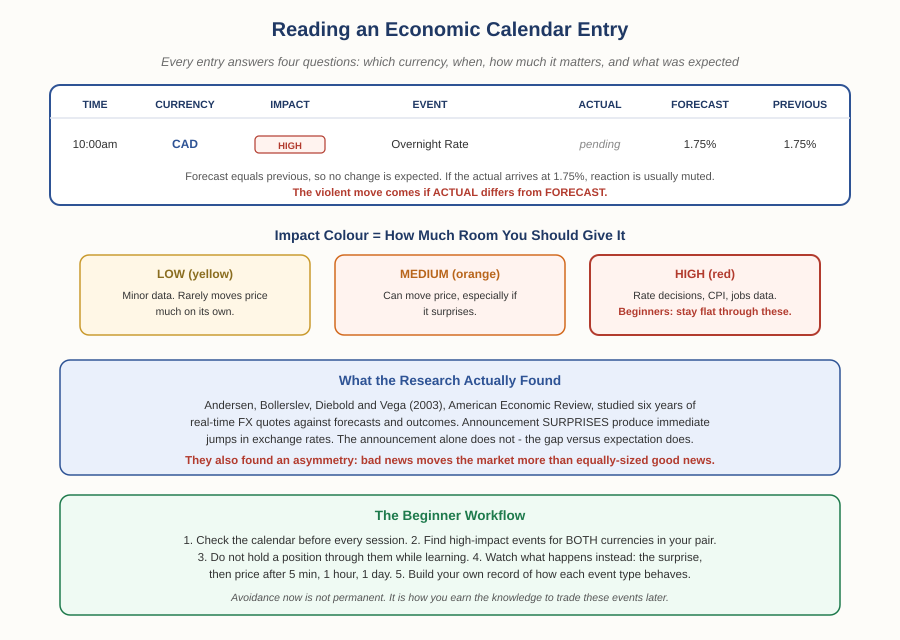

# Forex Track — Chapter 2, Lesson 4: The Economic Calendar — What to Watch, and When

## Learning Objectives

By the end of this lesson, you will be able to:

- Read every column of an economic calendar entry and explain what each one tells you
- Explain why the *forecast* column matters more than the actual number on its own
- Identify which scheduled events genuinely move currencies, and which rarely do
- Use the calendar as a learning tool, not just an avoidance tool

---

## 1. The One Habit Every Serious Trader Has

Lesson 3 ended on a specific idea: markets trade the *surprise*, not the raw decision. The economic calendar is the tool that makes that idea usable in practice.

:::definition
**Economic Calendar** — A schedule of upcoming economic data releases and policy announcements, listing the time, the currency affected, the expected impact, and the market's forecast for each.
:::

Because these events are *scheduled*, you know in advance when a currency is likely to move violently. That's an unusual gift in trading — most risk arrives unannounced. Several free calendars cover this well: **ForexFactory**, **Investing.com**, **TradingEconomics**, **DailyFX**, and **MarketWatch** all publish essentially the same underlying schedule with different interfaces.

:::warning
Checking the calendar isn't an advanced technique — it's basic hygiene, like checking the weather before sailing. Any good trader looks at it every single day, before anything else, to know whether the currencies they're holding have a scheduled event coming.
:::

---

## 2. Anatomy of a Calendar Entry

Every entry gives you the same core fields:

- **Time** — when the data drops, usually to the minute. Currency pairs can move within seconds of it.
- **Currency** — which currency the event affects. Critically: **check both sides of your pair.** A EUR event moves EUR/USD just as surely as a USD event does.
- **Impact** — a colour-coded severity rating (typically yellow = low, orange = medium, red = high).
- **Actual / Forecast / Previous** — the released number, what analysts expected, and last period's reading.

:::definition
**Forecast (Consensus)** — The market's aggregated expectation for an upcoming data release, compiled from economists' and analysts' predictions. It's the benchmark the actual number gets judged against.
:::

:::example
A calendar shows: 10:00am, CAD, HIGH impact, "Overnight Rate," Forecast 1.75%, Previous 1.75%. That tells you a lot before anything happens. The forecast matches the previous rate, so no change is expected — if the actual lands at 1.75%, the reaction is likely muted, because it's already priced in. But if the Bank of Canada surprises and hikes, every CAD pair can move sharply within seconds. Same event, wildly different outcomes, decided entirely by the gap between actual and forecast.
:::

Most calendars let you click through for detail: the source institution, what the indicator measures, why traders care, and the historical record of actual-vs-forecast. That history is genuinely useful — it shows you whether a given release tends to surprise or reliably lands on consensus.

---

## 3. The Evidence: It Really Is the Surprise That Moves Price

This is one of those claims that gets repeated everywhere in trading education. Unusually, it's also been rigorously tested — and it holds up.

:::example
Andersen, Bollerslev, Diebold & Vega (2003), published in the *American Economic Review*, examined six years of real-time exchange rate quotes alongside the matching macroeconomic *expectations* and actual *realizations*, across the dollar versus the German mark, pound, yen, Swiss franc, and euro. Their central finding: **announcement surprises — the divergence between what was expected and what arrived — produce immediate jumps in exchange rates.** Not the announcements themselves. The gap between expectation and reality is what moves price, confirming with high-frequency data exactly what Lesson 3 argued.
:::

That study also surfaced something your typical trading guide won't tell you:

:::warning
**The market reacts asymmetrically: bad news moves prices more than equally-sized good news.** A disappointing number tends to produce a bigger move than an equally-surprising positive one. Practically, this means downside surprises deserve more respect than upside ones when you're judging how much room to give an event — and it's another quiet echo of the fat-tails theme from Lesson 2 and the SNB collapse in Chapter 1.
:::

---

## 4. Which Events Actually Matter

Not every red entry is equal. The events that most reliably move currencies:

- **Central bank rate decisions** (Fed FOMC, ECB, BoE, BoJ) — the highest-impact events in forex, for all the reasons Lesson 3 covered
- **Inflation data (CPI)** — because it shapes what the central bank does next
- **Employment data** — especially US Non-Farm Payrolls (NFP), released monthly
- **GDP releases** — the broad growth picture
- **Central bank speeches and minutes** — often as market-moving as decisions themselves, since traders parse them for hawkish/dovish hints

Notice the pattern: nearly everything on that list matters *because it changes expectations about future interest rates.* Short-term rates are the dominant factor in currency valuation, and most other indicators are watched mainly as clues to where rates are heading.

---

## 5. How to Actually Use It as a Beginner

:::warning
While you're learning, the correct move around high-impact events is simple: **don't be in the trade.** Not because you can't ever trade news, but because you have no personal evidence yet for how a given event behaves — and an event that gaps the market is exactly where a stop-loss can fail to protect you (Chapter 1, Lesson 7).
:::

But avoidance alone wastes the opportunity. The genuinely valuable habit is to *watch* the events you're sitting out:

:::practice
Pick one high-impact event this week on a pair you follow. Before it lands, note the forecast. When the actual arrives, record: (1) was it a surprise, and in which direction? (2) where was price 5 minutes later? (3) 1 hour later? (4) the next day? Do this for a few events and you'll have something no article can give you — your own evidence base for how that specific release behaves. That's how you earn the right to trade news later, rather than guessing.
:::

This is the same principle from Foundations Chapter 3: build your judgement from evidence you've actually verified, not from claims you've been handed.

---

## What to Look For

- Check the calendar for **both** currencies in your pair, not just the one you're focused on.
- Compare forecast against previous *before* the release — that gap tells you what the market has already priced in.
- Give downside surprises extra respect: the research says bad news hits harder.
- Keep a personal log of how specific events behave. Your own data beats generic advice.

---

## Practice / Quiz

1. A calendar shows a high-impact event with Forecast 1.75% and Previous 1.75%. The actual arrives at exactly 1.75%. What's the most likely currency reaction?
   - A) A large move upward, because rates are high
   - B) A large move downward
   - C) A relatively muted reaction, because the result matched expectations
   - D) The currency always moves sharply on high-impact events regardless of the number

   **Correct: C.** No surprise means the outcome was already priced in. Big moves come from the gap between actual and forecast — not from the event happening.

2. True or False: Andersen, Bollerslev, Diebold & Vega (2003) found that markets respond symmetrically — good and bad news of equal size move prices by equal amounts.

   **Correct: False.** They documented a sign effect: bad news has a greater impact than good news of comparable magnitude.

---

## Key Terms Recap

| Term | One-line definition |
|---|---|
| Economic Calendar | A schedule of upcoming data releases and policy announcements, with expected impact. |
| Forecast (Consensus) | The market's aggregated expectation for a release — the benchmark the actual is judged against. |
| Announcement Surprise | The gap between the forecast and the actual result — what actually moves price. |
| Non-Farm Payrolls (NFP) | Monthly US employment release; one of the highest-impact scheduled events in forex. |

---

*Coming next: Lesson 5 — multi-timeframe analysis: why the same chart can look bullish and bearish at once, and the top-down method professional traders use to resolve it.*
