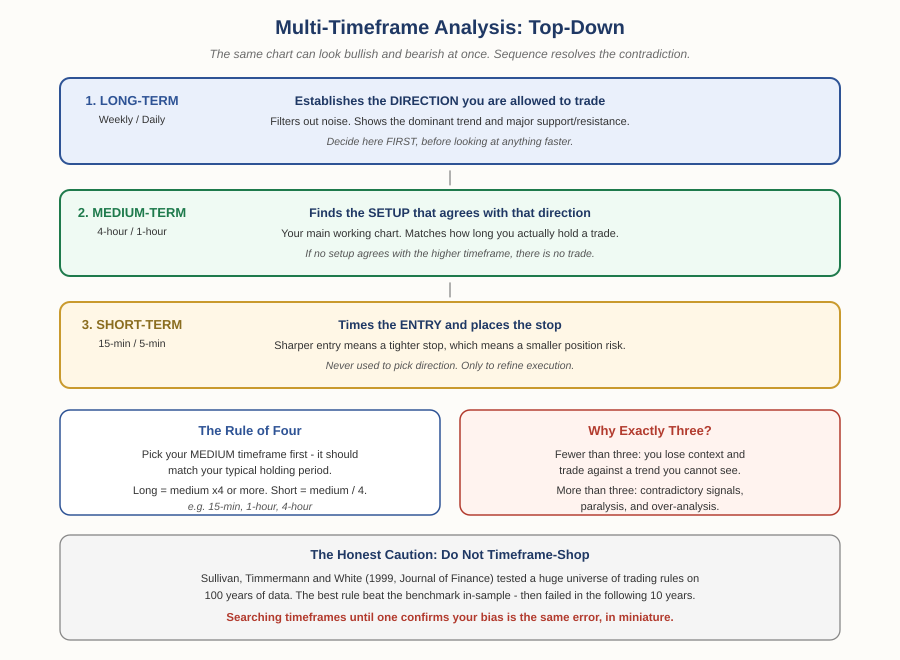

# Forex Track — Chapter 2, Lesson 5: Multi-Timeframe Analysis

## Learning Objectives

By the end of this lesson, you will be able to:

- Explain why the same currency pair can look bullish and bearish at the same time
- Apply the top-down method: direction, then setup, then entry
- Use the "rule of four" to choose three timeframes that actually complement each other
- Recognise timeframe-shopping as a form of the data-snooping error, and avoid it

---

## 1. The Problem This Solves

Here's a situation every new trader hits. You spot a clean uptrend on the 15-minute chart, go long — and the trade immediately dies. You pull up the daily chart and discover the pair has been in a steady downtrend for three weeks. Your "uptrend" was a small bounce inside a much larger fall.

Nothing was wrong with your chart reading. You were reading a chart that couldn't answer the question you were asking.

:::definition
**Multi-Timeframe Analysis (MTFA)** — Examining the same currency pair across several chart timeframes to understand both the broader trend and the immediate price action before committing to a trade.
:::

:::warning
A single timeframe gives you an incomplete picture *by construction*. A 5-minute chart cannot show you a three-month trend, and a weekly chart cannot show you a good entry price. These aren't competing views to pick between — they're different questions, and you need all of them answered in the right order.
:::

---

## 2. The Top-Down Method

The order is the entire technique. You move from slowest to fastest, and each timeframe has exactly one job.

**Step 1 — Long-term chart: establish direction.** Weekly or daily. This filters out short-term noise and shows the dominant trend plus major support and resistance (Foundations Ch3, Lesson 1). Whatever this chart says, that's the direction you're *permitted* to trade. Decide it here, before looking at anything faster.

**Step 2 — Medium-term chart: find the setup.** Typically 4-hour or 1-hour. This is your main working chart, and it should roughly match how long you actually hold trades. You're looking for a setup that agrees with the direction established in Step 1. If nothing agrees, there is no trade — that's a valid, complete outcome.

**Step 3 — Short-term chart: time the entry.** 15-minute or 5-minute. This is *only* for execution: pinpointing entry and placing a tighter stop-loss. It never decides direction.

:::example
Daily chart: EUR/USD in a clear uptrend, higher highs and higher lows. Direction established — you're looking for longs only. Down to the 1-hour: price has pulled back to a support level that held twice before. That's a setup consistent with the daily trend. Down to the 15-minute: you wait for price to stop falling and turn up, then enter — with your stop just below that support level. Because the 15-minute chart let you enter close to your invalidation point, your stop distance is smaller, which by the position-sizing formula from Chapter 1, Lesson 5 means you can take a properly sized position for the same fixed dollar risk.
:::

That last point is worth making explicit: **a sharper entry doesn't just feel better — it mathematically reduces the distance to your stop, which is a direct input to how much you're risking.** MTFA isn't just about being right more often; it's about being wrong more cheaply.

---

## 3. Choosing Your Three Timeframes: The Rule of Four

:::definition
**The Rule of Four** — A convention for selecting complementary timeframes: choose your medium-term chart first (it should reflect your typical holding period), then set the long-term at roughly four times that interval, and the short-term at roughly a quarter of it.
:::

:::example
Medium = 1-hour → long = 4-hour, short = 15-minute. Medium = daily → long = weekly, short = 4-hour. The exact multiplier isn't sacred (some traders use six), but the principle is: each timeframe should be far enough apart to tell you something genuinely different.
:::

Why three, specifically? Fewer than three and you lose context — you end up trading against a trend you can't see. More than three and you get contradictory signals, over-analysis, and paralysis. This is the same trap Lesson 1 warned about with indicators: **more inputs is not more insight.**

---

## 4. The Honest Caution — Don't Timeframe-Shop

There's a failure mode specific to this technique, and it's worth naming clearly because it feels like diligence.

:::warning
**Timeframe-shopping** is cycling through charts until you find one that agrees with a trade you already want to make. If the daily says down, the 4-hour says down, and the 9-minute says up — and you take the long — you haven't done multi-timeframe analysis. You've searched a set of options for the answer you wanted. The direction of travel must be top-down, decided in sequence, and you have to accept the answer the higher timeframe gives you.
:::

That failure has a formal name in the research literature, and a famous cautionary study:

:::example
Sullivan, Timmermann & White (1999), published in *The Journal of Finance*, examined the data-snooping problem directly: they took a huge universe of technical trading rules and tested them against 100 years of daily Dow Jones data. The best-performing rule genuinely did beat the benchmark over the original sample period, even after statistically accounting for data-snooping. But when they applied that same best rule to the following ten years of out-of-sample data, **it failed to outperform.** The rule hadn't found a durable truth about markets — it had found a pattern that fit the data it was selected on.
:::

:::definition
**Data Snooping** — The error of searching a large set of possibilities for one that fits your data, then treating the winner as a genuine discovery — when it may just be the best-fitting coincidence.
:::

Timeframe-shopping is that exact error in miniature: you search a set of charts for the one that fits your bias, then treat it as confirmation. The discipline of a fixed, pre-chosen sequence exists precisely to stop you from doing this.

:::warning
None of this means MTFA doesn't work. Ghanem, Harasheh, Sbaih & Ajmal (2024) — the same study cited back in Foundations Chapter 3 — found that technical analysis can be effective across multiple timeframes, from daily to weekly. The point is narrower and more useful: the *method* has support; the *shopping* does not. Choose your timeframes in advance and hold yourself to them.
:::

---

## What to Look For

- Always start on the highest timeframe. If you catch yourself opening the 5-minute chart first, stop and go back up.
- If the higher timeframe disagrees with the trade you want, the correct action is no trade — not a smaller timeframe.
- Fix your three timeframes before you start looking, and don't change them mid-analysis to justify an entry.
- Notice that a better entry shrinks your stop distance — that's a direct, quantifiable benefit, not just a feeling.

---

## Practice / Quiz

1. Using the rule of four, if your medium-term chart is the 1-hour, which pair of timeframes best completes the set?
   - A) 30-minute and 2-hour
   - B) 15-minute and 4-hour
   - C) 5-minute and 1-hour
   - D) 1-minute and weekly

   **Correct: B — 15-minute and 4-hour.** The short-term is roughly a quarter of the medium (60 ÷ 4 = 15), and the long-term roughly four times it (60 × 4 = 240 minutes = 4 hours).

2. True or False: if your daily chart shows a downtrend but the 15-minute shows an uptrend, the correct move is to take the long trade because the shorter timeframe is more current.

   **Correct: False.** That's timeframe-shopping. The higher timeframe sets the direction you're permitted to trade; the short-term chart is only for timing entries in that established direction.

---

## Key Terms Recap

| Term | One-line definition |
|---|---|
| Multi-Timeframe Analysis | Examining one pair across several chart timeframes before committing to a trade. |
| The Rule of Four | Choosing the medium timeframe first, then long ≈ ×4 and short ≈ ÷4. |
| Timeframe-Shopping | Searching charts until one agrees with a trade you already wanted — a bias, not a method. |
| Data Snooping | Searching many possibilities for one that fits your data, then mistaking it for a real discovery. |

---

*Coming next: Lesson 6 — price action: the practitioner school that argues you can read a market from raw price alone, closing out Chapter 2 with an honest look at what that claim can and can't support.*
