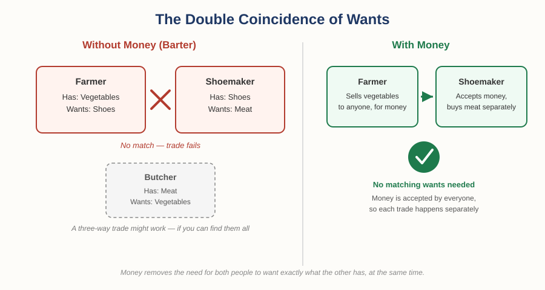
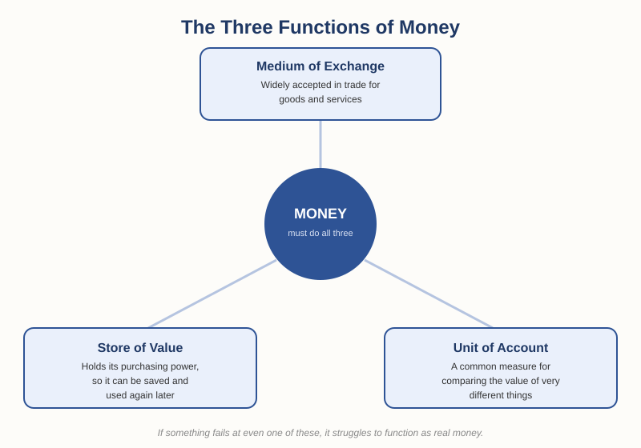
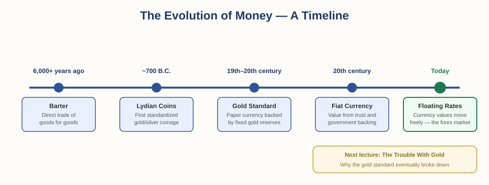

# The Foundation of Money and Trade — Chapter 1, Lesson 1: What Is Money?

## Learning Objectives

By the end of this lesson, you will be able to:

- Explain why barter could not support a growing economy
- Describe the three functions every form of money must perform
- Explain why gold became the dominant form of money for over 2,000 years
- Recognize that money is defined by *function*, not material — the idea that sets up everything else in this course

---

## 1. Before Money: The Barter System

:::definition
**Barter** — Trading goods or services directly for other goods or services, without using money.
:::

For most of human history — over 6,000 years — barter was how people exchanged what they had for what they needed. Understanding this history matters, because currency trading only makes sense once you understand what problem currency was invented to solve.

Barter worked, but it had one serious flaw.

:::definition
**Double Coincidence of Wants** — The requirement that two people each have exactly what the other person wants, at the same time, for a barter trade to happen.
:::

Picture a farmer who grows vegetables and needs new shoes. For barter to work, the farmer has to find a shoemaker who happens to want vegetables — not meat, not tools, not cloth. If the shoemaker wants something else instead, the trade cannot happen directly. The farmer would then need to find a third person who has what the shoemaker wants, trade with them first, and hope that solves it.

:::example
A farmer has vegetables and wants shoes. A shoemaker has shoes but wants meat, not vegetables. Without money, this trade cannot happen directly — the farmer would need to find someone who wants vegetables and has meat, trade for meat first, then trade that meat for shoes.
:::

As populations grew and trade routes expanded, this became unworkable at scale. Something else was needed — a good that everyone would accept, regardless of what they personally wanted at that exact moment. That "something else" is money.

---

## 2. The Three Functions of Money

Money isn't defined by what it's made of. It's defined by what it *does*. For anything to function as real money, it generally has to do three things at once:

:::definition
**Medium of Exchange** — Something widely accepted in trade for goods and services, so people no longer need a double coincidence of wants.
:::

:::definition
**Store of Value** — Something that holds its purchasing power over time, so people can save it today and still trade it for something valuable later.
:::

:::definition
**Unit of Account** — A common measure that lets people compare the value of very different things. How many chickens is a cow worth? Money answers that with a single number, instead of a thousand separate barter negotiations.
:::

:::practice
Think of something in your own life that isn't official government currency but still acts like money in a small community — examples: airtime/phone credit, gift cards, points in a loyalty program. Does it satisfy all three functions above? Which one is it weakest at, and why?
:::

---

## 3. Why Gold Won

Many materials have been tried as money throughout history — shells, salt, livestock, beads, tea bricks. Gold became the dominant choice in most parts of the world, for reasons that map directly onto the three functions above:

:::definition
**Scarcity** — Gold cannot be manufactured or grown; there is a limited supply, which is a key reason it holds value.
:::

- **Durable** — gold doesn't rust, rot, or decay, so it stores value over long periods.
- **Divisible** — it can be melted and divided into smaller, consistent units without losing value.
- **Portable and recognizable** — a small amount is worth a lot, and its purity could be tested and trusted.

Historians generally trace the first standardized gold and silver coinage to the Kingdom of Lydia (in present-day Turkey), around 700 B.C. Before standardized coins, every transaction required weighing and testing metal for purity — slow and open to disputes. A stamped coin with a guaranteed value solved that. That single innovation — a trusted, standardized unit — is arguably the ancestor of every currency system that came after it, including the exchange rates you'll be trading in forex.

---

## 4. Money Doesn't Have to Be Metal

Because money is defined by function, not material, almost anything can become money if a group of people agrees to treat it that way — and history has some striking examples.

:::example
In prisoner-of-war camps during the Second World War, cigarettes functioned as a fully working currency among prisoners. They were divisible (a pack could be broken into individual cigarettes), portable, reasonably durable, and — critically — valued by everyone, even non-smokers, because everyone knew everyone else would accept them in trade. Prices for other goods were quoted "in cigarettes," debts were tracked in cigarettes, and the camp's effective money supply even rose and fell with Red Cross parcel deliveries. This case is well documented in post-war economic literature (R.A. Radford's account of a WWII POW camp economy, published in 1945) and is still taught today as a clean, real-world example of money emerging spontaneously to solve the barter problem.
:::

This matters for a forex trader because it strips away the illusion that a currency has value because of what it's physically made of. A currency has value because enough people trust it and agree to use it — and that trust (or the loss of it) is exactly what moves currency markets today.

:::warning
It's tempting to think of currency value as fixed or "real," the way a kilogram of gold feels real. It isn't. Every currency's value is a reflection of collective trust and expectation — which is precisely why currency values move, and precisely why the forex market exists at all.
:::

---

## What to Look For

When you're evaluating any currency — including ones you'll eventually trade — ask yourself:

- Does this currency function well as a medium of exchange? Do people actually accept it in everyday transactions?
- Does it hold value over time, or does it lose purchasing power quickly? *(This is the seed of understanding inflation, which we'll cover directly in a later chapter.)*
- Is there a trusted, standardized unit that everyone agrees on?

Every one of these questions will come back when we get to fiat currency, central banks, and why some currencies are more volatile than others.

---

## Practice / Quiz

1. Name the three functions of money, and give a one-sentence description of each.
2. In your own words, explain why the "double coincidence of wants" made barter difficult to scale as populations and trade grew.
3. **True or False:** Money must be a physical object made of something valuable, like gold, to function as money. Explain your answer.
4. Using the cigarette-camp example, identify which of the three functions of money cigarettes performed well — and note where they may have been weaker.

:::practice
**Bonus:** Look at the currency used in your own country today. Is it backed by a physical commodity like gold, or is it a *fiat* currency — valuable because of trust and government backing rather than a physical asset? We'll cover this exact distinction in the next lecture.
:::

---

## Key Terms Recap

| Term | One-line definition |
|---|---|
| Barter | Trading goods or services directly, without money |
| Double coincidence of wants | Both parties must want exactly what the other has, at the same time |
| Medium of exchange | Something widely accepted in trade |
| Store of value | Something that holds value over time |
| Unit of account | A common measure for comparing the value of different things |
| Scarcity | Limited supply — a key trait that let gold hold value |

---

*Coming next: Lesson 2 — "Gold's Problems and the Birth of Paper Money," where gold's own limitations push the world toward paper IOUs, competing banknotes, and the first central banks.*

