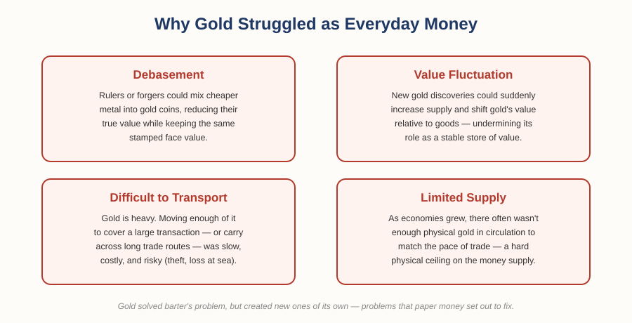
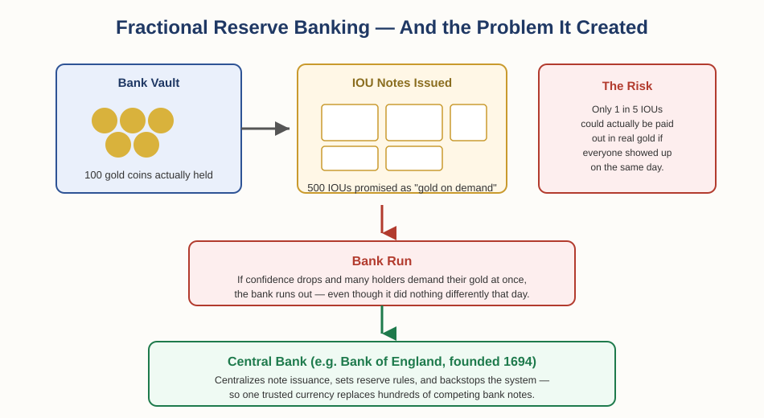

# The Foundation of Money and Trade — Chapter 1, Lesson 2: Gold's Problems and the Birth of Paper Money

## Learning Objectives

By the end of this lesson, you will be able to:

- Name the four practical problems gold had as everyday money
- Explain how paper IOUs solved gold's transport problem — and what new problem they created
- Explain fractional reserve banking and why it creates the risk of a bank run
- Explain what central banks were created to fix

---

## 1. The Trouble With Gold

Gold solved the barter problem — it was widely accepted, held its value, and gave everyone a common unit to measure worth by. But as trade grew larger and more complex, gold turned out to have four practical problems of its own.

:::definition
**Debasement** — Secretly reducing the amount of precious metal in a coin (by mixing in cheaper metal) while still presenting it as full value.
:::

- **Debasement** — rulers under financial pressure, or forgers looking for profit, could shave or dilute the gold content of coins while keeping the same stamped face value. Trust in the coin eroded once people caught on.
- **Value fluctuation** — a sudden gold discovery (a new mine, a conquered territory) could flood the supply and shift gold's value relative to everyday goods, undermining its role as a stable store of value.
- **Difficult to transport** — gold is heavy. Moving enough of it to cover a large transaction, or carrying it along long trade routes, was slow, costly, and risky — theft and shipwrecks were real threats to a trader's entire fortune.
- **Limited supply** — as economies and populations grew, there often wasn't enough physical gold in circulation to keep pace with the growing volume of trade. That's a hard physical ceiling on how much an economy can transact.

:::warning
Notice the pattern: gold was excellent as a *store of value* and *unit of account*, but its physical weight and fixed supply made it clumsy as a *medium of exchange* at scale. Money that's strong on two of the three functions but weak on the third still creates real problems — which is exactly what paper money was invented to fix.
:::

---

## 2. Paper Promises: The Birth of Banknotes

The core idea behind paper money is simple: instead of physically handing over gold every time you trade, what if you left your gold with someone trustworthy for safekeeping, and just traded the *receipt* instead?

:::definition
**IOU (Promissory Note)** — A paper document promising that the holder can redeem it for a specific amount of a real asset (in this case, gold) on demand.
:::

This idea has deep roots in more than one part of the world. Merchant receipts functioned this way in China as early as the Tang Dynasty (7th century), and by the Song Dynasty (11th century), government-issued paper currency was official policy — the earliest known system of its kind. A similar idea took hold independently in Europe centuries later: in 17th-century England, goldsmiths who stored merchants' gold for safekeeping began issuing paper receipts for it. People quickly realized that trading the receipt was far easier than digging up and hauling the actual gold — so the receipts themselves started circulating as money.

:::example
Instead of carrying 50 gold coins across town to pay a merchant, a trader could hand over a single paper note reading "redeemable for 50 gold coins at [Goldsmith's name]." As long as the merchant trusted that goldsmith, the paper was just as good as the gold — and far easier to carry.
:::

This solved gold's transport problem neatly. But it created a new one.

---

## 3. Too Many Promises: The IOU Confusion Problem

Once one goldsmith started issuing paper notes, others did too — each backed by gold held in that specific goldsmith's own vault. That created a practical headache: a note from Goldsmith A wasn't automatically trusted or accepted by Goldsmith B, and it was close to worthless the further it traveled from the goldsmith who issued it, since nobody nearby could verify or trust that particular signature and vault.

:::warning
A note is only as good as the trust behind it. With dozens of competing issuers and no shared standard, the same amount of "money" could be worth very different things depending on *whose* paper you were holding and *where* you tried to spend it.
:::

This is the same core problem barter had — needing to match wants at the individual level — just one layer up: instead of needing to match *goods*, people now needed to match *trust in a specific issuer*. A single, shared, trusted currency was still missing.

---

## 4. Fractional Reserve Banking — and Its Risk

As goldsmith-bankers noticed that customers rarely all showed up to redeem their gold at once, a tempting idea emerged: what if the bank issued *more* paper notes than the actual gold it held, and lent the difference out for profit?

:::definition
**Fractional Reserve Banking** — A banking system where a bank holds only a fraction of the deposits it's responsible for in actual reserve, and lends out or issues notes against the rest.
:::

This is genuinely useful — it's the mechanism that lets banks fund loans, mortgages, and business investment instead of gold just sitting idle in a vault. But it comes with a structural risk.

:::definition
**Bank Run** — A situation where a large number of depositors try to withdraw their funds at the same time, faster than the bank can actually pay out, because it only holds a fraction of deposits in reserve.
:::

:::example
A bank holds 100 gold coins but has issued 500 IOU notes against them — lending the difference out to earn interest. On an ordinary day, this works fine, because only a few people ever ask for their gold at once. But if confidence in the bank drops for any reason and everyone tries to redeem their notes on the same day, the bank runs out of gold long before it runs out of notes to honor — even though it didn't do anything different that day. The panic itself becomes the crisis.
:::

Multiply this by dozens of competing banks, each with their own notes, their own reserve ratio, and their own risk of collapse, and it's easy to see why national economies eventually needed something more stable than a patchwork of private promises.

---

## 5. Enter the Central Bank

To fix both problems at once — too many competing currencies, and the instability of fractional reserve banking — countries began establishing central banks: a single, government-backed institution responsible for issuing the national currency and regulating the banking system around it.

:::definition
**Central Bank** — A country's official monetary institution, responsible for issuing its currency, regulating the banking system, and managing the overall money supply.
:::

The Bank of England, founded in 1694, is one of the earliest and most influential examples. It began life primarily as a way to help the English government finance a war, but it gradually took on the role we now recognize as central banking: issuing one trusted, standardized currency instead of hundreds of competing bank notes, and setting rules for how much banks needed to hold in reserve.

:::practice
If a country has one trusted central bank instead of hundreds of competing private note-issuers, which of the three functions of money (medium of exchange, store of value, unit of account) does that most directly strengthen — and why?
:::

Central banks didn't eliminate every problem gold and private banknotes had. But they set the stage for the next major shift: currencies that were no longer tied to gold at all, and the beginning of the floating exchange rates that make the forex market possible.

---

## What to Look For

Add these to your checklist from earlier in the chapter:

- Who actually backs a currency, and how much do you trust that issuer?
- Is there one standard, trusted currency in circulation — or several competing versions that create confusion?
- What happens to this currency's holders if the issuing institution comes under stress?

---

## Practice / Quiz

1. Name the four practical problems with gold as everyday money, and briefly explain one of them in your own words.
2. Explain why a paper IOU from one goldsmith might not be accepted at full value by a different goldsmith or merchant.
3. In your own words, explain what fractional reserve banking is, and why it creates the possibility of a bank run.
4. What specific problems was the creation of central banks, like the Bank of England in 1694, designed to solve?

---

## Key Terms Recap

| Term | One-line definition |
|---|---|
| Debasement | Secretly reducing the precious-metal content of a coin |
| IOU (Promissory note) | A paper promise redeemable for a real asset on demand |
| Fractional reserve banking | Holding only part of deposits in reserve, lending out the rest |
| Bank run | Many depositors demanding withdrawal at once, faster than the bank can pay |
| Central bank | The official institution that issues a country's currency and regulates its banks |

---

*Coming next: Lesson 3 — "The Rise and Fall of the Gold Standard," where gold's role becomes official policy in 1879 — and where a world war, a depression, and a president named Roosevelt begin to unravel it.*

