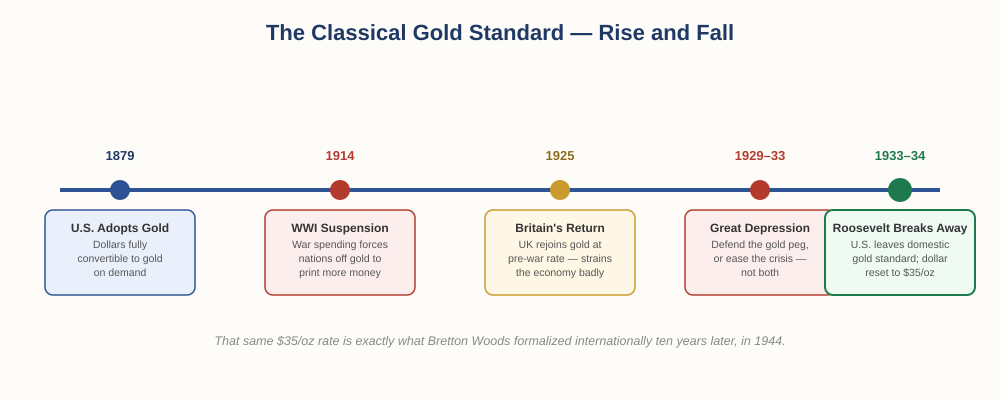

# The Foundation of Money and Trade — Chapter 1, Lesson 3: The Rise and Fall of the Gold Standard

## Learning Objectives

By the end of this lesson, you will be able to:

- Explain what the classical gold standard was and when the U.S. adopted it
- Explain how World War I and the Great Depression each strained the gold standard
- Explain what changed — and what didn't — when Roosevelt took the U.S. off the domestic gold standard in 1933–34
- Explain why a rigid gold standard limits a government's ability to fight a recession

---

## 1. The Classical Gold Standard (1879)

Central banks solved the "too many competing notes" problem, but most 19th-century currencies still weren't formally, directly tied to gold in a standardized way across the whole economy. That changed as major economies moved to what's now called the classical gold standard.

:::definition
**Gold Standard** — A monetary system in which a country's currency is directly backed by, and freely convertible into, a fixed quantity of gold.
:::

The United States formally adopted the gold standard in 1879, when the U.S. dollar became directly redeemable for a fixed amount of gold on demand — not just for foreign central banks, as under the later Bretton Woods system, but for ordinary citizens too. Britain had adopted a similar system decades earlier, in 1821, and by the late 19th century most major economies had followed.

The appeal was discipline: because every dollar in circulation had to correspond to real gold held in reserve, governments couldn't simply print money without limit. That constraint helped prevent the kind of runaway currency devaluation and loss of confidence that had plagued earlier, less disciplined paper-money systems.

---

## 2. World War I Breaks the System

The classical gold standard worked reasonably well — until a war forced every participating country to choose between keeping their promise to gold and paying for the war.

When the First World War began in 1914, the major combatant nations needed to raise money fast, far beyond what their gold reserves could support. One by one, they suspended gold convertibility so they could print the money needed to fund the war effort.

:::warning
This is the same trade-off you've already seen twice in this chapter — gold discipline versus the flexibility to respond to an urgent crisis. It will not be the last time this exact tension reappears.
:::

After the war, several countries tried to return to gold, hoping to restore the pre-war stability. Britain rejoined the gold standard in 1925, at the same exchange rate the pound had held before the war — a decision that, in trying to preserve national prestige, arguably overvalued the pound relative to Britain's actual post-war economic strength, and put lasting strain on its economy through the rest of the decade.

:::definition
**Gold Exchange Standard** — An interwar variant of the gold standard in which some countries held actual gold reserves, while others held reserves of a gold-convertible currency (like the British pound or U.S. dollar) instead of gold itself.
:::

This interwar system was more fragile than the pre-war original — it depended not just on gold, but on trust in a handful of key currencies that were themselves only indirectly backed by gold. That fragility would be tested within a few years.

---

## 3. The Great Depression and Roosevelt's Break From Gold

When the Great Depression hit in 1929, countries still on the gold standard faced an impossible choice. Defending a fixed gold peg during a severe economic downturn generally meant keeping interest rates high and the money supply tight — precisely the opposite of what a struggling economy needs to recover. Countries that stayed rigidly tied to gold tended to suffer deeper, longer downturns than those that broke away sooner.

:::definition
**Monetary Policy** — The actions a central bank takes to manage a country's money supply and interest rates, typically to influence inflation, employment, and economic growth.
:::

:::definition
**Deflation** — A general decline in prices across an economy over time — the opposite of inflation — which can deepen a recession by encouraging people to delay spending, expecting prices to fall further.
:::

In the United States, the crisis came to a head under President Franklin D. Roosevelt. In 1933, with the country's gold reserves under severe strain and the money supply unable to expand enough to fight the Depression, the U.S. government required citizens to exchange their gold coin and bullion for currency, ending the public's ability to redeem dollars for gold domestically. The following year, the Gold Reserve Act of 1934 officially devalued the dollar — resetting its value from $20.67 to $35 per ounce of gold.

:::definition
**Devaluation** — A deliberate reduction in the official value of a currency, typically expressed relative to another asset (like gold) or another currency.
:::

:::example
The U.S. didn't abandon its relationship with gold entirely in 1933–34 — it left the *domestic* gold standard (ordinary citizens could no longer redeem dollars for gold) while keeping a modified, international-only version alive at the new $35-per-ounce rate. That is exactly the rate — and exactly the structure — that Bretton Woods would formalize internationally ten years later, in 1944.
:::

---

## 4. Why the Gold Standard's Rigidity Became a Problem

Stepping back, the pattern across this entire chapter is the same one repeating at a larger and larger scale: a fixed, disciplined system prevents abuse and builds trust, but that same rigidity leaves no room to maneuver when a real crisis hits.

Under a strict gold standard, a central bank's ability to fight a recession by lowering interest rates or expanding the money supply is capped by how much physical gold it actually holds. When a country needed monetary flexibility most — during a war, a financial panic, or a depression — the gold standard offered the least of it. That structural rigidity is the main reason economists broadly agree the classical gold standard, however disciplined, became increasingly difficult to sustain as national economies grew larger and more complex.

:::practice
Look back at Lesson 2 ("The Trouble With Gold") and this section side by side. Gold's *physical* limitations (heavy, limited supply) and the gold standard's *policy* limitations (inflexibility during a crisis) are related but different problems. In your own words, explain the difference between the two.
:::

By the mid-1930s, the pure gold standard was effectively over in practice, even though the U.S. dollar retained a modified, international-only tie to gold. The world needed — and was about to build — a new, more coordinated system.

---

## What to Look For

Add these questions to your evaluation checklist:

- Is this currency's issuer constrained by a fixed physical asset (like gold), or does it have flexibility to respond to a crisis?
- Has this currency or economy ever been forced off a fixed system under pressure (war, depression, crisis)? What happened when it was?
- Would a "disciplined but rigid" system or a "flexible but trust-dependent" system serve this situation better?

---

## Practice / Quiz

1. What changed about the U.S. dollar's relationship to gold specifically in 1879?
2. Explain why World War I forced major economies to suspend the gold standard.
3. Britain's 1925 return to gold at its pre-war rate is often cited as a mistake. Based on what you've read, explain why.
4. What did Roosevelt's actions in 1933–34 actually change — and what stayed the same?
5. In your own words, explain why a fixed gold standard makes it harder for a country to fight a recession.

---

## Key Terms Recap

| Term | One-line definition |
|---|---|
| Gold Standard | Currency directly backed by, and convertible into, a fixed quantity of gold |
| Gold Exchange Standard | An interwar system mixing actual gold reserves with gold-convertible currency reserves |
| Monetary policy | Central bank actions managing money supply and interest rates |
| Deflation | A general decline in prices across an economy over time |
| Devaluation | A deliberate reduction in a currency's official value |

---

*Coming next: Lesson 4 — "Bretton Woods and the Birth of Forex," where the modified, international-only gold tie the U.S. kept alive in 1934 becomes a full global system in 1944 — and where that system's eventual collapse creates the forex market itself.*

