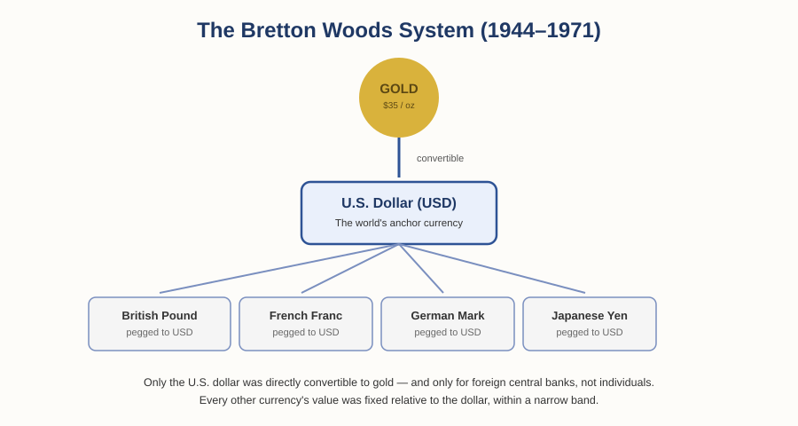
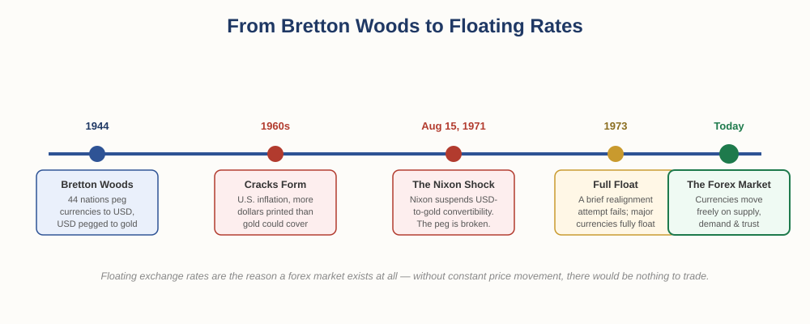

# The Foundation of Money and Trade — Chapter 1, Lesson 4: Bretton Woods and the Birth of Forex

## Learning Objectives

By the end of this lesson, you will be able to:

- Explain how the Bretton Woods system worked, and how it connects to Roosevelt's 1934 devaluation
- Explain the Triffin Dilemma and why Bretton Woods became unsustainable
- Explain what the Nixon Shock announced in 1971, and why it mattered
- Explain, in your own words, why floating exchange rates are the direct reason the forex market exists

---

## 1. Bretton Woods: One Currency to Rule Them All

By the end of the Second World War, the world needed a new answer to an old problem: how do you let dozens of separate national currencies trade with each other in a stable, predictable way? In July 1944, representatives of 44 Allied nations gathered in Bretton Woods, New Hampshire, to design that answer.

:::definition
**Bretton Woods System** — The 1944 international agreement under which most currencies were pegged to the U.S. dollar, while the U.S. dollar itself remained convertible to gold at a fixed rate.
:::

Rather than have every country individually back its own currency with its own gold reserves — the old, clumsy system — the conference settled on something more elegant: every country would peg its currency to the U.S. dollar, and only the dollar itself would remain directly convertible to gold, at a fixed rate of $35 per ounce.

:::definition
**Peg (Pegged Currency)** — A currency whose value is fixed, or held within a narrow band, relative to another currency rather than allowed to move freely.
:::

:::definition
**Convertibility** — The ability to exchange a currency for a fixed amount of another asset (in this case, gold) on demand.
:::

The U.S. was uniquely positioned for this role — at the time, it held the largest share of the world's gold reserves by far, which gave the dollar the credibility to anchor the entire system. In practice, that convertibility to gold was extended to foreign central banks, not individual citizens.

This arrangement had real advantages. Countries and businesses could now hold U.S. dollars as reserves instead of physically shipping gold to settle international trade, which made cross-border commerce faster, cheaper, and far more predictable — a direct fix for the transport problem gold always had.

---

## 2. The Cracks Form

A system where one country's currency underpins the entire world's trade only works as long as that country keeps its side of the bargain. Over the 1950s and 60s, the U.S. gradually strained under a structural conflict economists now call the Triffin Dilemma, after the economist who first articulated it.

:::definition
**Triffin Dilemma** — The conflict faced by a country whose currency serves as the world's primary reserve currency: it must supply the world with enough of its currency to support global trade, while also maintaining enough confidence in that currency's value to keep it credible — two goals that pull in opposite directions.
:::

To supply the world with enough dollars for growing global trade, the U.S. had to run persistent deficits and keep dollars flowing outward. But the more dollars that circulated abroad, the harder it became to credibly promise that every single one could still be converted to gold at $35 an ounce — especially as domestic inflation and heavy government spending (including the Vietnam War) meant more dollars were being printed than the U.S. gold reserve could realistically back.

:::warning
By the late 1960s, several countries had begun formally demanding gold in exchange for their dollar reserves rather than continuing to hold dollars — a rational response once doubt set in, but one that made the underlying problem worse by draining U.S. gold reserves even faster.
:::

---

## 3. The Nixon Shock (1971)

:::example
On August 15, 1971, U.S. President Richard Nixon announced in a televised address that the United States would suspend the convertibility of the dollar into gold. What was framed at the time as temporary turned out to be permanent — the U.S. never resumed gold convertibility. This announcement is often referred to as "closing the gold window," and is widely known today as the Nixon Shock.
:::

:::definition
**Nixon Shock** — The August 1971 announcement suspending the U.S. dollar's convertibility to gold, effectively ending the Bretton Woods system.
:::

A brief attempt to patch the system followed — the Smithsonian Agreement in December 1971 tried to realign currencies around a devalued dollar — but the underlying trust had already broken. By 1973, the major currencies of the world had abandoned fixed pegs entirely and began floating freely against one another.

:::definition
**Floating Exchange Rate** — An exchange rate determined by open market supply and demand, rather than fixed or pegged by government agreement.
:::

---

## 4. Fiat Currency: Value Without Gold

With the last formal tie between money and gold severed, the world entered the era of fiat currency — the system every major economy uses today.

:::definition
**Fiat Currency** — Money that has value because a government declares it legal tender and people trust and accept it, not because it's backed by a physical commodity like gold.
:::

This might sound unstable — money backed by nothing physical at all — but recall Lesson 1, Section 4 ("Money Doesn't Have to Be Metal"): money was never really about the physical material. It was always about trust, and about fulfilling the three functions (medium of exchange, store of value, unit of account). Fiat currency fulfills all three the same way the cigarette economy did in a POW camp — through shared trust and consistent acceptance, backed in this case by the credibility of a government and its central bank.

:::warning
This is also fiat currency's real vulnerability. A currency backed by trust can lose value if that trust erodes — through runaway inflation, political instability, or loss of confidence in the issuing government. Nothing about fiat currency guarantees stability; it has to be actively maintained by sound monetary policy.
:::

---

## 5. Why This Is the Birth of Forex

Here is the thread that ties this entire chapter together: as long as gold — or a gold-pegged dollar — anchored the world's currencies, exchange rates were mostly fixed. There wasn't much to actively trade, because a French franc was worth a predictable, government-set amount of dollars, day after day.

Once the Nixon Shock broke that peg and currencies began floating freely in 1973, every currency's value became a live, moving number — set in real time by supply, demand, interest rates, trust, and economic conditions in each country. That constant, live movement between currencies is precisely what created the need for a market where currencies could be actively bought, sold, and traded against each other.

:::definition
**Reserve Currency** — A currency held in significant quantities by governments and institutions worldwide for international trade and finance; the U.S. dollar has held this role since Bretton Woods.
:::

:::practice
In your own words, explain the direct link between the end of fixed exchange rates in 1971–73 and the existence of the forex market today. Why couldn't a forex market — as we know it — really exist under the Bretton Woods system?
:::

That's the answer to the question this whole chapter has been building toward: **What is forex?** It's the market that exists specifically because currencies are no longer fixed to gold or to each other — they float, they move, and where there's constant, unpredictable movement in something valuable, a market emerges to trade it.

---

## What to Look For

Your full Chapter 1 checklist:

- Does this currency function well as a medium of exchange? Do people actually accept it in everyday transactions?
- Does it hold value over time, or does it lose purchasing power quickly?
- Is there one trusted, standardized issuer — or competing, confusing versions?
- Who backs this currency, and how much do you trust that issuer?
- Is this currency's value fixed/pegged, or does it float freely on the open market?
- What underlying trust (government stability, monetary policy, economic strength) is this currency's value really resting on?

---

## Practice / Quiz

1. In one or two sentences, explain how the Bretton Woods system worked.
2. What was the Triffin Dilemma, and why did it make the Bretton Woods system difficult to sustain long-term?
3. What did the Nixon Shock actually announce, and why was 1971 a turning point in monetary history?
4. Explain, in your own words, why floating exchange rates are the reason the forex market exists.

---

## Key Terms Recap

| Term | One-line definition |
|---|---|
| Bretton Woods System | The 1944 agreement pegging currencies to the U.S. dollar, itself pegged to gold |
| Peg (Pegged currency) | A currency fixed in value relative to another currency |
| Convertibility | The ability to exchange a currency for a fixed amount of another asset on demand |
| Triffin Dilemma | The conflict facing a reserve-currency country between global liquidity and maintaining trust |
| Nixon Shock | The 1971 suspension of the dollar's convertibility to gold |
| Floating exchange rate | An exchange rate set by open market supply and demand |
| Fiat currency | Money valuable because of government backing and trust, not a physical commodity |
| Reserve currency | A currency widely held by governments and institutions for global trade and finance |

---

*Chapter 1 complete — you've now traced money from barter all the way to the modern forex market. Coming next: Chapter 2 — "Currency Pairs & Quotes," where we move from history into the mechanics you'll actually use to read and trade the forex market: how a quote like EUR/USD = 1.0850 is built, and what majors, minors, and exotics actually mean.*

