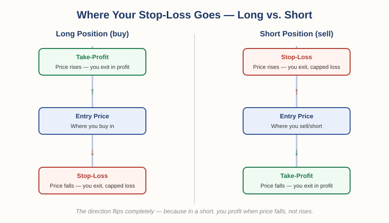

# The Foundation of Money and Trade — Chapter 2, Lesson 2: Setting a Stop-Loss — Where and Why

## Learning Objectives

By the end of this lesson, you will be able to:

- Identify the three prices every trade decision requires: entry, stop-loss, and take-profit
- Explain why stop-loss placement is mirrored between a long position and a short position
- Explain why risk management focuses overwhelmingly on the stop-loss, not the take-profit
- Recognize that a stop-loss price alone is only half the picture — position size is what's coming next

---

## 1. Three Prices, Every Time

Lesson 1 established that risk *limitation* — capping how much a position can cost you — is the technique you'll use the most. This lesson makes that concrete: this is exactly what a stop-loss does, and there's a precise, repeatable way to think about where it goes.

Every time you enter a position, there are three prices to think through — not one:

:::definition
**Entry Price** — The price at which you actually open a position.
:::

:::definition
**Take-Profit** — The price at which you plan to exit if the position moves in your favor.
:::

:::definition
**Stop-Loss** — The price at which you plan to exit if the position moves against you, capping your loss at a known, fixed amount.
:::

:::warning
Risk management, specifically, is almost entirely about the stop-loss. Making "too much" profit is never a problem worth solving. Losing more than you planned to is the only outcome risk management exists to prevent — so that's where the discipline goes.
:::

---

## 2. Going Long: Stop-Loss Below, Take-Profit Above

:::definition
**Long Position** — A position that profits if the price goes *up*. You're buying now, expecting to sell later at a higher price.
:::

If you're long, the logic is straightforward: you want out at a higher price if you're right, and out at a lower price — with a defined limit — if you're wrong.

:::example
You're watching USD/CAD trade inside a channel, and you decide to buy near a support zone — say, 1.34. You believe the price will rise from there. Your take-profit sits *above* your entry, at a level where you'd be satisfied taking the win. Your stop-loss sits *below* your entry — placed near the support zone, or another level the price would have real difficulty falling through if your read on the market is correct. If the price falls to your stop instead of rising, you exit there, take the defined loss, and move on to the next opportunity.
:::

For a long position: **stop-loss is below entry. Take-profit is above entry.** Always.

---

## 3. Going Short: The Exact Mirror

:::definition
**Short Position** — A position that profits if the price goes *down*. You're effectively selling now, expecting to buy back later at a lower price.
:::

Shorting flips the entire logic, because you're now betting on a decline rather than a rise.

:::example
You believe a currency pair is about to fall, so you open a short position at, say, 1.36. If you're right and the price falls, that's your profit — so your take-profit sits *below* your entry. But if the price rises instead of falling, you're now losing money, so your stop-loss sits *above* your entry — at a level where, if the price reaches it, you accept you were wrong on direction and exit.
:::

For a short position: **stop-loss is above entry. Take-profit is below entry.** The complete opposite placement from a long position — because the direction you're betting on is opposite too.

:::practice
Without looking back at the text: if you open a long position at 1.50, and you decide your stop-loss will be 30 pips away, is your stop-loss at 1.47 or 1.53? Now do the same exercise for a short position opened at 1.50 with a 30-pip stop. Work both out before checking — the direction of the stop is the entire point of this lesson.
:::

---

## 4. Where Exactly Does a Stop-Loss Go?

Notice that in both examples above, the stop wasn't placed at a random distance — it was placed near a level the price would plausibly have a *harder time reaching* if the original read on the market holds up: a support zone for a long, a resistance zone for a short. That logic comes from technical analysis, which this course covers in more depth elsewhere.

What matters for risk management specifically isn't the technical reasoning behind the exact level — it's the discipline of having a defined stop *before* you enter, every single time, with no exceptions.

:::warning
A stop-loss you decide on *after* you're already losing money is not risk management — it's hope with a delay. The entire value of a stop-loss comes from setting it before you enter, while you're still thinking clearly.
:::

---

## What to Look For

- Before entering any position, can you state your stop-loss price out loud, right now — not "somewhere around there," but an exact number?
- Does your stop-loss sit on the correct side of your entry for the direction you're trading — below for long, above for short?
- Are you setting your stop based on a plan made in advance, or reacting in the moment after a trade has already gone against you?

---

## Practice / Quiz

1. You enter a **long** position on a currency pair at 1.50. Where should your stop-loss sit relative to your entry?
   - A) Above your entry price
   - B) Below your entry price
   - C) Exactly at your entry price
   - D) It doesn't matter, as long as you have one

   **Correct: B — below your entry price.** A long position profits when price rises, so the stop-loss — your defined exit if you're wrong — sits below, where a fall would prove the trade against you.

2. True or False: in a short position, your stop-loss is placed below your entry price.

   **Correct: False.** A short position profits when price falls, so the stop-loss sits *above* the entry — a rise is what proves a short position wrong.

---

## Key Terms Recap

| Term | One-line definition |
|---|---|
| Entry Price | The price at which you open a position. |
| Take-Profit | The price at which you plan to exit if the trade moves in your favor. |
| Stop-Loss | The price at which you plan to exit if the trade moves against you. |
| Long Position | A position that profits if price rises. |
| Short Position | A position that profits if price falls. |

---

*Coming next: Lesson 3 — position sizing. A correctly placed stop-loss only protects you if you've also sized the trade correctly — how many units, lots, or shares you actually buy based on your account size and how far away your stop sits.*
