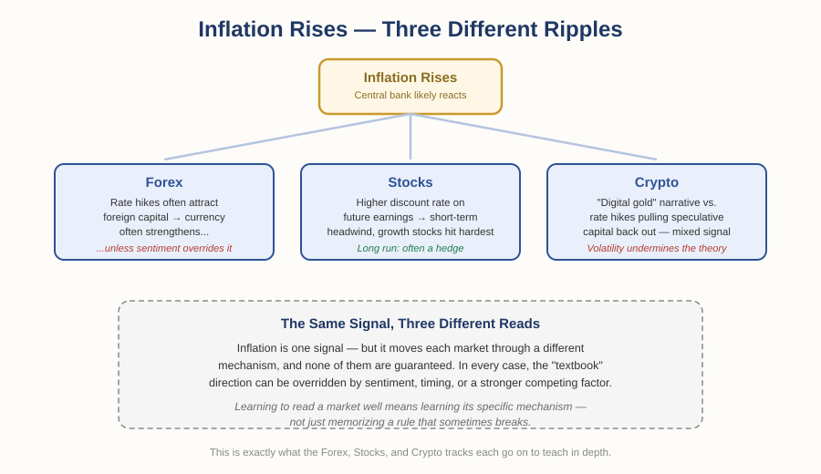

# The Foundation of Money and Trade — Chapter 2, Lesson 3: Inflation — What It Is, and How It Moves Every Market

## Learning Objectives

By the end of this lesson, you will be able to:

- Define inflation and explain the two basic ways it gets started
- Explain why central banks target a low, positive inflation rate rather than zero
- Explain how inflation tends to affect currencies, stocks, and crypto assets — and why "tends to" is doing a lot of work in that sentence
- Recognize inflation as a signal worth reading regardless of which market you eventually trade

---

## 1. The Measurable Version of a Problem You Already Know

Back in Chapter 1, we established that fiat currency has value purely because people trust it — and that trust can erode. Inflation is what that erosion looks like when you actually measure it.

:::definition
**Inflation** — A general, sustained rise in the prices of goods and services across an economy, which reduces how much each unit of currency can buy.
:::

When inflation rises, a unit of currency buys less than it did before — not because the currency changed physically, but because trust and supply dynamics shifted the price level around it.

---

## 2. What Actually Causes Inflation

Inflation doesn't have one single cause. It generally comes from one of two directions.

:::definition
**Demand-Pull Inflation** — Inflation that occurs when demand for goods and services grows faster than the economy's ability to supply them, pushing prices up.
:::

:::definition
**Cost-Push Inflation** — Inflation that occurs when the cost of producing goods rises (raw materials, wages, transport), and businesses pass those higher costs on to consumers.
:::

:::example
If wages rise across an economy and people simply have more money to spend, demand can outpace supply — that's demand-pull. If a shipping disruption makes raw materials more expensive to move, and manufacturers raise prices to cover it, that's cost-push. Real-world inflation is often a mix of both at once.
:::

---

## 3. How Inflation Gets Measured

:::definition
**Consumer Price Index (CPI)** — A measure of the average change in prices for a fixed basket of goods and services commonly bought by households; the most widely used inflation gauge.
:::

:::definition
**Core Inflation** — Inflation measured after excluding food and energy prices, which swing sharply for reasons unrelated to the broader economy and can otherwise distort the picture.
:::

Government statistics agencies track thousands of individual prices — everything from rent to groceries to electronics — and weight them by how much of a typical household's spending they represent. That weighted average, tracked over time, is what you see reported as "the inflation rate."

---

## 4. Why 2%, Not 0%

Most major central banks — the U.S. Federal Reserve and the Bank of England among them — target inflation around 2% per year, not zero.

:::warning
Zero inflation sounds ideal until you remember Chapter 1's discussion of deflation. A little inflation gives a central bank room to maneuver — it can cut interest rates to fight a slowdown without immediately pushing the economy into deflation, which discourages spending and can deepen a recession rather than ease it. Too high, and inflation erodes trust in the currency; too low, and the economy loses the cushion it needs. Moderate, steady inflation is the target precisely because both extremes are worse.
:::

:::practice
If a central bank raises interest rates specifically to fight inflation, what effect would you expect that to have on borrowing and spending, based on what you already know about monetary policy from Chapter 2, Lesson 1? Work it out before continuing.
:::

---

## 5. How Inflation Moves Three Different Markets

This is where inflation stops being an abstract economic statistic and starts being something a trader actually watches. Here's the important part: **inflation doesn't affect every market the same way — and it doesn't even affect any one market the same way every time.**

### Forex: Inflation, Interest Rates, and Currency Strength

Central banks fight high inflation by raising interest rates. Higher rates tend to attract foreign capital — investors can earn a better return holding that currency — which tends to make the currency appreciate.

:::example
In late 2021, U.S. inflation was running notably higher than inflation in the Eurozone. The textbook expectation would be a weaker dollar against the euro. Instead, the U.S. dollar traded near a 16-month high against the euro — because fears of renewed COVID-19 lockdowns in Europe outweighed the inflation differential in traders' minds. The "textbook" relationship didn't break; it was simply overridden by a stronger factor at that moment.
:::

:::warning
Forex trading always involves *two* currencies. High inflation weakening one side of a pair tells you nothing useful until you also check what's happening with the other side — and even then, sentiment can override the textbook relationship entirely.
:::

### Stocks: Inflation, Earnings, and Valuation

Inflation's effect on stocks splits by time horizon. In the long run, many companies can pass rising costs on to consumers, eventually restoring normal profit levels — making a diversified stock portfolio a reasonable long-term inflation hedge. In the short run, the relationship is frequently the opposite: rising inflation often pushes stock prices *down*, largely because a stock's value is partly based on discounting its expected future earnings back to today's terms, and higher inflation increases that discount rate — shrinking the present value of future profits.

:::definition
**Value Stock** — A share trading below what its current earnings and cash flow arguably justify, typically an established, mature company.
:::

:::definition
**Growth Stock** — A share priced on the expectation of much larger future earnings, typically a younger or fast-expanding company.
:::

Because growth stocks lean more heavily on distant future earnings, they tend to suffer more than value stocks when inflation rises — that higher discount rate shrinks a far-off dollar more than a near-term one.

### Crypto: The "Digital Gold" Narrative, and Its Limits

Bitcoin is often called "digital gold" because its supply is capped at 21 million coins — unlike a fiat currency, no central bank can print more of it. That scarcity is the entire basis of the argument that it should hold value well during inflation.

:::warning
The theory is clean; the practice is messier. Bitcoin's short-term price volatility has repeatedly overshadowed its case as a reliable inflation hedge — an asset that can swing 10% in a day doesn't behave like a stable store of value, whatever its long-term supply cap implies. Rising interest rates (the usual response to inflation) also tend to pull speculative capital *out* of crypto, since safer, yield-bearing assets suddenly look more attractive — often pushing crypto prices down at exactly the moment the "digital gold" narrative would predict a rise.
:::

In economies experiencing severe currency devaluation — Venezuela and Türkiye are frequently cited examples — cryptocurrency adoption has genuinely risen as people look for an alternative to a rapidly weakening local currency. That's a real pattern, distinct from the shorter-term "hedge" narrative in more stable economies.

---

## What to Look For

- What's actually driving a given inflation reading — demand outpacing supply, or rising input costs? The cause shapes how long it's likely to persist.
- Is a central bank's response to inflation seen as credible and confident, or as too slow or too aggressive? Market *perception* of the response often matters more than the inflation number itself.
- Before assuming "inflation up → this market moves this way," check whether a stronger, more immediate factor might be overriding the textbook relationship right now.
- Which time horizon are you actually reasoning about — the long-run relationship and the short-run relationship are frequently opposites.

---

## Practice / Quiz

1. Why do most central banks target a low, positive inflation rate (commonly around 2%) instead of 0%?
   - A) A 0% target is illegal in most countries
   - B) Slight inflation gives room for monetary policy to work and helps avoid the risks of deflation
   - C) Inflation below 2% cannot be accurately measured
   - D) Central banks don't actually target any specific inflation rate

   **Correct: B.** Zero or negative inflation (deflation) removes a central bank's room to maneuver and can deepen a recession — moderate, steady inflation is the healthier target.

2. True or False: higher-than-expected inflation always causes a currency to weaken.

   **Correct: False.** The EUR/USD example shows inflation differentials can be completely overridden by other factors — like fear of lockdowns — that traders weigh more heavily at a given moment.

3. True or False: Bitcoin's fixed supply guarantees it will hold its value during periods of high inflation.

   **Correct: False.** The fixed-supply argument is theoretically sound, but short-term volatility and capital flows driven by interest rate changes have repeatedly undermined Bitcoin's reliability as a short-term inflation hedge in practice.

---

## Key Terms Recap

| Term | One-line definition |
|---|---|
| Inflation | A general, sustained rise in prices that reduces what a currency can buy. |
| Demand-Pull Inflation | Inflation from demand growing faster than supply. |
| Cost-Push Inflation | Inflation from rising production costs passed on to consumers. |
| Consumer Price Index (CPI) | The most widely used measure of average price change across a household basket of goods. |
| Core Inflation | Inflation excluding volatile food and energy prices. |
| Value Stock | A share trading below what its current earnings arguably justify. |
| Growth Stock | A share priced mainly on expected future earnings growth. |

---

*Coming next: Lesson 4 — diversification, and why "don't put all your eggs in one basket" is a genuinely testable claim, not just a saying, closing out Chapter 2.*
