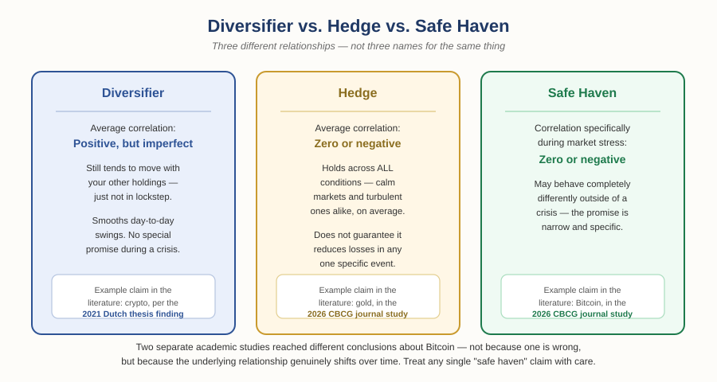

# The Foundation of Money and Trade — Chapter 2, Lesson 4: Diversification — Why "Don't Put All Your Eggs in One Basket" Is Testable

## Learning Objectives

By the end of this lesson, you will be able to:

- Explain what a portfolio is and why its parts interact, not just coexist
- Explain diversification as a specific, testable relationship between assets — not just "owning a lot of different things"
- Distinguish between a diversifier, a hedge, and a safe haven — three genuinely different things often used as if they're the same word
- Explain why diversification reduces risk but never eliminates it

---

## 1. What a Portfolio Actually Is

:::definition
**Portfolio** — The complete collection of everything you hold — every position across every asset — treated as one connected whole rather than separate, unrelated bets.
:::

Think of a portfolio like a cake. A cake has distinct ingredients — flour, sugar, eggs — each with its own function, and each still recognizably itself. But once baked, they don't act independently anymore: they interact to produce something new. Your portfolio works the same way. A stock position and a currency position are genuinely different things, but they're both part of the same total outcome, and market conditions can move several of your holdings at once even though none of them directly caused the others to move.

---

## 2. What Diversification Actually Means

:::definition
**Diversification** — Spreading exposure across different assets, sectors, regions, or markets so that a single holding's poor performance doesn't dominate your overall result.
:::

Here's the part most beginner explanations skip: diversification isn't about *quantity* — owning twenty things isn't automatically safer than owning five. It's about *relationship*. Two assets that always move together provide almost no real diversification benefit no matter how different they seem on the surface.

:::definition
**Correlation** — A measure of how closely two assets' prices tend to move in relation to each other, ranging from perfectly together (+1) to perfectly opposite (-1), with 0 meaning no consistent relationship at all.
:::

:::warning
Highly correlated holdings can create the illusion of diversification without the substance. A portfolio split evenly across ten tech stocks looks diversified by holding count — but if all ten tend to rise and fall together, it behaves like one large bet, not ten independent ones. This is sometimes called naive diversification: mistaking the *number* of holdings for actual risk reduction.
:::

---

## 3. Three Words People Use Interchangeably — and Shouldn't

This is where most casual explanations of diversification get imprecise, and it's worth getting right, because the distinction genuinely changes how you'd use an asset.

:::definition
**Diversifier** — An asset with an average *positive* — but imperfect — correlation to your existing holdings. It still tends to move in the same general direction as the rest of your portfolio, just not in lockstep, which smooths out some of the swings.
:::

:::definition
**Hedge** — An asset with an average correlation at or below zero to another asset, *across all conditions* — calm markets and turbulent ones alike.
:::

:::definition
**Safe Haven** — An asset that specifically holds zero or negative correlation *during periods of market stress* — even if it behaves completely differently the rest of the time.
:::

The distinction matters because an asset can be one of these without being the others. Something can be a genuine diversifier — smoothing your portfolio's day-to-day swings — without being remotely reliable as a safe haven during an actual crisis.

:::example
Two separate academic studies looked at whether Bitcoin behaves as a safe haven for stock portfolios. One (published in the Journal of Central Banking Theory and Practice, 2026) found Bitcoin showed a statistically significant *negative* correlation with the S&P 500 — a real candidate for safe-haven status, by that specific test. Another, more time-extended study found Bitcoin's correlation with U.S. and European stocks had risen from roughly 0.05 in 2017 to somewhere between 0.25 and 0.30 by 2021 — a meaningfully positive relationship, not a negative one — and concluded that crypto behaves as a diversifier, not a safe haven. Both studies used real data and careful methods. They still disagree. That's not a flaw in the research — it's a sign that the underlying relationship genuinely shifts over time, and "digital gold" is a much shakier label than it sounds.
:::

---

## 4. Diversification Across Currency Pairs (A Forex Preview)

The same logic applies inside a single market, not just across different ones. In forex specifically, diversification means holding multiple currency pairs rather than concentrating everything in one — but only if those pairs aren't just quietly moving together anyway.

:::warning
EUR/USD and GBP/USD frequently move in the same direction, since both the euro and the pound respond to overlapping economic pressures relative to the dollar. Holding both isn't meaningfully different from holding a larger position in just one of them. Genuine forex diversification means deliberately choosing pairs with low or negative correlation to each other — not just holding more pairs for the sake of it.
:::

---

## 5. What Diversification Does *Not* Do

:::warning
Diversification reduces risk. It does not remove it, and it does not guarantee a profit. During a genuine broad market shock, correlations across many assets tend to rise together — the calm-market relationships you diversified around can temporarily break down exactly when you need them most. A well-diversified portfolio can still lose money in a crisis; the goal is limiting how much, not avoiding loss altogether.
:::

This is worth sitting with, because it directly echoes something from Chapter 2, Lesson 1: risk management was never about eliminating risk. It's about deciding which risks are worth taking and controlling how much they can cost you. Diversification is one more tool in that same toolbox — not a way around the fundamental deal you're making every time you hold a position.

---

## What to Look For

- Before assuming two holdings diversify each other, check whether they're actually correlated — don't assume based on how different they look on the surface.
- If someone calls an asset a "safe haven," ask: safe haven *during what, specifically* — and is that claim based on one study, or a broad, consistent body of evidence?
- Remember that correlations are not fixed. An asset that diversified your portfolio well two years ago may not do so today — a genuine reason to revisit a portfolio periodically rather than assume yesterday's structure still holds.
- Watch for naive diversification — count is not the same as genuine risk-spreading.

---

## Practice / Quiz

1. What's the key difference between a "diversifier" and a "safe haven," as defined in this lesson?
   - A) There is no real difference — they're the same thing
   - B) A diversifier has an average positive (but imperfect) correlation; a safe haven specifically holds zero/negative correlation during market stress
   - C) A safe haven is always gold, and a diversifier is always a stock
   - D) A diversifier only applies to forex, and a safe haven only applies to crypto

   **Correct: B.** These are precise, different relationships — an asset can be one without being the other.

2. True or False: owning a large number of different assets automatically means a portfolio is well-diversified.

   **Correct: False.** This is the naive diversification trap — if the holdings are highly correlated, a large number of them can still behave like one concentrated bet.

3. True or False: a well-diversified portfolio is protected from losses during a major market crash.

   **Correct: False.** Diversification reduces risk but does not eliminate it — correlations across many assets often rise together during genuine market-wide shocks.

---

## Key Terms Recap

| Term | One-line definition |
|---|---|
| Portfolio | The complete collection of everything you hold, treated as one connected whole. |
| Diversification | Spreading exposure so no single holding dominates the result. |
| Correlation | A measure of how closely two assets' prices move in relation to each other. |
| Diversifier | An asset with an average positive but imperfect correlation to your holdings. |
| Hedge | An asset with an average zero/negative correlation across all conditions. |
| Safe Haven | An asset with zero/negative correlation specifically during market stress. |

---

*Chapter 2 complete — you've now covered risk, stop-losses, inflation, and diversification. Coming next: Chapter 3, the final Foundations chapter before the paid tracks begin — reading markets and making decisions, tying everything so far into one practical framework.*
