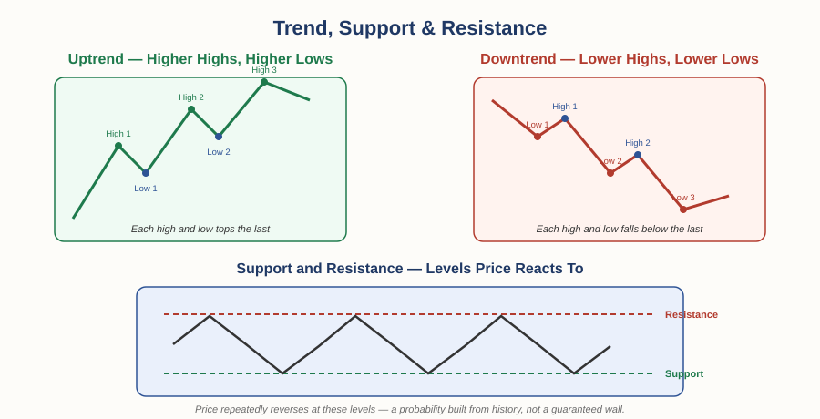

# The Foundation of Money and Trade — Chapter 3, Lesson 1: How to Read a Market

## Learning Objectives

By the end of this lesson, you will be able to:

- Identify the three main chart types and what each one actually shows you
- Define support and resistance, and describe the basic shape of a trend
- Explain what tape reading was, and how its core idea survives in modern markets
- Recognize that reading a chart is gathering information — not, by itself, making a decision

---

## 1. Three Ways to Look at the Same Price

Every price chart is showing you the same underlying thing — how a price moved over time — but the three common formats reveal different amounts of detail.

:::definition
**Line Chart** — Connects closing prices over time with a single line. Simple and clear for spotting the overall trend, but tells you nothing about what happened *within* each period.
:::

:::definition
**Bar Chart** — Shows the open, high, low, and close for each period as a single vertical bar, with small horizontal ticks marking the open (left) and close (right).
:::

:::definition
**Candlestick Chart** — Shows the same open/high/low/close data as a bar chart, but with a colored "body" between the open and close, making bullish and bearish periods visually obvious at a glance. We covered candlestick origins back in Chapter 1 — this is the same tool, now in its modern trading context.
:::

None of these formats is "more correct" than the others — they're the same data, presented with different amounts of visual detail. Most traders default to candlesticks simply because the color-coded body makes sentiment easiest to scan quickly across many periods.

---

## 2. Trend, Support, and Resistance

A trend isn't just "the price is going up" or "the price is going down" — it has a specific, checkable shape.

:::definition
**Uptrend** — A series of higher highs and higher lows over time.
:::

:::definition
**Downtrend** — A series of lower highs and lower lows over time.
:::

:::definition
**Support** — A price level where a falling price has repeatedly stopped falling and reversed upward, as buyers step in.
:::

:::definition
**Resistance** — A price level where a rising price has repeatedly stopped rising and reversed downward, as sellers step in.
:::

:::warning
Support and resistance are not hard physical barriers — they're levels where enough traders have historically reacted that the reaction becomes somewhat self-reinforcing. They can, and do, eventually break. Treat them as a probability, not a guarantee.
:::

Beyond basic trend lines, traders watch for recurring shapes — triangles, flags, pennants, head-and-shoulders formations — that may signal a continuation of the existing trend or a reversal into a new one. We'll put several of these claims under real scrutiny in the next lesson, rather than just listing them as if they're settled fact.

---

## 3. Tape Reading: The Original "Read the Market" Skill

Long before charts as we know them existed, traders read the market a different way entirely.

:::definition
**Tape Reading** — Reading the real-time sequence of trade prices, sizes, and volume — originally from a literal paper ticker tape — to gauge buying and selling pressure as it happens, rather than after the fact on a chart.
:::

The technology traces back to 1867, when Edward Calahan built the first stock ticker for the Gold and Stock Telegraph Company, printing ticker symbol, price, and volume in real time over telegraph lines. Thomas Edison improved the design in 1871, and it became the standard across American brokerages for the better part of a century.

:::example
Jesse Livermore, one of the most famous traders of the early 20th century, built his reputation almost entirely on tape reading — starting as a teenager reading ticker tape at a bucket shop in the 1890s. He was reportedly good enough at it that some shops refused to let him trade with them. His core idea, later popularized in the book *Reminiscences of a Stock Operator*, was simple: the tape records actual transactions, not opinions or predictions — and actual transactions reflect real buying and selling pressure in a way a chart, updated only after the fact, cannot.
:::

Ticker tape itself disappeared decades ago, replaced first by electronic quote screens and now by Level II market data, order books, and order-flow software. But the underlying idea Livermore was chasing — reading real buying and selling pressure as it happens, not just the price left behind by it — is exactly what modern order-flow and footprint-chart tools are still trying to do.

:::practice
Think about the difference between a chart (which shows you *where price has been*) and tape reading or order flow (which tries to show you *what's happening right now*). Which one would you expect to be more useful for a very short-term, fast trade — and which for a decision you plan to hold for weeks? Explain your reasoning.
:::

---

## What to Look For

- What shape is the trend actually making — genuine higher highs and higher lows, or are you seeing a pattern because you're looking for one?
- Has a support or resistance level actually held on repeated tests, or are you drawing a line after the fact to fit what already happened?
- Are you reading historical price (a chart) or real-time pressure (tape/order flow) — and does your trade's timeframe actually call for the one you're using?

---

## Practice / Quiz

1. What is the key difference between a bar chart and a candlestick chart?
   - A) They show completely different data
   - B) They show the same open/high/low/close data, but candlesticks add a colored body for faster visual reading
   - C) Bar charts are only used in forex, candlesticks only in stocks
   - D) Candlestick charts don't show the closing price

   **Correct: B.** Both show the same four data points per period — candlesticks just make the relationship between open and close easier to scan visually.

2. True or False: a support level is a hard price floor that a stock's price cannot fall below.

   **Correct: False.** Support is a level where price has repeatedly reversed in the past due to buying pressure — a historical pattern and probability, not a physical barrier. Support levels break all the time.

---

## Key Terms Recap

| Term | One-line definition |
|---|---|
| Line Chart | Connects closing prices over time with a single line. |
| Bar Chart | Shows open/high/low/close per period as a bar with open/close ticks. |
| Candlestick Chart | Same data as a bar chart, with a colored body for fast visual reading. |
| Uptrend | A series of higher highs and higher lows. |
| Downtrend | A series of lower highs and lower lows. |
| Support | A price level where falling prices have repeatedly reversed upward. |
| Resistance | A price level where rising prices have repeatedly reversed downward. |
| Tape Reading | Reading real-time trade price, size, and volume to gauge buying/selling pressure. |

---

*Coming next: Lesson 2 — does any of this actually work? We put real academic research (not blog claims) up against the most commonly repeated chart-pattern statistics, and close out the Foundation of Money and Trade with what "making a decision" actually means.*
