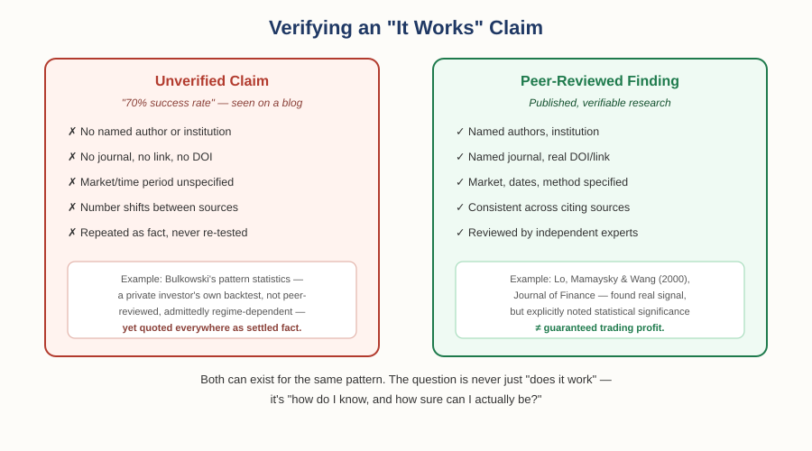

# The Foundation of Money and Trade — Chapter 3, Lesson 2: Does It Actually Work? Evidence, Skepticism, and Making a Decision

## Learning Objectives

By the end of this lesson, you will be able to:

- Distinguish a peer-reviewed academic finding from a self-published, non-peer-reviewed statistic
- Explain what real academic research actually found about chart-pattern reliability — including where it disagrees with itself
- Spot the warning signs of an unverifiable "success rate" claim
- Explain how reading a market connects to the risk-management skills from Chapter 2 to become an actual decision

---

## 1. The Most Repeated Statistic Might Not Mean What You Think

Search for almost any chart pattern's "success rate," and you'll find a very specific-sounding number — "70% success rate for head-and-shoulders," "88% for a double bottom." These numbers trace back overwhelmingly to one source: Thomas Bulkowski, a private investor who published his own backtested pattern statistics in books and on a personal website.

:::warning
Bulkowski's work is more methodical than most pattern literature, and he's transparent that his numbers are historical averages from his own dataset — not peer-reviewed, not independently replicated, and not stable across time. By his own published data, failure rates for chart patterns nearly doubled in some cases between the bullish 1990s and the more volatile 2000s. Yet his numbers get repeated across trading blogs and course materials as if they were settled, permanent facts — often with the exact figure quietly changed from one secondary source to the next.
:::

:::practice
While researching this very lesson, a live search turned up a trading-education blog claiming "a study covering over 8,000 chart setups between 2020–2023" found a "62% average success rate" — with no named author, no journal, no link, nothing to verify. This is exactly the kind of claim the Citation Verification Protocol exists to catch. Before trusting a number like this, what specific pieces of information would you want to see before believing it?
:::

---

## 2. What Real Academic Research Actually Found

This is where it gets genuinely interesting — because peer-reviewed research on chart patterns exists, it's rigorous, and it does not give a simple "yes" or "no" answer.

:::definition
**Peer Review** — A process where independent experts in a field evaluate a study's methodology and findings before it's published, specifically to catch errors, weak methodology, or unsupported conclusions.
:::

:::example
**Lo, Mamaysky & Wang (2000)**, published in *The Journal of Finance* — one of the most respected journals in the field — built an automated, objective system to detect chart patterns (removing the "I see what I want to see" problem of manually eyeballing a chart) and tested it on decades of U.S. stock data. They found that several technical patterns, including head-and-shoulders and double bottoms, did provide statistically significant information beyond random chance. But they were careful to add an important caveat: a pattern being statistically detectable is not the same as that pattern being profitable to trade after real-world costs.
:::

:::example
**Chang & Osler (1999)**, published in *The Economic Journal*, tested the head-and-shoulders pattern specifically on foreign exchange rates. They found the pattern *did* generate statistically significant trading profits — but it was "dominated" by simpler trading rules, meaning a plainer strategy achieved the same or better result with less complexity. A pattern can genuinely work and still not be the smartest tool for the job.
:::

:::example
**Ghanem, Harasheh, Sbaih & Ajmal (2024)**, published in *Cogent Business & Management* — genuinely recent research, not a decades-old study — tested 497 technical trading rules across 10 currencies over 22 years of data (2000–2022). They found technical trading rules significantly predicted price movements in both developed and emerging-market currencies, with emerging-market currencies showing *even higher* predictability than developed ones.
:::

Put together, honest academic evidence says: some chart-based signals do carry real, measurable information — but "real" doesn't mean "guaranteed," "simple," or "the best available tool." That's a meaningfully different claim than "this pattern has a 70% success rate," and it's the more accurate one.

---

## 3. A Checklist for Any "It Works" Claim You Encounter

Pulling directly from the Citation Verification Protocol this course now follows internally:

:::warning
Before trusting any stated success rate, ask: Is this from a peer-reviewed journal, or a personal website/book? Can I find the original source, or only secondhand mentions of it? Does the claim specify the market, time period, and conditions it was tested under? Is the number repeated identically everywhere, or does it quietly shift from source to source? A claim that fails several of these checks isn't necessarily false — but it hasn't earned your trust yet either.
:::

---

## 4. Reading the Market Is Not the Same as Making a Decision

This closes the loop on everything Foundations has covered. A chart, a candlestick pattern, a support level, a piece of tape — all of it is *information*. None of it is a decision by itself.

Go back to Chapter 2: risk management is what turns information into a controlled decision. Reading a chart might tell you a currency looks like it's forming a head-and-shoulders pattern. Chapter 2 is what tells you where your stop-loss goes if you're wrong, how much of your account you're willing to risk on being wrong, and whether the potential reward actually justifies that risk. A perfect read of a chart, paired with no risk management, is still a losing strategy waiting to happen. A mediocre read of a chart, paired with real risk management, can still be around to trade another day.

:::practice
Bring together everything from Chapters 1 through 3: you spot what looks like a head-and-shoulders pattern on a currency pair. Academic research says this pattern carries *some* real signal, but isn't necessarily the best tool available and doesn't guarantee an outcome. What questions from Chapter 2 (risk management) should you answer before acting on this pattern at all?
:::

---

## What to Look For

Your complete Foundations checklist, carried forward into every future chapter:

- Is a claim's source peer-reviewed and independently verifiable, or self-published and unverified?
- Does "some evidence of an effect" get inflated into "guaranteed" somewhere between the research and the sales pitch?
- Have you defined your risk (stop-loss, position size) *before* acting on any market read, not after?
- Is the "textbook" relationship you're relying on actually the strongest factor at play right now, or could something else be overriding it?

---

## Practice / Quiz

1. What did Lo, Mamaysky & Wang (2000) actually conclude about chart patterns?
   - A) Chart patterns are completely useless and provide no information
   - B) Chart patterns guarantee profitable trades 70% of the time
   - C) Several patterns provided statistically significant information, but that doesn't automatically mean they're profitable to trade after costs
   - D) Only candlestick patterns work; bar and line charts provide no signal

   **Correct: C.** This is the precise, nuanced finding — real signal, not a guarantee of profit.

2. True or False: a statistic repeated across many trading websites is more likely to be accurate because so many sources agree on it.

   **Correct: False.** Widely repeated statistics (like Bulkowski's pattern success rates) often trace back to a single non-peer-reviewed original source, just copied and re-copied — repetition is not independent verification.

---

## Key Terms Recap

| Term | One-line definition |
|---|---|
| Peer Review | Independent expert evaluation of a study's methodology before publication. |

---

## Chapter 3 Complete — Foundations Complete

*You've now completed "The Foundation of Money and Trade": the history of money (Chapter 1), risk management, inflation, and diversification (Chapter 2), and how to read a market critically (Chapter 3). Every principle here — question the textbook claim, verify the source, control the downside before chasing the upside — carries forward unchanged into whichever paid track you choose next: Forex, Crypto, or Stocks. The tools get more specific from here. The way of thinking doesn't change.*
